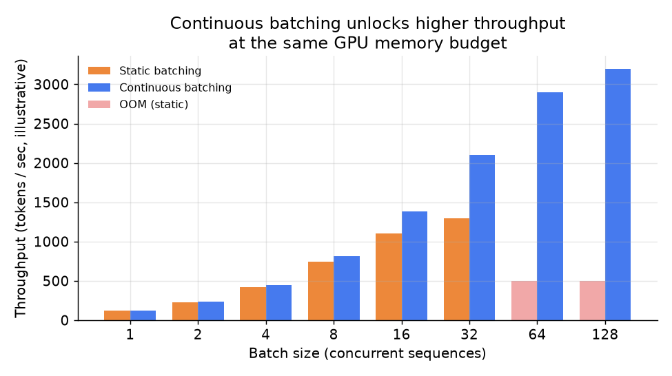

# 6. Serving and scaling

The previous sections attacked the KV cache at the entry level: shrink each entry,
page the cache, reuse it across requests. This section covers the system-level
decisions that determine how many requests a given GPU node can sustain and where
the next bottleneck will be.

## Continuous batching: the first throughput win

In a naive serving loop, a batch is formed once and the GPU waits for every request
in the batch to finish before starting new ones. Long requests block short ones.
GPU utilization collapses when batch sizes are uneven.

**Continuous batching** (also called in-flight batching) removes this constraint.
The server maintains a running pool of active decode steps. After each token step,
completed requests are retired and new requests are inserted at the token level.
Every GPU step advances all active sequences by one token, regardless of when each
request arrived. Under mixed workloads this often doubles or triples throughput
compared to static batching.

The cost: the KV cache now holds all active sequences at once, so GPU memory
becomes the binding constraint. This is what motivates PagedAttention (keep the
cache compact), KV quantization (shrink each entry), and GQA (fewer entries to
begin with).

*Illustrative throughput curves for static batching (orange) versus continuous
batching (blue). Static batching hits an out-of-memory wall (red bars) at moderate
batch sizes because the full KV cache for every concurrent sequence must fit in a
single contiguous allocation per request. Continuous batching with paged memory
extends the working range significantly.*

## Speculative decoding: fewer expensive decode steps

Decode is expensive precisely because each step is one token: one full forward pass
through all parameters plus a full cache read. **Speculative decoding** (also called
assisted generation) restructures this:

1. A small, cheap **draft model** proposes a block of $k$ tokens in $k$ sequential
   steps (these are fast because the draft model is tiny).
2. The large **target model** verifies all $k$ proposed tokens in a single parallel
   forward pass (like prefill, but over $k$ tokens rather than the full prompt).
3. The longest correct prefix is accepted; the rest are discarded and the process
   repeats.

When the draft model agrees with the target model often, the result is multiple
accepted tokens per expensive target-model step. Net effect: fewer calls to the
expensive decode loop for the same output.

The gain depends critically on draft accuracy. On structured outputs (code,
templates, formulaic responses) acceptance rates can be very high. On open-ended
creative text they drop sharply. Speculative decoding is most valuable at low-to-
moderate batch sizes where the target GPU is not yet saturated; at very high batch
sizes the extra draft-model compute adds overhead without clearing the memory
bottleneck.

## Bottlenecks and how to diagnose them

| Bottleneck | First sign | Root cause | Fix |
|---|---|---|---|
| OOM under load | Requests queue, GPU memory full | KV cache for concurrent long sessions exceeds HBM | Cap concurrent sequences; page the cache; quantize KV; reduce sequence length |
| High inter-token latency | p99 decode latency above budget | Decode is memory-bandwidth-bound; cache grows with S | Shrink cache (GQA, MLA, quantize); reduce active batch; KV eviction for stale sessions |
| High first-token latency | Users wait long for first token | Long-prompt prefill is slow; prefix cache misses | Prefix caching; chunked prefill; increase parallelism for compute-bound prefill |
| Throughput plateau at low batch | GPU underutilized; few concurrent requests | Static batching; blocked by long sequences | Switch to continuous batching |
| Quality regression under quantization | Perplexity or retrieval eval degrades | KV quantization bits too low for this task | Raise bits; keep full-precision window; quantize keys less aggressively than values |
| Single-node prefix cache misses in cluster | Hit rate lower than expected at scale | Prefix cache is per-node; requests not routed to the node holding their prefix | Cache-aware routing (llm-d approach); distributed prefix cache |
