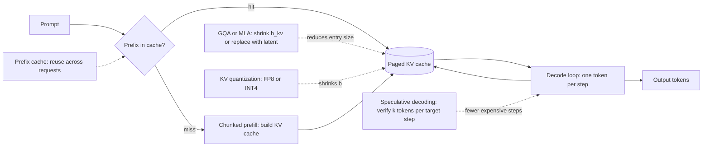

# 9. Summary

## One-page recap

- **The KV cache, not the model weights, dominates memory at long context.** One
  100k-token session on a 32-layer GQA model in FP16 costs over 13 GB of cache.
  The weights of the same model cost 14 GB. At 100 concurrent sessions the weights
  are still 14 GB; the cache is 1.3 TB. Recite the formula:
  $\text{kv\_bytes} \approx 2 \cdot L \cdot S \cdot h_{\text{kv}} \cdot d_{\text{head}} \cdot b \cdot B$.

- **Decode is memory-bandwidth-bound; prefill is compute-bound.** Each decode step
  reads the full model plus the full cache to emit one token (roughly 1 FLOPs/byte,
  far below the GPU roofline). Prefill processes $S$ tokens at once across the same
  weight read ($\approx S$ FLOPs/byte). The levers you pick depend on which phase
  is the wall; profile first.

- **Shrink each entry with architecture (train-time) or quantization
  (serving-time).** GQA is the safe default: near-MHA quality, 4x to 8x cache
  reduction, cheap to uptrain. MLA (DeepSeek-V2/V3) compresses further (~93%) by
  replacing K/V with a latent, but requires the RoPE split-head fix baked in at
  training. KV quantization (FP8, NVFP4, INT4) is the bolt-on option for a model
  you cannot retrain; always gate it behind your own long-context eval.

- **Eliminate fragmentation with paging; eliminate redundant prefill with prefix
  caching.** PagedAttention (vLLM) manages KV blocks like OS virtual memory,
  doubling or tripling concurrency at matched memory. Prefix caching skips
  prefill for any repeated prefix (system prompt, shared document), which is the
  single largest first-token latency win for RAG chatbots. At cluster scale,
  cache-aware routing is required to preserve the hit rate.

- **Long context requires position extension as well as memory.** Naive RoPE
  extrapolation past training length fails. YaRN gives 4x to 16x extension with
  minimal fine-tuning. Sliding-window attention bounds KV memory per layer but
  drops mid-document recall. Pick based on whether the task requires whole-document
  retrieval or tolerates window-based access.

- **Continuous batching and speculative decoding govern throughput.** Continuous
  batching is the mandatory first step; static batching wastes GPU time and OOMs
  earlier. Speculative decoding multiplies effective token throughput at low-to-
  moderate batch sizes on structured output; it adds overhead at high batch sizes
  where the GPU is already saturated.

## The system on one page

## Test yourself

1. At what sequence length does a single session's KV cache exceed the model
   weight footprint for a 7B model in GQA (8 KV heads, $d_{\text{head}} = 128$,
   32 layers, FP16)? Show the arithmetic.

2. GQA reduces $h_{\text{kv}}$; MLA replaces the cached K/V with a latent. Why does
   MLA achieve a larger compression ratio, and what must be done differently at
   training time to make it work with RoPE?

3. Prefix caching skips prefill for matching prefixes. Under what single prompt
   structure condition will the cache always miss, and how do you fix it?

4. PagedAttention raises throughput but does not change per-request decode latency.
   Explain why, and describe when the throughput gain would disappear.

5. You are told to extend a 8k-context Llama model to 128k at low fine-tuning cost.
   You also need whole-document recall (not windowed). Which long-context extension
   technique do you pick, and what fine-tuning recipe does it require?

6. An engineer proposes to quantize the KV cache from FP16 to INT2 to fit 8x more
   sessions into GPU memory. What questions do you ask before shipping it, and what
   is the one eval you insist on running?

## Further reading

- Dense reference with all math, comparison diagrams, and case studies:
  [../../topics/02-long-context-and-kv-cache.md](../../topics/02-long-context-and-kv-cache.md).
- Per-company teardowns (vLLM, Character.AI, DeepSeek, Google GQA, NVIDIA, Databricks,
  StreamingLLM): the source material at
  [../../tools/teardowns/02.md](../../tools/teardowns/02.md).
- Side-by-side comparison with math and quadrant chart:
  [../../tools/comparisons/02.md](../../tools/comparisons/02.md).
- Trace real model dimensions live in the
  [Model Zoo](https://github.com/neurarch-ai/awesome-llm-model-zoo)
  ([gallery](https://neurarch-ai.github.io/awesome-llm-model-zoo)).
  Built by [Neurarch](https://www.neurarch.com).
