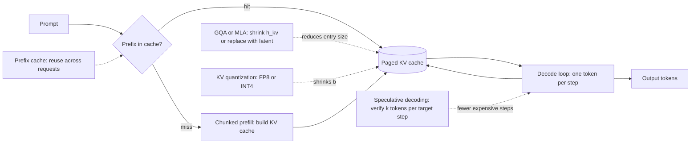

# 9. Summary

## One-page recap

- **The KV cache, not the model weights, dominates memory at long context.** One
  100k-token session on a 32-layer GQA model in FP16 costs over 13 GB of cache.
  The weights of the same model cost 14 GB. At 100 concurrent sessions the weights
  are still 14 GB; the cache is 1.3 TB. Recite the formula:
  $\text{kv-bytes} \approx 2 \cdot L \cdot S \cdot h_{\text{kv}} \cdot d_{\text{head}} \cdot b \cdot B$.

- **Decode is memory-bandwidth-bound; prefill is compute-bound.** Each decode step
  reads the full model plus the full cache to emit one token (roughly 1 FLOPs/byte,
  far below the GPU roofline). Prefill processes $S$ tokens at once across the same
  weight read ($\approx S$ FLOPs/byte). The levers you pick depend on which phase
  is the wall; profile first.

- **Shrink each entry with architecture (train-time) or quantization
  (serving-time).** GQA is the safe default: near-MHA quality, 4x to 8x cache
  reduction, cheap to uptrain. MLA (DeepSeek-V2/V3) compresses further (~93%) by
  replacing K/V with a latent, but requires the RoPE split-head fix baked in at
  training. KV quantization (FP8, NVFP4, INT4) is the bolt-on option for a model
  you cannot retrain; always gate it behind your own long-context eval.

- **Eliminate fragmentation with paging; eliminate redundant prefill with prefix
  caching.** PagedAttention (vLLM) manages KV blocks like OS virtual memory,
  doubling or tripling concurrency at matched memory. Prefix caching skips
  prefill for any repeated prefix (system prompt, shared document), which is the
  single largest first-token latency win for RAG chatbots. At cluster scale,
  cache-aware routing is required to preserve the hit rate.

- **Long context requires position extension as well as memory.** Naive RoPE
  extrapolation past training length fails. YaRN gives 4x to 16x extension with
  minimal fine-tuning. Sliding-window attention bounds KV memory per layer but
  drops mid-document recall. Pick based on whether the task requires whole-document
  retrieval or tolerates window-based access.

- **Continuous batching and speculative decoding govern throughput.** Continuous
  batching is the mandatory first step; static batching wastes GPU time and OOMs
  earlier. Speculative decoding multiplies effective token throughput at low-to-
  moderate batch sizes on structured output; it adds overhead at high batch sizes
  where the GPU is already saturated.

## The system on one page

```mermaid
flowchart LR
  P[Prompt] --> PF_CHK{Prefix in cache?}
  PF_CHK -- hit --> KV[(Paged KV cache)]
  PF_CHK -- miss --> PF[Chunked prefill: build KV cache]
  PF --> KV
  KV --> DEC[Decode loop: one token per step]
  DEC --> KV
  DEC --> O[Output tokens]

  GQA[GQA or MLA: shrink h_kv or replace with latent] -.reduces entry size.-> KV
  QKWANT[KV quantization: FP8 or INT4] -.shrinks b.-> KV
  PFX[Prefix cache: reuse across requests] -.-> PF_CHK
  SPEC[Speculative decoding: verify k tokens per target step] -.fewer expensive steps.-> DEC
```

## Test yourself

Answers are collapsed. Attempt each question before opening one.

1. At what sequence length does a single session's KV cache exceed the model
   weight footprint for a 7B model in GQA (8 KV heads, $d_{\text{head}} = 128$,
   32 layers, FP16)? Show the arithmetic.

   

Answer

   At roughly **107k tokens**, just past the worked example in section
   [2](02-the-cost-model.md). Strip $S$ and $B$ out of the size formula to get the
   per-token cost: $2 \cdot L \cdot h_{\text{kv}} \cdot d_{\text{head}} \cdot b
   = 2 \times 32 \times 8 \times 128 \times 2 = 131\,072$ bytes, which is 128 KB
   per token. A 7B model in FP16 weighs $7 \times 10^9 \times 2 = 14$ GB. Divide:
   $14 \times 10^9 / 131\,072 \approx 106\,800$ tokens. Section
   [2](02-the-cost-model.md) runs the same arithmetic at 100k tokens and gets
   13.1 GB of cache against 14 GB of weights, just under the crossover. The exact
   token count matters less than the scaling: the weights stay at 14 GB no matter
   how many sessions you serve, while the cache multiplies by $B$, so 100
   concurrent 100k sessions cost 1.3 TB of cache against the same 14 GB of weights.

   

2. GQA reduces $h_{\text{kv}}$; MLA replaces the cached K/V with a latent. Why does
   MLA achieve a larger compression ratio, and what must be done differently at
   training time to make it work with RoPE?

   

Answer

   MLA compresses harder because it removes the per-head K and V tensors from the
   cache entirely instead of sharing them, so its ratio is **independent of head
   count**. GQA is bounded by heads: $r_{\text{GQA}} = h_{\text{kv}} / h_q = 8/32
   = 1/4$, and even MQA at $h_{\text{kv}} = 1$ only reaches $1/32$. MLA caches one
   low-rank latent per token, giving $r_{\text{MLA}} = d_c / (2 \cdot h_{\text{kv}}
   \cdot d_{\text{head}}) \approx 512 / (2 \times 32 \times 128) \approx 0.063$,
   about 93% smaller than MHA, because the saving comes from the latent width $d_c$
   rather than from how many heads read it. The training-time difference is the
   **decoupled RoPE head**: RoPE rotates keys by a position-dependent angle, but the
   cached latent is position-free, and rotating before compression bakes the
   rotation into the stored latent so the up-projection can no longer be absorbed
   into the query projection, which is the trick that makes MLA cheap. Rotating
   after up-projection is no better, since every decode step would have to re-rotate
   every reconstructed head and the saving evaporates. DeepSeek's fix is to split
   each head into a large latent-compressed part plus a small RoPE-carrying part
   that is cached directly, then concatenate them back. That split has to be baked
   in at training time, which is why MLA is a train-time architecture change and not
   a serving-time bolt-on (sections [3](03-shrinking-the-cache.md) and
   [8](08-interview-qa.md)).

   

3. Prefix caching skips prefill for matching prefixes. Under what single prompt
   structure condition will the cache always miss, and how do you fix it?

   

Answer

   The cache always misses when a per-request variable token sits at the very
   beginning of the prompt, ahead of the stable content. Prefix caching is
   **exact-prefix matching**: a single differing token forces a miss from that token
   onward, so a user name, session ID, timestamp, or retrieved chunk placed at
   position 0 defeats the cache for every request even though the 4k system prompt
   right behind it is identical fleet-wide. The fix is a prompt-layout change, not
   an engine change: put all stable content first, byte-identical across requests,
   and push every per-user variable after it. Section
   [4](04-paged-and-shared.md) calls this out as the common mistake, and section
   [10](10-putting-it-together.md) lists it as the rule for the first-token budget.
   It is worth checking before you tune anything else, because the shared 4k prompt
   is the single largest first-token latency lever in the scenario, and Databricks
   measured 2.5x input-token throughput and 3x lower P50 latency at only a 30% hit
   rate.

   

4. PagedAttention raises throughput but does not change per-request decode latency.
   Explain why, and describe when the throughput gain would disappear.

   

Answer

   PagedAttention attacks **fragmentation**, not per-step work. Each decode step
   still reads the whole model plus that sequence's whole cache to emit one token,
   so an individual request advances at exactly the same pace, and the block-table
   indirection actually adds a small overhead to the attention kernel. Throughput
   rises for a different reason: decode is memory-bandwidth-bound and the fixed
   weight read is shared by every live sequence in the batch, so packing 2x to 4x
   more sequences into the same HBM means each weight read yields more tokens.
   Report the win in fleet-wide tokens per second, never in single-request decode
   latency (sections [4](04-paged-and-shared.md) and [8](08-interview-qa.md)). The
   gain disappears whenever fragmentation was not the binding constraint: a single
   sequence on a single GPU, or a uniform-length workload where contiguous buffers
   already pack tightly, has no 20% to 40% of wasted memory to recover. It also
   disappears once you are no longer memory-limited at all, because paging can only
   admit more sequences, and if concurrency is already capped by something else the
   extra block bookkeeping is pure cost.

   

5. You are told to extend a 8k-context Llama model to 128k at low fine-tuning cost.
   You also need whole-document recall (not windowed). Which long-context extension
   technique do you pick, and what fine-tuning recipe does it require?

   

Answer

   Pick **YaRN**. The target is a 16x extension (8k to 128k), which sits at the top
   of YaRN's 4x to 16x range, and unlike sliding-window attention or attention sinks
   it keeps the full cache, so mid-document content is still attendable, which is
   exactly what the whole-document recall requirement demands. Mechanically YaRN
   applies **frequency-dependent scaling**: high-frequency RoPE dimensions that
   encode fine local position are left uncompressed while low-frequency dimensions
   that encode global position are interpolated, plus a temperature term that
   rescales attention logits so the softmax does not flatten at long range. The
   recipe is a short fine-tune on long sequences, heavier than plain position
   interpolation's 1 000 to 10 000 gradient steps but nowhere near pretraining cost.
   Plain PI is the cheaper alternative but is really a 2x to 4x tool and loses more
   short-range resolution at this stretch; sliding window plus sinks would bound
   memory but genuinely forgets the middle, so retrieval from it fails. Gate the
   result on **NIAH recall** across the length-by-depth grid, not perplexity,
   because perplexity recovers while mid-depth retrieval quietly stays broken
   (section [5](05-long-context.md); the same choice is committed in section
   [10](10-putting-it-together.md)).

   

6. An engineer proposes to quantize the KV cache from FP16 to INT2 to fit 8x more
   sessions into GPU memory. What questions do you ask before shipping it, and what
   is the one eval you insist on running?

   

Answer

   The 8x is arithmetically right ($b$ drops from 2 bytes to 2 bits), but INT2 is
   the most aggressive row in the whole quantization table, so ask what is being
   skipped on the way there. First: have the **lossless levers** been exhausted?
   GQA or MLA, paging, and prefix caching all shrink the bill without perturbing a
   single stored value, and section [10](10-putting-it-together.md) says to spend
   those rows first. Second: is this the KIVI scheme, with **per-channel key scaling
   and per-token value scaling** plus a full-precision recent-token window? Keys
   carry outlier channels that a single per-tensor scale cannot represent, and key
   error passes through the softmax where it can flip which tokens win, so keys must
   be quantized less aggressively than values. Third: does the workload need
   whole-document recall, and does the serving stack actually have kernels for this
   format? The one eval to insist on is **needle-in-a-haystack recall** on a
   length-by-depth grid at the target context, on your own data. Perplexity is the
   trap here: it can look completely normal while mid-depth retrieval degrades, and
   sections [3](03-shrinking-the-cache.md) and [5](05-long-context.md) both say to
   gate production-readiness on retrieval recall rather than on PPL.

   

## Further reading

- The capstone: [the complete build](10-putting-it-together.md), where every
  choice in this chapter is committed once for the scenario, sized against the
  node's memory, rebuilt under two other constraint sets, and compressed into a
  runnable one-file KV-cache model.
- Dense reference with all math, comparison diagrams, and case studies:
  [../../topics/02-long-context-and-kv-cache.md](../../topics/02-long-context-and-kv-cache.md).
- Per-company teardowns (vLLM, Character.AI, DeepSeek, Google GQA, NVIDIA, Databricks,
  StreamingLLM): the source material at
  [../../tools/teardowns/02.md](../../tools/teardowns/02.md).
- Side-by-side comparison with math and quadrant chart:
  [../../tools/comparisons/02.md](../../tools/comparisons/02.md).
- Trace real model dimensions live in the
  [Model Zoo](https://github.com/neurarch-ai/awesome-llm-model-zoo)
  ([gallery](https://neurarch-ai.github.io/awesome-llm-model-zoo)).
  Built by [Neurarch](https://www.neurarch.com).
