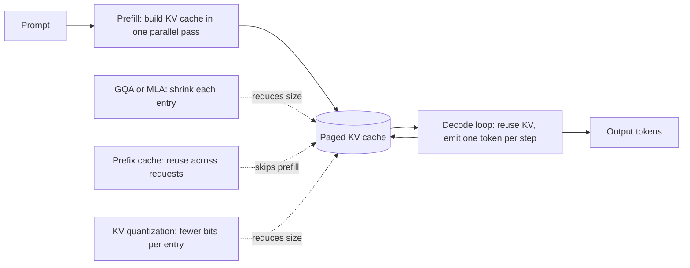

# Long-Context Inference and the KV Cache

> **Style note.** This chapter is a teach-first, book-like deep dive into long-context
> LLM inference. It borrows the arc of Aminian and Xu's *Machine Learning System
> Design Interview* (an interviewer dialogue, a consistent cost-model-then-levers
> arc, one figure per idea) without copying its layout. On top of that it keeps what
> this repo adds: real production case studies, "when to use which" tables per method
> group, live architecture graphs, worked KaTeX formulas, and interview Q&A. Split
> into one file per section so no single file gets long.

An interviewer rarely says "explain the KV cache." They say **"our GPU bills are
climbing and p99 latency is bad under load. Walk me through what is expensive about
serving an LLM and how you would bring the cost down without hurting quality."**
That question has one correct entry point: the KV cache. Get the cost model right
and every design choice follows from it.

## Sections

1. [Clarifying the requirements](01-clarifying-requirements.md) -- the dialogue that scopes the problem.
2. [The cost model](02-the-cost-model.md) -- prefill vs decode, why decode is memory-bandwidth-bound, the KV-cache formula.
3. [Shrinking the cache](03-shrinking-the-cache.md) -- MHA, GQA, MQA, MLA, and quantized KV.
4. [Paged and shared](04-paged-and-shared.md) -- PagedAttention, prefix caching, RadixAttention.
5. [Long context](05-long-context.md) -- position interpolation, YaRN, sliding-window, chunked prefill.
6. [Serving and scaling](06-serving-and-scaling.md) -- continuous batching, speculative decoding, bottlenecks.
7. [How teams do it in production](07-how-teams-do-it-in-production.md) -- named companies, divergence table, first-party links.
8. [Interview Q&A](08-interview-qa.md) -- commonly asked, tricky, and commonly answered wrong.
9. [Summary](09-summary.md) -- one-page recap, mermaid, test-yourself, further reading.

## The whole system on one page

Read the sections in order the first time. They build on each other.
Each opens with the question an interviewer actually asks, then answers it.
