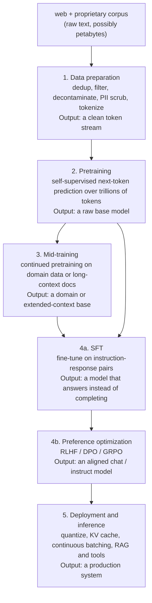
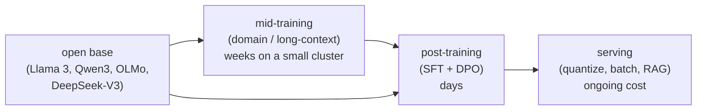

# 2. The five stages

Building with LLMs is five distinct stages. Each stage has a different input,
a different output, a different dominant cost, and a different failure mode.
Confusing them is the fastest way to waste budget and fail the interview.

## Stage by stage

## The one-line job of each stage

| Stage | Input | Output | Dominant cost | Typical failure |
|---|---|---|---|---|
| 1. Data prep | raw web plus proprietary text | clean tokenized token stream | pipeline engineering, storage | eval leakage from missing decontamination |
| 2. Pretraining | the token stream | raw base model | compute (GPU cluster, weeks) | under- or over-fitting compute budget (violating Chinchilla) |
| 3. Mid-training | existing base plus domain corpus | domain or long-context base | compute (small fraction of pretrain) | catastrophic forgetting if general data is not mixed in |
| 4. Post-training | base plus (instruction, response) pairs and preference data | aligned instruct model | data quality, labeling cost | reward hacking or alignment tax from dropping the KL leash |
| 5. Deployment | aligned model | production serving system | ongoing GPU spend, engineering | KV cache OOM, latency blowup, hallucination without RAG |

## Where most teams actually enter

Almost no product team runs stage 2. That stage is a lab-scale capital
commitment. Most teams enter the diagram at the base model, having downloaded
an open-weights checkpoint (Llama 3, DeepSeek-V3, OLMo, Qwen3), and they
iterate from there.

The expensive, rare stage (pretraining) is upstream and shared. The stages a
product team actually owns and iterates on (mid-training, post-training,
serving) are downstream and, by comparison, cheap.

## A note on evaluation

Each stage has a different metric, and using the wrong one is a classic
mistake:

- **Pretraining:** perplexity or bits-per-byte on a held-out set, plus
  zero/few-shot benchmark suites (MMLU, HellaSwag, GSM8K). Perplexity tracks
  the objective but not usefulness; bits-per-byte is tokenizer-invariant so you
  can compare across models.
- **Mid-training:** domain-specific benchmarks (legal, medical, code) plus the
  full general eval suite to catch forgetting.
- **Post-training:** human preference win rate and LLM-as-judge scores
  (Chatbot Arena style), instruction-following and safety suites, task-specific
  evals (code pass@k, math accuracy).
- **Serving:** latency (p50/p95 time-to-first-token and inter-token),
  throughput (tokens/sec/GPU), and cost per million tokens, with a quality
  check that compression did not regress the model.

Name the metric before you propose a fix. Saying "improve perplexity" when the
real goal is preference win rate is a red flag.
