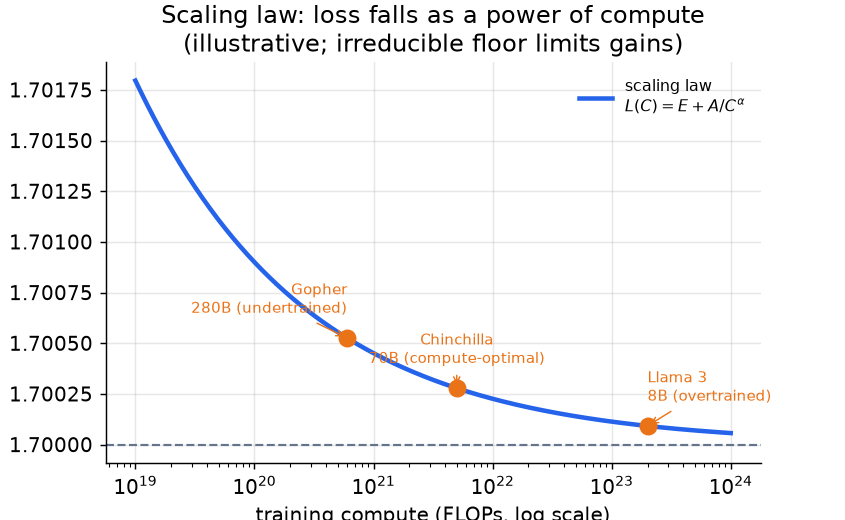
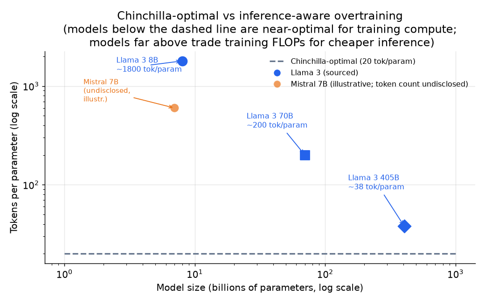

# 3. Pretraining and scaling

Pretraining is self-supervised next-token prediction over trillions of tokens.
The architecture is not the interesting question; the interesting questions are
**how big** and **how much data**, and the answer changed materially after
Chinchilla.

## The compute budget formula

Training compute is approximated by a simple expression. With $N$ parameters
and $D$ training tokens, the total floating-point operations are:

$$C \approx 6 N D$$

The factor of 6 accounts for the forward pass (multiply-add at each weight,
so 2 FLOPs), the backward pass (roughly twice the forward), and the update.
This is a whiteboard sanity check, not a contract, but it lets you estimate:
a 7B model trained on 140B tokens costs roughly $6 \times 7 \times 10^9 \times
1.4 \times 10^{11} \approx 5.9 \times 10^{21}$ FLOPs.

## The scaling law

Loss follows a power law in both model size and training tokens:

$$L(N, D) = E + \frac{A}{N^{\alpha}} + \frac{B}{D^{\beta}}$$

where $E$ is the irreducible entropy floor of the data, and $\alpha, \beta
\approx 0.3$ in the Chinchilla fit. Two structural points:

- Neither $N$ nor $D$ alone determines loss; both matter.
- Gains are diminishing; the floor $E$ cannot be reduced by scale.



*Loss falls as a power of training compute, asymptoting toward an irreducible
floor set by data entropy. Pre-Chinchilla models (Gopher) were undertrained:
a 280B model at the same compute as a 70B Chinchilla loses. Llama 3 8B
deliberately uses far more tokens than compute-optimal because inference
economics dominate its lifetime cost. Illustrative.*

## Chinchilla-optimal: the training-side answer

For a fixed compute budget $C$, minimize loss by choosing $N$ and $D$
together. The Chinchilla result is that the compute-optimal token count is
roughly:

$$D^{\ast} \approx 20 \, N^{\ast}$$

```python
def chinchilla_optimal(C):
    # C: training compute budget in FLOPs; uses C = 6*N*D and D = 20*N
    N = (C / 120) ** 0.5   # params: substituting D=20N into 6ND gives C = 120*N^2
    D = 20 * N             # tokens: about 20 per parameter at the optimum
    return N, D
# chinchilla_optimal(5.9e21) -> (~7.0e9, ~1.4e11): a 7B model wants ~140B tokens
```

That is, scale tokens and parameters together, about 20 tokens per parameter.
A 7B model needs roughly 140B tokens to be compute-optimal. The models of the
pre-Chinchilla era (Gopher, GPT-3) were severely undertrained: a 280B model
trained on 300B tokens wastes most of its parameter budget because the data is
exhausted first.

## The inference-aware shift: why Llama overtrained

Chinchilla-optimal minimizes **training** compute for a given loss. But if you
will serve a model billions of times after training, the objective shifts: you
want to minimize the lifetime cost of (training plus inference), not just
training alone.

A smaller model served a billion times is cheaper than a larger model served
the same number of times, even if the smaller model took more tokens to train
to the same quality. So you deliberately overtrain a smaller model past its
compute-optimal point. This is why Llama 3 8B was trained on roughly 15
trillion tokens (about 1800 tokens per parameter) when compute-optimal would
be 160B tokens (20 per parameter).



*The dashed line at 20 tokens per parameter is Chinchilla-optimal for
training. Llama 3 8B (about 1800 tok/param) sits far above it, deliberately
trading extra training FLOPs for a permanently cheaper inference cost at scale.
Mistral 7B is shown as an illustrative overtrained point; its token count was
not publicly disclosed. Llama 3 405B (about 38 tok/param, from roughly 15.6T
tokens) sits closer to Chinchilla-optimal: further overtraining a model that
expensive to serve would not pay off.*

## When to use which approach

| Reach for | When | Instead of |
|---|---|---|
| Compute-optimal pretrain (Chinchilla ratio) | minimizing training compute for a research run or a prototype | overtraining, which pays off only when serving at scale |
| Inference-aware overtraining (Llama 3 8B) | you will serve billions of tokens and the forever cost of inference dominates | compute-optimal sizing that leaves a large expensive model to serve |
| Mid-training on an open base (most product teams) | limited compute budget and an open base covers the capability need | from-scratch pretrain that requires lab-scale resources |
| From-scratch pretrain | genuinely new capability not in any open base (a new language, a new modality, a frontier advance) | adapting, which would have sufficed |

**Tools for each approach.** From-scratch and compute-optimal pretraining at cluster
scale run on Megatron-LM (NVIDIA), GPT-NeoX (EleutherAI), and DeepSpeed (Microsoft)
ZeRO for the distributed sharding, with nanotron and litGPT as lighter-weight
trainers. Inference-aware overtraining uses the same trainers, just carried far past
the Chinchilla token ratio. Mid-training on an open base (continued pretraining or
context extension) is the common product path and runs on Hugging Face Transformers
and Accelerate over a downloaded checkpoint, which needs a fraction of the
infrastructure. Data curation and decontamination for any of these leans on the
datasets and tokenizers libraries plus dedup tooling.

**Provenance.** The compute-optimal token-to-parameter ratio comes from Chinchilla
(DeepMind, 2022), which corrected the earlier power-law tradeoffs of the original
scaling laws (OpenAI, 2020); the "overtrain past the optimal ratio when inference
dominates" logic is the practical inversion of that result. The distributed-training
tooling traces to Megatron-LM (NVIDIA) for tensor and pipeline parallelism and to
ZeRO (Microsoft), which DeepSpeed implements.

**Worked example.** A domain-LLM team needs a model fluent in a specialized corpus but
lacks lab-scale compute. Because an open base already covers general language ability
and only the domain vocabulary is missing, they choose mid-training on that base over
a from-scratch pretrain, which would demand resources they do not have and would
mostly relearn what the base already knows. If they were instead standing up a model
they would serve billions of times, they would push inference-aware overtraining well
past the twenty-tokens-per-parameter ratio, trading extra training FLOPs for a
permanently cheaper serving cost rather than stopping at compute-optimal. A
from-scratch pretrain earns its cost only when the capability, such as a new language
or modality, is genuinely absent from every open base.

## Architecture choices that matter at scale

The decoder-only transformer is the default; the deltas that matter are:

- **Attention variant.** Multi-head (MHA) has the best quality but the largest
  KV cache. Grouped-query (GQA, used by Llama 3 and Mistral) cuts the KV cache
  by $n_{\text{heads}} / n_{\text{kv}}$ with minimal quality loss; it is the
  default for any model you plan to serve at scale. Multi-query (MQA) goes
  further (Character.AI) at a larger quality cost.
- **Positional encoding.** RoPE (used by Llama, Mistral, Qwen3) injects
  position as a rotation so the query-key dot product depends only on relative
  offset. It generalizes better to longer contexts than learned absolute
  positions and is required for context extension in mid-training.
- **Mixture of experts (MoE).** Replace the dense MLP with $E$ experts and a
  router that sends each token to its top-$k$. Total parameters grow while
  per-token FLOPs stay flat. DeepSeek-V3 and Mixtral use this to get a large
  parameter count (and thus better quality) at a small per-token compute
  budget. The risk is load imbalance: the auxiliary balancing loss (or
  DeepSeek-V3's bias-based approach) is what keeps it from routing everything
  to one expert.

> **Trace the architecture live.** The structural choice that pretraining
> optimizes is the decoder block: RMSNorm, causal self-attention (MHA / GQA),
> and a feed-forward layer (MLP / SwiGLU), stacked $n_{\text{layers}}$ deep.
> Inspect a canonical base (GPT-2 small) and a modern production base (Llama 3
> 8B) in the
> [Model Zoo](https://github.com/neurarch-ai/awesome-llm-model-zoo).
> Seeing where GQA replaces MHA and where MoE replaces the dense MLP makes the
> cost argument concrete.
