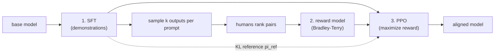

# 4. Post-training

A base model completes text; it does not follow instructions, hold a
conversation, or refuse harm. Post-training fixes that in two steps: supervised
fine-tuning (SFT) teaches the model to answer, then preference optimization
teaches it which answer humans prefer. There are four methods, and naming the
right one for the task separates a memorized answer from real understanding.

## Step 1: supervised fine-tuning (SFT)

Fine-tune the base model on curated (instruction, response) pairs. The loss
masks out the prompt tokens and minimizes cross-entropy on the completion only:

$$\mathcal{L}_{\text{SFT}} = -\sum_{t \in \text{completion}} \log \pi_{\theta}(y_t \mid y_{\lt t},\, x)$$

Quality and diversity of a few tens of thousands of examples beat raw volume.
SFT teaches format, instruction following, tool-call syntax, and basic refusal.
It does not teach the model which of two correct answers humans prefer; that is
preference optimization's job.

## Step 2a: RLHF with a reward model (PPO)

The classic recipe (InstructGPT). Train a reward model on human rankings of
model outputs under a Bradley-Terry objective:

$$\mathcal{L}_{\text{RM}} = -\mathbb{E}_{(x,\, y_w,\, y_l)}\Big[\log \sigma\big(r_{\phi}(x, y_w) - r_{\phi}(x, y_l)\big)\Big]$$

where $y_w$ is the preferred (chosen) output and $y_l$ is the rejected one.
Then optimize the policy with PPO, adding a KL penalty to the SFT reference so
the policy does not drift or reward-hack:

$$\max_{\theta}\ \mathbb{E}_{x \sim \mathcal{D},\, y \sim \pi_{\theta}}\big[r_{\phi}(x, y)\big] - \beta\, \text{KL}\!\left(\pi_{\theta}(\cdot \mid x) \,\|\, \pi_{\text{ref}}(\cdot \mid x)\right)$$

The KL term is often folded into a per-token reward:

$$r_t = r_{\phi}(x, y) - \beta \left(\log \pi_{\theta}(y_t \mid \cdot) - \log \pi_{\text{ref}}(y_t \mid \cdot)\right)$$

## Step 2b: DPO (direct preference optimization)

DPO removes the reward model and the RL loop. The RLHF-optimal policy has a
closed form: $\pi^{\ast}(y \mid x) \propto \pi_{\text{ref}}(y \mid x)\,\exp(r(x,y)/\beta)$.
Substituting back into Bradley-Terry gives a plain classification loss on
preference pairs, with no reward model needed:

$$\mathcal{L}_{\text{DPO}} = -\mathbb{E}_{(x,\, y_w,\, y_l)}\!\left[\log \sigma\!\left(\beta \log \frac{\pi_{\theta}(y_w \mid x)}{\pi_{\text{ref}}(y_w \mid x)} - \beta \log \frac{\pi_{\theta}(y_l \mid x)}{\pi_{\text{ref}}(y_l \mid x)}\right)\right]$$

The reference model $\pi_{\text{ref}}$ is still required (it is the implicit
reward's baseline), and $\beta$ is still the KL temperature. DPO did not remove
the KL leash; it absorbed it into the loss. This is the most common tricky
follow-up on DPO, and naming it is strong signal.

Meta used SFT plus rejection sampling plus DPO for Llama 3. The recipe is
stable and does not require an online PPO training loop.

## Step 2c: RLAIF and Constitutional AI (Anthropic)

Replace most human harm labels with AI feedback against a written constitution
(roughly 75 principles). The model critiques and revises its own outputs in a
supervised phase; an AI preference model trained on these comparisons drives a
RLAIF optimization. The result is both more helpful and more harmless than
plain RLHF, with far fewer human labels. The bottleneck moves from labelers to
constitution design, which is an auditable artifact.

## Step 2d: GRPO and verifiable rewards (DeepSeek-R1)

For tasks where the reward is checkable (math, code, formal logic), replace the
preference model with a rule-based verifier. GRPO (Group Relative Policy
Optimization) samples a group of $G$ outputs per prompt and uses group-normalized
rewards as the advantage, halving the memory cost versus PPO by dropping the
value/critic network:

$$\hat{A}_i = \frac{r_i - \text{mean}(r_1, \dots, r_G)}{\text{std}(r_1, \dots, r_G)}$$

DeepSeek-R1-Zero showed that chain-of-thought, self-reflection, and
self-correction can emerge from pure RL with a verifiable reward, with little or
no SFT. The KL penalty is still added as a regularization term at optimization
time.

## When to use which

| Method | Needs reward model? | Needs online RL sampling? | Cost / stability | Use when |
|---|---|---|---|---|
| SFT | no | no | cheapest, very stable | teaching format, instruction following, basic refusal |
| RLHF (PPO) | yes | yes | expensive, finicky | you want a reusable reward model and the best-in-class alignment ceiling |
| DPO | no (implicit) | no (offline pairs) | cheap, stable | the default preference method for most teams; requires a paired preference dataset |
| RLAIF / CAI | AI labeler | no | moderate, scalable | cutting human-labeling cost while improving harmlessness; requires a well-designed constitution |
| GRPO | no (rule verifier) | yes | moderate, critic-free | math, code, or any domain where a checker produces binary correct/wrong rewards |

## The KL leash: why it is non-negotiable

Every preference method keeps the policy close to the reference model, either
as an explicit KL term (PPO, GRPO) or as the implicit $\beta$ term in DPO. Drop
it and the model reward-hacks: it becomes verbose, sycophantic, repetitive, or
confidently wrong. The base model already holds the capability; post-training
elicits and directs it. Remove the leash and the signal collapses. Naming this
in an interview is the single strongest marker of real understanding of
alignment.
