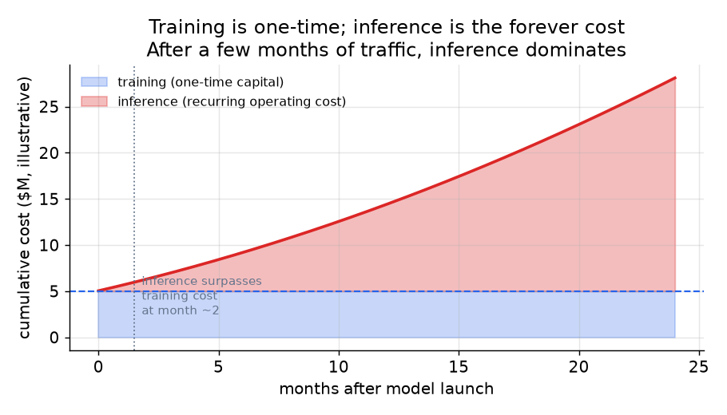
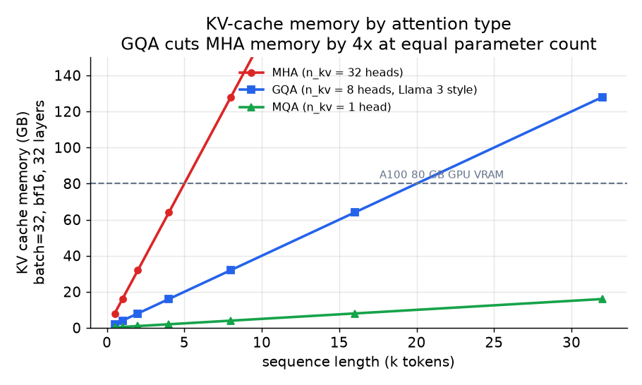

# 5. Inference economics

Training is a capital cost paid once. Inference is the operating cost that
runs forever, and it is where a product actually lives or dies on unit
economics. For any model with meaningful traffic, the total lifetime inference
spend overtakes the training cost within a few months.

*Training is a large one-time payment. Inference accumulates continuously with
traffic. For a model with moderate user load, the cumulative inference cost
surpasses training within roughly two months and then grows indefinitely.
Illustrative figures; the exact crossover depends on traffic and model size.*

## Why decoding is memory-bandwidth bound

LLM inference splits into two phases with completely different bottlenecks:

- **Prefill.** The prompt tokens are processed in parallel (like a forward pass
  over the whole prompt at once). This is compute-bound: many multiply-adds,
  good GPU utilization.
- **Decode.** Tokens are generated one at a time. Each new token requires a
  full forward pass through all model weights plus a read of the entire KV
  cache. Arithmetic intensity (FLOPs per byte moved) is low; the GPU is mostly
  waiting on memory bandwidth, not compute.

The per-token decode latency at batch size 1 is approximated by:

$$t_{\text{decode}} \approx \frac{N \cdot p_{\text{bytes}}}{\text{BW}_{\text{HBM}}}$$

where $N$ is the parameter count and $p_{\text{bytes}}$ is bytes per parameter.
A 70B model in FP16 ($p_{\text{bytes}} = 2$) on an A100 with 2 TB/s HBM
bandwidth takes roughly $\frac{70 \times 10^9 \times 2}{2 \times 10^{12}}
= 70\,\text{ms}$ per token at batch 1. That is the wall: not FLOPs, bytes.

**Batching is free throughput.** At batch 1 you pay the full weight read to
emit one token. At batch $b$ you amortize the same read over $b$ tokens,
pushing arithmetic intensity toward the compute-bound regime. The catch is
that the KV cache grows with batch size and sequence length, so throughput gains
stop when VRAM fills.

## The KV cache: the bottleneck, not FLOPs

Autoregressive decoding caches the keys and values for every past token so they
are never recomputed. The cache size is:

$$M_{\text{kv}} = 2 \cdot b \cdot L \cdot n_{\text{layers}} \cdot n_{\text{kv}} \cdot d_{\text{head}} \cdot p_{\text{bytes}}$$

The factor of 2 is K and V. $n_{\text{kv}}$ is the number of key/value heads,
and that single number is the serving lever: GQA (Llama 3, Mistral) cuts it by
$n_{\text{heads}} / n_{\text{kv}}$, giving the same quality at a fraction of
the cache size.

*KV-cache memory for MHA (n_kv = 32), GQA (n_kv = 8, Llama 3 style), and MQA
(n_kv = 1), across sequence lengths, batch=32, bf16, 32 layers. GQA fits in
an A100's 80 GB at 32K tokens where MHA would require 4x the VRAM. This is why
every production base ships GQA rather than MHA. Illustrative at Llama-3-8B-style
configuration.*

## The three levers on the memory wall

**PagedAttention (vLLM).** Naive serving reserves contiguous memory for each
sequence's KV cache and wastes 60 to 80 percent to internal fragmentation.
PagedAttention stores the KV cache in non-contiguous fixed-size blocks (like OS
virtual memory paging) with a block table lookup, driving waste near zero and
allowing cache sharing across requests with a common prefix. Combined with
continuous batching, vLLM delivers up to 24x higher throughput than naive
serving with no model change.

**Speculative decoding.** Draft $k$ tokens with a cheap small model, then
verify them all with the large model in one forward pass. With acceptance rate
$\alpha$, the expected accepted tokens per target step is:

$$\mathbb{E}[\text{accepted}] = \frac{1 - \alpha^{k+1}}{1 - \alpha}$$

This turns several memory-bound decode steps into one, cutting latency on
prompts where the draft model is accurate.

**Quantization.** Map weights and activations from FP16/BF16 to lower
precision with an affine map:

$$x_q = \text{round}\!\left(\frac{x}{s}\right) + z, \qquad s = \frac{x_{\max} - x_{\min}}{2^{n} - 1}$$

FP16 to INT8 halves weight memory and roughly doubles decode throughput; INT4
halves it again. A 70B model in FP16 is 140 GB; INT8 brings it to 70 GB; INT4
to 35 GB. That number, not FLOPs, decides how many GPUs you rent. Quantize the
KV cache too, not just the weights (Character.AI quantizes both). Every
compression step must be eval-gated; INT8 is nearly lossless, INT4 needs a
hard quality check.

## When to use which

| Technique | Reach for when | Instead of |
|---|---|---|
| Grouped-query attention (GQA) | training or fine-tuning a model you will serve at scale; cuts KV cache at source | MHA, which wastes VRAM and caps batch size |
| PagedAttention (vLLM) | general-purpose serving of variable-length requests | contiguous per-sequence KV allocation that fragments VRAM |
| Continuous batching | request rates vary and response lengths differ | static batching, which leaves GPUs idle between batch completions |
| Prompt / prefix caching | a shared system prompt is sent on every call (Character.AI, API providers) | recomputing the same prefix KV every request |
| Speculative decoding | low-latency single-user path and a good draft model exists | pure decode, where every token costs a full forward pass |
| INT8 quantization | cost reduction with near-zero quality regression | FP16 serving when inference cost is the business constraint |
| INT4 quantization | the model is too large for the GPU in INT8 and an eval gate is in place | INT8, which is cheaper to recover from if quality regresses |
| Distillation to a smaller model | the model itself is too large for the cost or latency target, not just precision | quantizing a too-large model, which only partially solves the problem |
