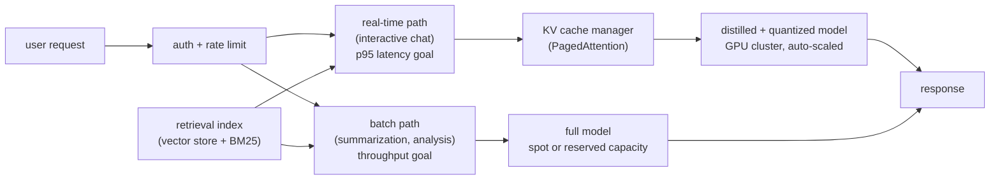

# 6. Serving and scaling

## RAG vs fine-tuning: the most commonly confused decision

Before designing the serving stack, resolve the single most common product
mistake: reaching for fine-tuning when RAG is the right answer, or vice versa.

**Fine-tuning teaches behavior.** It changes how the model writes, formats,
reasons, and refuses. It does not reliably teach facts, because the facts bake
in as weights that cannot be updated without another training run and that the
model may misremember or hallucinate.

**RAG teaches facts.** Retrieve the relevant passages at inference time and put
them in context. The model never hallucinates a fact it received two seconds ago
in its context window; it can also cite the source, which fine-tuning cannot do
from weights alone.

They compose, and most production systems use both: fine-tune the behavior
(tone, format, domain vocabulary, refusal style), retrieve the facts (product
catalog, case law, current news). Confusing them is the single most common
LLM-product mistake.

| The problem is | Use | Because |
|---|---|---|
| The model does not write in our citation style | fine-tuning (SFT / DPO) | style is behavior, not a fact; weights hold it efficiently |
| The model answers with outdated case law | RAG over a fresh index | law changes; baking it into weights creates a staleness and hallucination risk |
| The model refuses too many benign requests | post-training (SFT + DPO) | the refusal behavior is learned; refusal tuning changes it |
| The model does not know about our internal API | RAG or function calling | internal APIs change frequently; fine-tuning will not track them |
| The model does not follow our output JSON schema | SFT | schema is a format/behavior, stable enough to teach |
| The model hallucinates company facts | RAG with grounding + citations | facts change; retrieval with citation is the verifiable path |

## The serving architecture

The serving design splits traffic into two shapes:

Interactive and batch workloads have opposite bottlenecks. Interactive traffic
needs low time-to-first-token: use a distilled or quantized smaller model,
continuous batching, and prompt caching. Batch traffic needs high throughput:
use the full-precision model on spot capacity with large static batches.
Separating them avoids a batch job blocking an interactive user.

## Bottlenecks and fixes

| Bottleneck | First sign | Fix | Tradeoff |
|---|---|---|---|
| KV cache fills VRAM at load | OOM or forced batch-size reduction under peak traffic | PagedAttention (vLLM), GQA/MQA at training time | engineering complexity; GQA requires a re-trained base |
| Decode latency too high per user | p95 TTFT exceeds budget | smaller or quantized model; speculative decoding; prefix caching for shared prompts | small quality regression risk; eval-gate every compression |
| Hallucination on private or fresh facts | users report outdated or fabricated information | RAG with grounding; do not retrain to fix factual gaps | retrieval latency; index freshness SLA |
| Cost per token too high at volume | inference budget exceeds revenue threshold | INT8/INT4 quantization; distill to a smaller model; continuous batching to amortize weight reads | quality regression; distillation training cost |
| Model behavior degrades after quantization | eval scores drop post-compression | eval-gate on the full suite; fall back to INT8 if INT4 regresses | higher serving cost than the quantized target |
| Alignment drifts under adversarial users | jailbreaks succeed at scale | input/output filtering; periodic post-training refresh; red-team continuously | false-positive refusals on benign inputs |
| Stale facts reach users between RAG index updates | users receive outdated answers | freshness SLA on the index; add a "last updated" citation; fall back to "I don't know" | more indexing infra; higher latency per query if index is slow |

## Serving shape by use case

| Use case | Model size | Precision | KV variant | Batching | RAG |
|---|---|---|---|---|---|
| Interactive legal assistant (500 concurrent) | 7-13B | INT8 | GQA | continuous | yes, case-law index |
| Code completion (low latency) | 7B distilled | INT4 + eval gate | GQA / MQA | continuous + speculative decode | no |
| Overnight batch summarization | 70B | BF16 | GQA | large static batches | yes, if grounding needed |
| Chatbot at 20k+ QPS (Character.AI style) | custom small | INT8 + KV INT8 | MQA | continuous + inter-turn prefix cache | no (weights hold persona) |
