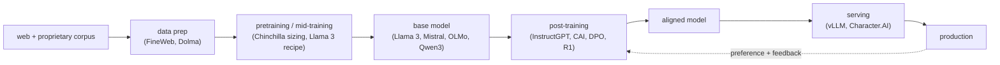

# 7. How teams do it in production

Every real system is one or more stages of the same lifecycle skeleton: data
cleaned and tokenized, a pretraining or mid-training run yields a base model,
post-training aligns it, and a serving stack wraps it for production, with
feedback looping back. What actually differs is which stage a team owns and what
the dominant cost or risk is at that stage.

## Where the designs diverge

| System | Stage owned | Method | Key lever | When it wins | Watch out | Metric it moves |
|---|---|---|---|---|---|---|
| Hugging Face FineWeb | data prep | filter + dedup 96 Common Crawl dumps to 15T tokens | learned quality classifier (FineWeb-Edu) | open pretrain data that beats prior public sets | keeps a small fraction; decontamination is critical | downstream benchmark per token |
| Ai2 Dolma / OLMo | data prep + open base | 3T-token open corpus, fully documented | reproducibility end to end | studying data curation; a truly open base | open data is a legal and safety commitment | corpus quality, reproducibility |
| Google DeepMind Chinchilla | pretraining | compute-optimal scaling study (400+ models) | roughly 20 tokens per parameter | fixed compute budget, sizing decisions | optimal for training, not inference | loss at fixed compute |
| Meta Llama 3 | full lifecycle | data + scale + SFT + rejection sampling + DPO | staged context extension; simple post-train | a strong open base plus instruct model | 405B pretrain is lab-scale | benchmark suite, human win rate |
| Mistral 7B | pretraining + serving | GQA + sliding-window attention | small KV cache at long context | efficient inference on a small model | 7B ceiling on hard tasks | tokens/sec, quality per FLOP |
| OpenAI InstructGPT | post-training | RLHF: reward model + PPO under KL | human preference as reward signal | making a base model follow instructions | reward hacking without the KL leash | preference win rate |
| Anthropic Constitutional AI | post-training | RLAIF against a written constitution | AI feedback replaces human labels | scaling alignment without armies of labelers | constitution design is the new bottleneck | harmlessness + helpfulness |
| DeepSeek-R1 | post-training (reasoning) | pure RL with rule-based rewards (GRPO) | verifiable reward, minimal SFT | math/code/reasoning tasks with a checker | reward only where verifiable | AIME, MATH, code benchmarks |
| vLLM | serving | PagedAttention + continuous batching | KV cache as OS-style paging | high-throughput cheap serving | engineering complexity | throughput (up to 24x over naive), cost/token |
| Character.AI | serving | INT8 + MQA + inter-turn prefix KV cache | aggressive multi-layer KV reduction | serving 20k+ QPS chat cheaply | quality vs quantization tradeoff | cost per query, tokens/sec |

## The shared pipeline

Under the lifecycle framing, all of these are the same skeleton at different
stages. The data recipe sets the capability ceiling; post-training decides
whether the model is usable and safe; serving decides whether the unit economics
work. A complete interview answer places the problem on exactly one stage and
reasons about the dominant cost there.

## The systems (first-party write-ups)

- **Hugging Face** [FineWeb: decanting the web for the finest text data at scale](https://huggingface.co/spaces/HuggingFaceFW/blogpost-fineweb-v1): a 15T-token open pretraining set from 96 Common Crawl dumps, with the filtering and deduplication recipe documented and ablated. *(data recipe)*

- **Ai2** [Dolma: an Open Corpus of Three Trillion Tokens for Language Model Pretraining Research](https://arxiv.org/abs/2402.00159): a fully open 3T-token corpus and toolkit, the data behind the open OLMo base model. *(data recipe)*

- **Google DeepMind** [Training Compute-Optimal Large Language Models (Chinchilla)](https://arxiv.org/abs/2203.15556): 400+ models show model size and tokens should scale together at roughly 20 tokens per parameter; a 70B Chinchilla beats a 280B Gopher at equal compute. *(training decision)*

- **Meta** [The Llama 3 Herd of Models](https://ai.meta.com/research/publications/the-llama-3-herd-of-models/): an end-to-end open recipe, careful data curation, staged context extension, and SFT plus rejection sampling plus DPO post-training. *(full lifecycle)*

- **Mistral** [Mistral 7B](https://mistral.ai/news/announcing-mistral-7b/): grouped-query plus sliding-window attention shrink the KV cache so a 7B model serves long context cheaply and beats larger models. *(architecture + serving)*

- **OpenAI** [Aligning language models to follow instructions (InstructGPT)](https://openai.com/index/instruction-following/): RLHF with a reward model and PPO under a KL penalty makes a 1.3B model preferred over 175B GPT-3 on instruction following. *(post-training)*

- **Anthropic** [Constitutional AI: Harmlessness from AI Feedback](https://www.anthropic.com/research/constitutional-ai-harmlessness-from-ai-feedback): RLAIF against a short written constitution replaces most human harm labels and is both more helpful and more harmless than plain RLHF. *(post-training)*

- **DeepSeek** [DeepSeek-R1: Incentivizing Reasoning Capability in LLMs via Reinforcement Learning](https://arxiv.org/abs/2501.12948): pure RL with rule-based rewards (GRPO) grows chain-of-thought and self-correction with little or no SFT. *(post-training, reasoning)*

- **vLLM** [Easy, Fast, and Cheap LLM Serving with PagedAttention](https://blog.vllm.ai/2023/06/20/vllm.html): paging the KV cache like OS virtual memory plus continuous batching delivers up to 24x higher throughput than naive serving. *(serving)*

- **Character.AI** [Optimizing AI Inference at Character.AI](https://blog.character.ai/optimizing-ai-inference-at-character-ai-2/): INT8, multi-query attention, and a tree-structured inter-turn KV cache serve 20k+ queries per second at a fraction of the cost. *(serving)*

> **Model Zoo.** Browse validated architecture graphs for the key models above:
> [Llama 3 8B](https://www.neurarch.com/?import=https://raw.githubusercontent.com/neurarch-ai/awesome-llm-model-zoo/main/architectures/llama3-8b/model.json),
> [Mistral 7B](https://www.neurarch.com/?import=https://raw.githubusercontent.com/neurarch-ai/awesome-llm-model-zoo/main/architectures/mistral-7b/model.json),
> [DeepSeek-V3](https://www.neurarch.com/?import=https://raw.githubusercontent.com/neurarch-ai/awesome-llm-model-zoo/main/architectures/deepseek-v3/model.json),
> [OLMo 7B](https://www.neurarch.com/?import=https://raw.githubusercontent.com/neurarch-ai/awesome-llm-model-zoo/main/architectures/olmo-7b/model.json).
> Each graph is shape-checked end to end at real dimensions. Full index:
> [github.com/neurarch-ai/awesome-llm-model-zoo](https://github.com/neurarch-ai/awesome-llm-model-zoo).
