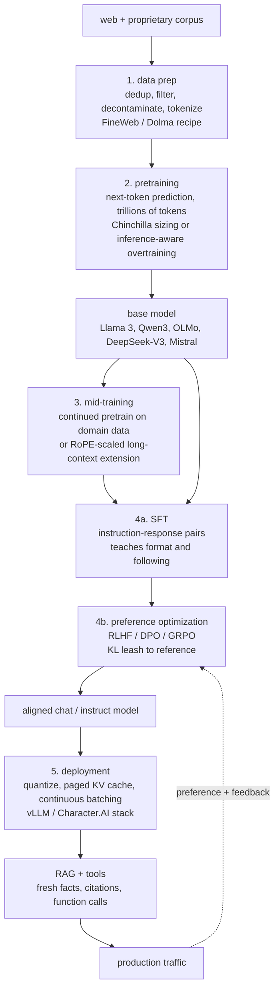

# 9. Summary

## One-page recap

- **Name the five stages before sizing anything.** Data prep, pretraining,
  mid-training, post-training, deployment. Most product teams enter at the base
  model; stages 1 and 2 are upstream and shared.
- **Almost never a from-scratch pretrain.** The right answer for a product team
  is almost always mid-training an open base (Llama 3, Qwen3, OLMo) on
  proprietary domain data, then post-training for instruction following.
- **Data quality is the capability ceiling.** Model quality is bounded by data
  long before it is bounded by architecture. Deduplication, quality filtering,
  and decontamination against eval sets are non-negotiable. A benchmark number
  without a decontamination claim is meaningless.
- **Chinchilla-optimal is for training, not serving.** The compute-optimal rule
  (roughly 20 tokens per parameter) minimizes training compute. If you serve at
  scale, deliberately overtrain a smaller model past that point (Llama 3 8B at
  roughly 1800 tok/param) so inference stays cheap forever.
- **Post-training has four methods; the KL leash holds them all together.** SFT
  teaches format, DPO is the cheap stable preference default, RLHF (PPO) when
  you need a reusable reward model, GRPO when the reward is verifiable (math,
  code). Every method needs the KL leash to the reference policy. Drop it and
  the model reward-hacks.
- **Inference, not training, is the recurring cost.** Decoding is
  memory-bandwidth bound. The KV cache, not FLOPs, caps throughput. Paged KV
  (vLLM), GQA, continuous batching, prefix caching, speculative decoding, and
  quantization are the levers. Eval-gate every compression step.
- **RAG for facts, fine-tuning for behavior.** They compose. Confusing them is
  the most common product mistake.
- **Safety is measured, not asserted.** Track attack success rate,
  false-refusal rate, and jailbreak robustness as release gates. Assume
  adversarial evasion is continuous.

## The lifecycle on one page

## Test yourself

1. An interviewer says "build an LLM for our domain." What is the first
   question you ask, and what stage does the answer most likely point to?

2. A team trained a 70B model on 280B tokens. Chinchilla says roughly 20
   tokens per parameter. Were they compute-optimal, and should they fix it?

3. DPO has no reward model and no RL loop. Why does it still need a reference
   model and a $\beta$ parameter?

4. Your post-training run finished and MMLU dropped 4 points versus the base
   model. What happened and how do you diagnose it?

5. Your serving cost is $2M per month and you need to cut it in half. Name
   three levers in order of how you would apply them, and the risk of each.

6. A user says "we should just fine-tune the model on all our internal
   documents." Give the precise conditions under which fine-tuning is the right
   answer versus RAG, and explain why they often compose.

## Further reading

- Full dense reference with all derivations, case studies, and math:
  [../../topics/13-llm-lifecycle.md](../../topics/13-llm-lifecycle.md)
- Post-training deep dive (SFT, LoRA, reward modeling, PPO, DPO, GRPO):
  [../../topics/05-post-training-pipeline.md](../../topics/05-post-training-pipeline.md)
- Data curation and pretraining (FineWeb, Dolma, Chinchilla, MoE):
  [../../topics/14-data-curation-and-pretraining.md](../../topics/14-data-curation-and-pretraining.md)
- Continued pretraining and long-context adaptation (RoPE scaling, YaRN):
  [../../topics/15-continued-pretraining-and-long-context.md](../../topics/15-continued-pretraining-and-long-context.md)
- KV cache and long-context serving:
  [../../topics/02-long-context-and-kv-cache.md](../../topics/02-long-context-and-kv-cache.md)
- Inference serving at scale (PagedAttention, speculative decoding, batching):
  [../../topics/04-inference-serving-at-scale.md](../../topics/04-inference-serving-at-scale.md)
- Model Zoo (Llama 3, DeepSeek-V3, OLMo, Mistral, Qwen3, GPT-2 validated graphs):
  [github.com/neurarch-ai/awesome-llm-model-zoo](https://github.com/neurarch-ai/awesome-llm-model-zoo)
