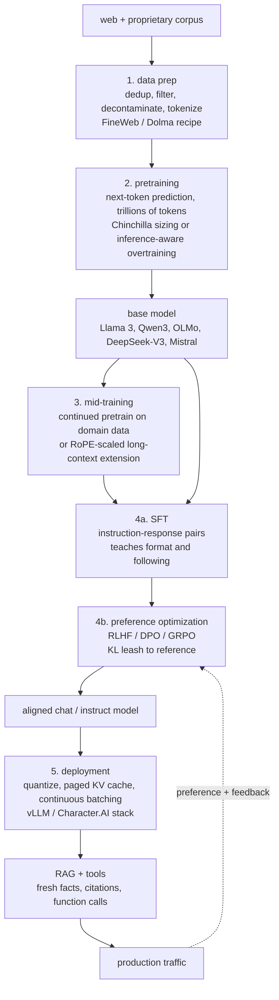

# 9. Summary

## One-page recap

- **Name the five stages before sizing anything.** Data prep, pretraining,
  mid-training, post-training, deployment. Most product teams enter at the base
  model; stages 1 and 2 are upstream and shared.
- **Almost never a from-scratch pretrain.** The right answer for a product team
  is almost always mid-training an open base (Llama 3, Qwen3, OLMo) on
  proprietary domain data, then post-training for instruction following.
- **Data quality is the capability ceiling.** Model quality is bounded by data
  long before it is bounded by architecture. Deduplication, quality filtering,
  and decontamination against eval sets are non-negotiable. A benchmark number
  without a decontamination claim is meaningless.
- **Chinchilla-optimal is for training, not serving.** The compute-optimal rule
  (roughly 20 tokens per parameter) minimizes training compute. If you serve at
  scale, deliberately overtrain a smaller model past that point (Llama 3 8B at
  roughly 1800 tok/param) so inference stays cheap forever.
- **Post-training has four methods; the KL leash holds them all together.** SFT
  teaches format, DPO is the cheap stable preference default, RLHF (PPO) when
  you need a reusable reward model, GRPO when the reward is verifiable (math,
  code). Every method needs the KL leash to the reference policy. Drop it and
  the model reward-hacks.
- **Inference, not training, is the recurring cost.** Decoding is
  memory-bandwidth bound. The KV cache, not FLOPs, caps throughput. Paged KV
  (vLLM), GQA, continuous batching, prefix caching, speculative decoding, and
  quantization are the levers. Eval-gate every compression step.
- **RAG for facts, fine-tuning for behavior.** They compose. Confusing them is
  the most common product mistake.
- **Safety is measured, not asserted.** Track attack success rate,
  false-refusal rate, and jailbreak robustness as release gates. Assume
  adversarial evasion is continuous.

## The lifecycle on one page

```mermaid
flowchart TD
  WEB["web + proprietary corpus"]
  PREP["1. data prep<br/>dedup, filter, decontaminate, tokenize<br/>FineWeb / Dolma recipe"]
  PT["2. pretraining<br/>next-token prediction, trillions of tokens<br/>Chinchilla sizing or inference-aware overtraining"]
  BASE["base model<br/>Llama 3, Qwen3, OLMo, DeepSeek-V3, Mistral"]
  MID["3. mid-training<br/>continued pretrain on domain data<br/>or RoPE-scaled long-context extension"]
  SFT["4a. SFT<br/>instruction-response pairs<br/>teaches format and following"]
  PREF["4b. preference optimization<br/>RLHF / DPO / GRPO<br/>KL leash to reference"]
  CHAT["aligned chat / instruct model"]
  SERVE["5. deployment<br/>quantize, paged KV cache, continuous batching<br/>vLLM / Character.AI stack"]
  RAG["RAG + tools<br/>fresh facts, citations, function calls"]
  PROD["production traffic"]

  WEB --> PREP --> PT --> BASE
  BASE --> MID --> SFT
  BASE --> SFT
  SFT --> PREF --> CHAT --> SERVE --> RAG --> PROD
  PROD -.preference + feedback.-> PREF
```

## Test yourself

Answers are collapsed. Attempt each question before opening one.

1. An interviewer says "build an LLM for our domain." What is the first
   question you ask, and what stage does the answer most likely point to?

   

Answer

   Ask **what capability the company does not get from an existing API today**,
   which is the same as asking what gap justifies owning weights at all. That is
   the question section [1](01-clarifying-requirements.md) opens the dialogue
   with, and the answer names the stage rather than the model. In the chapter's
   scenario the gap is data residency for sensitive legal documents plus domain
   terminology and citation style, and that combination points at **mid-training
   an open base plus post-training**, stages 3 and 4, not a from-scratch
   pretrain. The rule-of-thumb table in the same section maps the other common
   phrasings: "follow our style guide" is post-training only, "we need 200K
   context" is mid-training as context extension, and only "a new foundation
   model for a new language" is genuinely stage 2. State which stage the problem
   belongs to before you size anything, because jumping to "we will pretrain"
   when mid-training would do the job is the fastest way to fail the interview.

   

2. A team trained a 70B model on 280B tokens. Chinchilla says roughly 20
   tokens per parameter. Were they compute-optimal, and should they fix it?

   

Answer

   No, they were badly undertrained: 280B tokens over 70B parameters is 4 tokens
   per parameter, about **five times below the Chinchilla ratio** of roughly 20,
   which is the same shape of mistake as Gopher (a 280B model on 300B tokens).
   Run the chapter's own arithmetic from section
   [3](03-pretraining-and-scaling.md): their budget is
   $C \approx 6ND \approx 1.2 \times 10^{23}$ FLOPs, and substituting $D = 20N$
   into $C = 120N^2$ gives $N = \sqrt{C/120} \approx 31$B parameters on roughly
   630B tokens as the compute-optimal split for the money they already spent. So
   at equal compute a ~31B model would have beaten their 70B, exactly the
   Chinchilla result that a 70B beats a 280B Gopher. Whether to fix it depends on
   which cost you are optimizing, and the fix is usually not "keep feeding tokens
   to the 70B": if this model will be served at scale, a 70B is expensive to
   decode forever, and the inference-aware move is to train a **smaller model
   deliberately overtrained past its own optimum** the way Llama 3 8B was (about
   1800 tokens per parameter). Only when training compute is the binding cost and
   this exact parameter count is required does continuing the same run make
   sense.

   

3. DPO has no reward model and no RL loop. Why does it still need a reference
   model and a $\beta$ parameter?

   

Answer

   Because **DPO absorbed the KL leash into its loss rather than removing it**.
   The RLHF-optimal policy has a closed form,
   $\pi^{\ast}(y \mid x) \propto \pi_{\text{ref}}(y \mid x)\exp(r(x,y)/\beta)$,
   and substituting that back into the Bradley-Terry objective is what turns
   preference learning into a plain classification loss, so the reference model
   survives inside the log-ratio $\log(\pi_{\theta} / \pi_{\text{ref}})$ as the
   implicit reward's baseline. Without that anchor the policy has nothing to be
   measured against and can drift to degenerate solutions. $\beta$ is the same KL
   temperature as in PPO: small $\beta$ lets the policy move far from the
   reference (more optimization, more drift risk), large $\beta$ holds it close.
   Naming this is the strongest signal on the DPO follow-up (sections
   [4](04-post-training.md) and [8](08-interview-qa.md)); the sharper extension is
   **likelihood displacement**, where the leash holds but the margin-only
   objective still lets the chosen response's absolute log-probability fall, so
   you monitor that log-probability directly rather than trusting the margin.

   

4. Your post-training run finished and MMLU dropped 4 points versus the base
   model. What happened and how do you diagnose it?

   

Answer

   This is the **alignment tax**: general capability regressed while you were
   optimizing format and preference, and the usual causes are a full fine-tune
   without general replay data (catastrophic forgetting), a KL leash that is too
   loose so the policy drifted off the base distribution, or an eval artifact
   rather than a real loss. Diagnose by bisecting the pipeline: score the base,
   the SFT-only checkpoint, and the post-preference checkpoint on the same suite,
   which localizes the drop to one stage before you change anything. Then check
   the cheapest explanation first, **chat template drift between training and
   serving** (section [6](06-serving-and-scaling.md)), because a mis-parsed turn
   format looks exactly like a capability loss on a harness. If the drop is real
   and lands in preference tuning, inspect the measured KL from the reference and
   raise $\beta$; if it lands in SFT or mid-training, the fixes from section
   [6](06-serving-and-scaling.md) apply: prefer LoRA over full fine-tuning, mix a
   fraction of general data back in, and lower the learning rate. Finally weigh
   the 4 points against what post-training is supposed to move, since section
   [2](02-the-five-stages.md) is explicit that each stage has its own metric and
   preference win rate, not MMLU, is the post-training metric.

   

5. Your serving cost is \$2M per month and you need to cut it in half. Name
   three levers in order of how you would apply them, and the risk of each.

   

Answer

   Apply them cheapest-quality-cost first, because decode is memory-bandwidth
   bound and the bill tracks bytes moved per token. **One, INT8 quantization**
   (weights, and the KV cache too, as Character.AI does): it halves the bytes
   read per token and roughly doubles decode throughput, taking a 70B model from
   140 GB to 70 GB and therefore cutting the GPU count directly. The risk is a
   small quality regression, so it is eval-gated, but section
   [5](05-inference-economics.md) calls INT8 nearly lossless. **Two, fix the
   serving stack**: vLLM with PagedAttention, continuous batching, and prefix
   caching on the shared system prompt, which reclaims the 60 to 80 percent of
   VRAM that naive contiguous KV allocation wastes and delivers up to 24x the
   throughput of naive serving with no model change. The risk here is engineering
   complexity, not quality, and section [6](06-serving-and-scaling.md) adds that
   splitting the interactive and batch paths keeps a long batch job from spiking
   interactive p95. **Three, shrink the model itself**: INT4 behind a hard eval
   gate, or distillation to a smaller student. This is last because it is the
   only lever that trades answer quality directly, and distillation additionally
   costs a training run.

   

6. A user says "we should just fine-tune the model on all our internal
   documents." Give the precise conditions under which fine-tuning is the right
   answer versus RAG, and explain why they often compose.

   

Answer

   **Fine-tune for behavior, retrieve for facts.** Fine-tuning is right when the
   gap is how the model writes, formats, reasons, or refuses (citation style,
   output JSON schema, tone, tool-call syntax, refusal policy) and that behavior
   is stable enough to be worth baking into weights. RAG is right when the gap is
   facts, and specifically under any of three conditions from section
   [6](06-serving-and-scaling.md): the knowledge changes, the answer must cite a
   source, or the corpus is larger than model capacity. The decisive boundary is
   the update rate: the moment knowledge changes faster than your
   retrain-and-redeploy cadence, weights are structurally always stale, and
   retrieval is the only mechanism that can keep up. Note also that "all our
   internal documents" is raw text, not instruction pairs, so mechanically it is a
   mid-training corpus rather than SFT data (section [8](08-interview-qa.md)), and
   mid-training shifts what the model knows but still cannot cite a source. They
   compose because the two failure modes are different and complementary:
   retrieval misses a fact it never found, weights confidently state the stale
   version they memorized, so production systems fine-tune the style and retrieve
   the facts, exactly as the chapter's legal build does.

   

## Further reading

- The capstone: [the complete build](10-putting-it-together.md), where every
  choice in this chapter is committed once for the scenario, costed, rebuilt
  under two other constraint sets, and compressed into a runnable one-file compute-optimal planner.
- Full dense reference with all derivations, case studies, and math:
  [../../topics/13-llm-lifecycle.md](../../topics/13-llm-lifecycle.md)
- Post-training deep dive (SFT, LoRA, reward modeling, PPO, DPO, GRPO):
  [../../topics/05-post-training-pipeline.md](../../topics/05-post-training-pipeline.md)
- Data curation and pretraining (FineWeb, Dolma, Chinchilla, MoE):
  [../../topics/14-data-curation-and-pretraining.md](../../topics/14-data-curation-and-pretraining.md)
- Continued pretraining and long-context adaptation (RoPE scaling, YaRN):
  [../../topics/15-continued-pretraining-and-long-context.md](../../topics/15-continued-pretraining-and-long-context.md)
- KV cache and long-context serving:
  [../../topics/02-long-context-and-kv-cache.md](../../topics/02-long-context-and-kv-cache.md)
- Inference serving at scale (PagedAttention, speculative decoding, batching):
  [../../topics/04-inference-serving-at-scale.md](../../topics/04-inference-serving-at-scale.md)
- Model Zoo (Llama 3, DeepSeek-V3, OLMo, Mistral, Qwen3, GPT-2 validated graphs):
  [github.com/neurarch-ai/awesome-llm-model-zoo](https://github.com/neurarch-ai/awesome-llm-model-zoo)
