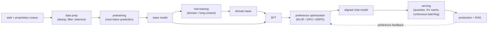

# The LLM Lifecycle

An interviewer rarely says "design an LLM." They say: **"Your company wants its
own language model for a domain. Walk me through the whole build from data to
production, where the money goes, and where the risk goes."**

The trap is jumping to "fine-tune GPT" or "we will pretrain a 70B." Building
with LLMs is five distinct stages, each with its own data, its own compute
profile, its own failure mode, and its own eval. The signal is that you name the
stages, place your problem in the right one (almost never a from-scratch
pretrain), and reason about the two costs that dominate: **data quality up
front** and **inference at scale** on the back end.

## Sections

1. [Clarifying requirements](01-clarifying-requirements.md) - the dialogue that scopes the real question, which stage it belongs to, and the consequences of getting it wrong.
2. [The five stages](02-the-five-stages.md) - data prep, pretraining, mid-training, post-training, deployment: what each stage takes as input and produces as output.
3. [Pretraining and scaling](03-pretraining-and-scaling.md) - compute-optimal sizing, Chinchilla, the shift to inference-aware overtraining, and the KaTeX for both.
4. [Post-training](04-post-training.md) - SFT, RLHF, DPO, GRPO: the four methods, when to use each, and the KL leash that holds them all together.
5. [Inference economics](05-inference-economics.md) - why inference dominates cost, the KV cache as the bottleneck, quantization, and the key tradeoffs.
6. [Serving and scaling](06-serving-and-scaling.md) - RAG vs fine-tuning, serving architectures, and a bottlenecks table.
7. [How teams do it in production](07-how-teams-do-it-in-production.md) - named companies, what diverges, and first-party links.
8. [Interview Q&A](08-interview-qa.md) - commonly asked, tricky, and commonly answered wrong, with clear answers.
9. [Summary](09-summary.md) - recap, the 5-stage mermaid diagram, test-yourself questions, and further reading.

## The lifecycle on one page

Read the sections in order the first time; they build on each other. Each
section opens with the question an interviewer actually asks, then answers it.
