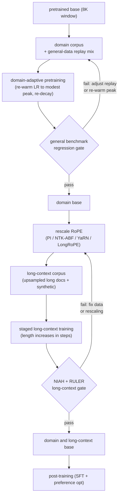

# 9. Summary

## One-page recap

- **This stage is mid-training, and it has two dialects.** Lab-side, you are still
  mid-run: the knob is the data mixture and when you decay, the anneal phase is
  where the best data goes, and a stable-phase checkpoint branches into many short
  microanneals. Practitioner-side, the base is already fully decayed, which is why
  your recipe adds a learning-rate re-warm and a replay fraction that the lab
  version does not need. Mixing the recipes up is the usual mistake.

- **Name the two axes before you design.** Domain adaptation (DAPT) and context
  extension are independent problems with different failure modes and different
  tools. Solving one with the other's tool is the first tell of a shallow answer.

- **Continued pretraining is a controlled re-entry, not "just keep training."**
  The base finished fully decayed. Re-warm the learning rate to a modest peak,
  re-decay, and replay a fraction of general data. Those three choices prevent the
  two ways a DAPT run fails: stalling at the decayed floor and catastrophic
  forgetting at the original peak.

- **Catastrophic forgetting is silent.** It shows up outside the domain slice, so
  the only way to detect it is to run the full general-evaluation suite before and
  after, not just the domain benchmark. Gate on the regression; do not assert it.

- **Naive extrapolation fails.** Setting max position to 128K without rescaling
  RoPE frequencies produces garbage past the original window. Extension is a
  rescale plus a training run on genuine long documents, staged in length.

- **Uniform interpolation is the baseline, not the goal.** Every better method
  (NTK-ABF, YaRN, LongRoPE) is a way to scale low-frequency (global) dimensions
  while sparing high-frequency (local) ones, because the model must still
  distinguish position $m$ from position $m+1$ while learning to reach position
  $m+100000$.

- **NIAH is a smoke test; RULER is the gate.** Needle-in-a-haystack is single-hop
  retrieval often anchored at the edge. RULER's multi-hop, aggregation, and multi-
  needle tasks reveal the effective context, which is almost always shorter than
  the configured one. Report recall as a function of depth to catch the lost-in-
  the-middle decay.

- **Long context is a serving-systems cost.** Prefill attention is quadratic in
  length; the KV cache is linear. GQA, KV quantization, FlashAttention, and paged
  attention are mandatory at 128K. Budget both before shipping the length.

- **Long context and retrieval compose.** Long context for one big document; RAG
  for a corpus. They are not substitutes.

## The whole pipeline on one page

## Test yourself

Answers are collapsed. Attempt each question before opening one.

1. A DAPT run lifts the domain benchmark by eight points. What else must you
   check before promoting the adapted base, and where is the forgetting most
   likely to hide?

   

Answer

   Run the **full general-benchmark suite before and after** the run and gate
   promotion on the regression bar fixed in
   [section 1](01-clarifying-requirements.md): MMLU, GSM8K, and an
   instruction-following task such as MT-Bench, none of them regressing by more
   than two percentage points. A domain gain of eight points that costs five
   points of MMLU is usually a net product loss, and you only see it if you
   measure. The forgetting hides **outside the domain slice**, concentrated in
   the capabilities the domain corpus never exercises: math reasoning, code, and
   general instruction following. That is why a single averaged score is not
   enough; a targeted skill can collapse while the average stays flat, so run the
   specific suites ([section 5](05-evaluation.md)). If a benchmark does regress,
   [section 3](03-the-mid-training-phase.md) gives the check order: was replay in
   the mix at all, then was the re-warm peak too high, then was the corpus large
   enough. Asserting no forgetting without a before-and-after gate is the
   quietly fatal mistake in DAPT.

   

2. A colleague sets `max_position_embeddings` to 200000 in the config. What will
   happen at inference on a 150K prompt, and what two steps actually produce a
   working 150K model?

   

Answer

   The model will accept the prompt and produce **garbage past its original 8K
   window**. That config field only sizes a position-embedding table or caps the
   allowed position index, and a RoPE model has no learned position table at all:
   rotation angles are computed on the fly as position times per-dimension
   frequency, so raising the number just lifts the guardrail on weights that have
   never seen those angles. The low-frequency dimension pairs are the ones that
   break, because they complete less than one full rotation across the trained
   window and were therefore only ever shown a short arc; the runnable file in
   [section 10](10-putting-it-together.md) marks exactly those three slowest
   pairs UNSEEN at position 65535. The two steps that actually work are: **one,
   rescale the RoPE frequencies** (PI, NTK-ABF, YaRN, or LongRoPE), and **two,
   run a short continued-training pass on genuinely long documents**, upsampled
   with real long-range dependencies rather than packed short docs, and staged in
   length increments the way Llama 3 goes 8K to 128K in six stages
   ([section 4](04-context-extension.md)). Then gate the result on NIAH
   recall-by-depth plus RULER, because the configured length is not the effective
   one.

   

3. Explain in one sentence each why uniform position interpolation hurts short
   prompts, why NTK-ABF helps, and why YaRN is better still.

   

Answer

   **Uniform PI** divides every RoPE frequency by the same length scale $s$,
   including the high-frequency pairs that encode adjacency, so neighboring
   tokens land at almost the same angle and local ordering blurs (at $s = 8$ the
   fastest pair's adjacent-token step drops from 1.000 to 0.125 radians, crowded
   8x). **NTK-ABF** helps because it raises the RoPE base instead of dividing
   positions, $b' = b \cdot s^{d/(d-2)}$, which rescales non-uniformly by
   construction: the low-frequency dimensions move a lot and the high-frequency
   ones barely move, which is how Code Llama trains at 16K with the base raised
   from 10000 to 1000000 and still extrapolates usably to 100K. **YaRN** is
   better still because it makes that non-uniformity explicit and principled,
   classifying each dimension by how many rotations its wavelength completes
   across the original window so low-frequency dimensions are interpolated,
   high-frequency ones are left near-unscaled, a ramp blends the middle band, and
   a softmax-temperature correction $1/\sqrt{t} = 0.1 \ln s + 1$ counters the
   attention-entropy increase that a longer sequence causes. The through-line is
   that every method after PI is a way to spare local resolution while stretching
   global reach, which is why the chapter treats uniform interpolation as the
   baseline to beat rather than the goal
   ([section 4](04-context-extension.md)).

   

4. You have NIAH results showing 95 percent recall at 128K. An engineer says
   "long context works." What additional eval do you run before agreeing, and
   what specific failure mode are you checking for?

   

Answer

   Run **RULER**, and insist on the NIAH numbers as a recall-by-depth heatmap
   rather than one averaged figure. NIAH is single-hop retrieval of one verbatim
   fact, often anchored near an edge of the window where recall is highest, so a
   95 percent average can coexist with a broken model. The failure mode you are
   checking for is that the **effective context is shorter than the configured
   one**: RULER's multiple needles, multi-hop variable tracing, aggregation, and
   long-context QA routinely fail on models that pass NIAH, and NVIDIA's finding
   is that most models claiming 32K or more degrade sharply well before their
   advertised length. Effective context length is defined as the longest window
   at which aggregate accuracy stays above a fixed threshold, commonly 85 percent
   of the accuracy at a short reference length such as 4K, so a model that claims
   128K but crosses that threshold at 32K has an effective context of 32K. The
   second failure mode the depth plot exposes is **lost in the middle**, the
   U-shaped curve where a fact at 50 percent depth is the hardest to retrieve
   even well inside the trained length. Perplexity on long documents does not
   substitute for either check; it stays low while retrieval is broken
   ([section 5](05-evaluation.md)).

   

5. Your 128K model OOMs on a 64-token batch during decoding. Name two serving
   techniques that address this without reducing the context window.

   

Answer

   Decoding OOM at long context is a **KV-cache** problem, since KV memory grows
   linearly in both length and batch:
   $M_{\text{kv}} = 2 \cdot n_{\text{layers}} \cdot n_{\text{kv}} \cdot d_{\text{head}} \cdot L \cdot b \cdot s_{\text{bytes}}$.
   Two techniques that keep the window intact: **KV
   quantization**, storing the cached K and V tensors at 8-bit or 4-bit for a
   small quality cost, and **paged attention** (vLLM), which maps the cache to
   fixed-size blocks instead of one contiguous pre-allocated buffer so
   fragmentation and heterogeneous batch lengths stop forcing premature OOM.
   Grouped-query attention is the third and largest lever, shrinking
   $n_{\text{kv}}$ by sharing K and V heads across groups of Q heads, but it has
   to be baked in at pretraining and so is not a fix for an already-trained
   model. The magnitudes from [section 10](10-putting-it-together.md) show why
   this dominates: an 8B-class configuration with 32 layers, 8 KV heads via GQA,
   head dimension 128, and fp16 holds about 8.6 GB of KV cache for a single 64K
   sequence, against 34.4 GB for the same model with full multi-head attention,
   and int8 quantization halves the 8.6 GB again. Note that FlashAttention and
   chunked prefill will not help here; they address the quadratic prefill side,
   not the linear cache that binds during decoding
   ([section 6](06-serving-and-scaling.md)).

   

6. A user asks whether to use long context or RAG for a 500-document knowledge
   base. What is the right answer, and why?

   

Answer

   **RAG.** The rule is corpus versus single document: long context is for one
   big document the model must reason over whole, where retrieval would split the
   reasoning across chunk boundaries, and retrieval is for a collection you pull
   the few relevant chunks from. A 500-document knowledge base is a corpus, so
   stuffing it into the window fails on three counts at once: prefill attention
   is quadratic in length and the KV cache is linear, both paid per query and per
   token; recall decays toward the middle of the window; and the model
   reprocesses the entire corpus on every single request. The two are not
   substitutes but compose: retrieve over the corpus, and extend the window for
   the individual long document a retrieved answer has to be reasoned over whole.
   [Section 10](10-putting-it-together.md) lists "extending to 1M to avoid
   building retrieval over the corpus" as the canonical over-engineering answer
   for exactly this case. Long context replacing retrieval is one of the traps in
   [section 8](08-interview-qa.md), and stating the composition rather than
   picking a side is the signal here.

   

## Further reading

- The capstone: [the complete build](10-putting-it-together.md), where every
  choice in this chapter is committed once for the scenario, costed, rebuilt
  under two other constraint sets, and compressed into a runnable one-file RoPE-scaling calculator.
- Dense reference (all mechanisms, math, case studies):
  [topics/15-continued-pretraining-and-long-context.md](../../topics/15-continued-pretraining-and-long-context.md)
- Per-company teardowns (Llama 3, Code Llama, YaRN, LongRoPE, Yi, Qwen2.5, Mila):
  see the teardown entries in [tools/teardowns/15.md](../../tools/teardowns/15.md)
- Side-by-side mechanism comparison and quadrant chart:
  [tools/comparisons/15.md](../../tools/comparisons/15.md)
