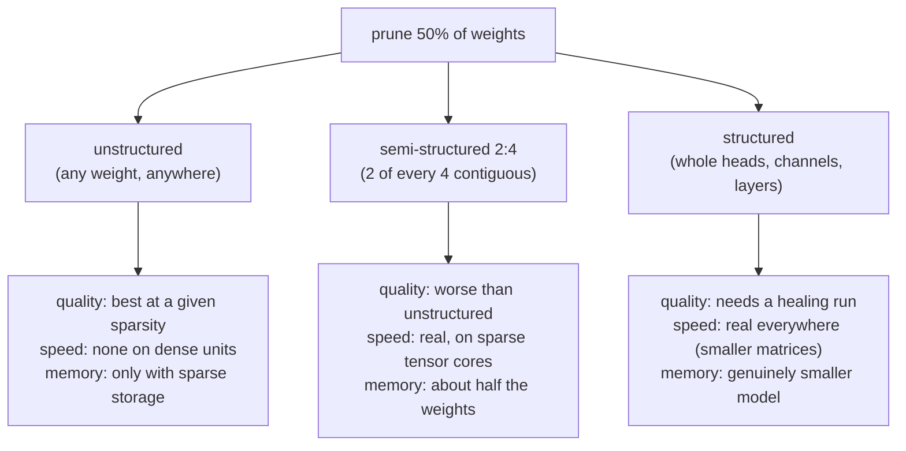

# 4. Pruning and sparsity

Pruning removes weights. Whether that removal buys anything depends entirely on the
*shape* of what you removed, which is why this is the lever with the widest gap
between the paper number and the deployed result.

## Three shapes, three completely different outcomes

The middle column is the whole lesson. Unstructured sparsity is the easiest to
achieve and the hardest to cash in: a dense matmul unit does the same work whether
the zeros are there or not. The 2:4 pattern (exactly two nonzeros in every group of
four along the reduction dimension) exists because it is the compromise modern
accelerators can actually skip work for, and it costs quality precisely because the
constraint is rigid.

## Choosing what to remove

Magnitude alone is a weak criterion in transformers, because a small weight
multiplying a large activation matters more than a large weight multiplying a dead
one. The two references bracket the design space.

**One-shot with error compensation.** SparseGPT solves a layer-wise reconstruction
problem: prune and then adjust the remaining weights to compensate, using
second-order information, which makes 50 percent one-shot sparsity viable on very
large models without retraining
([SparseGPT](https://arxiv.org/abs/2301.00774)).

**One-shot, no reconstruction, almost free.** Wanda scores each weight by its
magnitude times the norm of its corresponding input activation, computed per output
row, and simply removes the lowest scores:

$$S_{ij} = |W_{ij}| \cdot \lVert X_j \rVert_2$$

No weight updates, no solver, and it is competitive with the reconstruction approach
([A Simple and Effective Pruning Approach for Large Language Models](https://arxiv.org/abs/2306.11695)).
This formula is worth memorizing: it makes the "why not just magnitude" point in one
line, and it generalizes (the same activation-awareness idea drives AWQ on the
quantization side).

## Structured pruning: making a genuinely smaller model

Structured pruning removes units the architecture is built from: attention heads,
FFN intermediate channels, embedding dimensions, or whole layers. The result is a
smaller dense model that is fast on any hardware, and the cost is that quality drops
enough to require a **healing** run, continued pretraining on billions of tokens.

Two axes, with different damage profiles:

- **Width** (heads, channels, hidden size) degrades gracefully and heals well. It is
  the safer default.
- **Depth** (dropping layers) gives better latency per unit removed, because layers
  are serial, but damages multi-step behavior disproportionately: long chains of
  reasoning and long-context aggregation are exactly what the removed depth was
  doing. Test those capabilities specifically before accepting a depth-pruned model.

Two production-shaped recipes:

- **Prune from a big base, then continue pretraining.** Sheared LLaMA targets a
  desired final architecture, prunes to it, and continues pretraining with dynamic
  data loading, reaching a competitive small model for a fraction of the tokens a
  from-scratch model would need ([Sheared LLaMA](https://arxiv.org/abs/2310.06694)).
- **Prune, then distill from the original as teacher.** The Minitron recipe combines
  structured pruning with knowledge distillation for the healing phase, which is
  substantially cheaper than training the small model from scratch and lands closer
  to the parent's quality ([Compact Language Models via Pruning and Knowledge
  Distillation](https://arxiv.org/abs/2407.14679)).

The second is the one to name when an interviewer asks how you would build a small
model without a pretraining budget: **prune the big one to the target shape, then
distill the big one into it.**

## Mixture-of-experts is its own case

For MoE models the interesting sparsity already exists: only a few experts run per
token. The compression question becomes which experts you can drop or merge for a
given deployment, since expert usage is highly skewed and a deployment that serves
one domain may never route to most of them. That is a serving-time capacity decision
as much as a compression one, and it interacts with expert parallelism (see
[inference serving](../inference-serving/05-parallelism-and-quantization.md)).

## When to use which

| Reach for | When | Instead of |
|---|---|---|
| Wanda-style one-shot pruning | You want a fast, no-retrain baseline to see how much sparsity the model tolerates | Assuming a sparsity level from a paper's headline |
| SparseGPT | One-shot at higher sparsity, and you can afford the reconstruction pass | Plain magnitude pruning, which ignores activations |
| 2:4 semi-structured | The accelerator has sparse tensor cores and you want a real matmul speedup | Unstructured sparsity, which does not accelerate dense kernels |
| Structured width pruning plus healing | You need a genuinely smaller model and have a modest token budget | Aggressive quantization past the point where it holds quality |
| Structured depth pruning | Latency is binding and long-chain reasoning is not load-bearing | Width pruning, when serial layer count is the actual bottleneck |
| Prune plus distill (Minitron-style) | Building a small model family from a large parent without a pretraining budget | Training the small model from scratch |
| Not pruning at all | Quantization already met the target | Stacking levers and spending two quality budgets for one constraint |

**Provenance.** One-shot reconstruction pruning is SparseGPT (IST Austria and Neural Magic, 2023); activation-aware one-shot pruning is Wanda (CMU, Meta AI, and Bosch, 2023); targeted structured pruning plus continued pretraining is Sheared LLaMA (Princeton, 2023); prune-plus-distill is the Minitron line (NVIDIA, 2024). The 2:4 pattern is NVIDIA's sparse-tensor-core format.

**Tools.** Pruning implementations live in llm-compressor and the SparseGPT and Wanda reference repositories; 2:4 acceleration requires a runtime with sparse kernels (TensorRT-LLM, or PyTorch semi-structured sparsity) on Ampere-generation or newer NVIDIA hardware. Structured pruning plus healing is an ordinary training job on PyTorch with Megatron-LM or DeepSpeed, and the distillation half reuses the post-training stack (TRL, Axolotl).

**Worked example.** A team needs a model roughly half the size of its parent for a latency-bound service, with a few billion tokens of healing budget and no pretraining budget. It skips unstructured pruning, because the serving hardware runs dense kernels and the zeros would buy nothing, and it skips 2:4 because the quality cost at the sparsity it needs is worse than the alternative. It prunes structurally along width (heads and FFN channels) rather than depth, since the product depends on multi-step tool use that depth pruning damages most, then heals with knowledge distillation from the unpruned parent rather than plain continued pretraining, which is the cheaper path to the parent's quality. Acceptance is paired per item against the parent on code, tool-call validity, and long-context retrieval rather than on an average benchmark score, and the measured latency is taken on the target accelerator, not inferred from the parameter count.

## Implementation pitfalls

| Problem | Symptom | Fix |
|---|---|---|
| Unstructured sparsity on dense hardware | Zero speedup despite 50 percent sparsity | Use 2:4 or structured pruning, or treat it as a memory-only technique with sparse storage |
| Reporting sparsity without a shape | "50 percent pruned" that nobody can reproduce as a speedup | Always state the pattern (unstructured, 2:4, structured) and the measured latency |
| Skipping the healing run after structured pruning | Large quality drop attributed to pruning being "bad" | Budget the healing tokens up front; structured pruning is a two-step method |
| Depth pruning a reasoning-heavy product | Benchmarks hold, multi-step tasks and long-context aggregation collapse | Prune width first; test long-chain behavior explicitly before accepting depth cuts |
| Pruning uniformly across layers | Early and late layers damaged disproportionately | Use per-layer sensitivity to allocate sparsity non-uniformly |
| Pruning then quantizing without re-testing | Each step passed alone; the composition regressed | Evaluate the composed artifact, not the levers separately, and prefer prune-then-heal-then-quantize |
