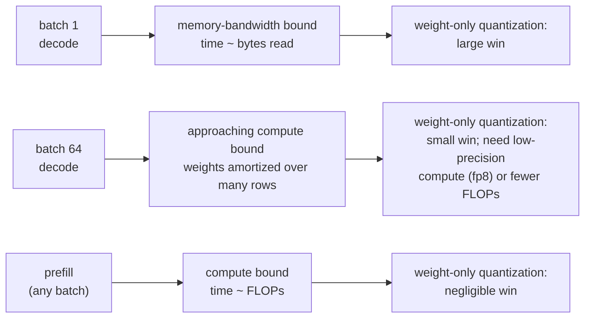

# 6. Serving a compressed model

A compressed artifact is not a deployment. The gap between the two is kernels,
memory layout, and a set of operational facts that decide whether the theoretical
win survives contact with production.

## The win depends on the batch size

The single most misleading number in compression is a speedup measured at batch one.

The rule to state in an interview: **weight-only quantization buys bandwidth, not
arithmetic.** It is a large win exactly where the machine is idle waiting for
weights (small-batch decode) and close to nothing where the machine is busy
multiplying (prefill, large batch). If throughput per dollar at high batch is the
goal, you need a format the compute units accelerate (fp8, int8 with fused kernels)
or genuinely fewer FLOPs, which means a smaller model.

## Kernel support is the real constraint

| What you want | What must exist | If it does not |
|---|---|---|
| int4 weight-only decode speedup | A fused dequantize-and-matmul kernel for your shape and runtime | You get memory savings and a dequantization tax, sometimes net slower |
| fp8 weights and activations | fp8 tensor cores plus runtime support for the scaling recipe | Falls back to higher precision silently in some stacks; measure, do not assume |
| 2:4 sparsity speedup | Sparse tensor cores and a runtime that emits sparse kernels | Zeros are stored and multiplied like any other number |
| Quantized KV cache | Runtime support in the attention kernel, plus paged allocation | Dequantize-per-step overhead can exceed the bandwidth saved |
| Rotation-based 4-bit activations | The rotation fused into adjacent layers at export time | A runtime rotation cost on every forward |

This table is why the honest answer to "which quantization method is best" is
"which one does your runtime have a good kernel for." Method quality differences at
the same bit width are usually smaller than the difference between a fused kernel
and an unfused one.

## Mixed precision by layer is the standard fix

Compression damage is not uniform across a network, and neither should the precision
be. The usual pattern when one capability regresses:

- Keep **embeddings and the output projection** at higher precision (they are a
  small fraction of parameters and a large fraction of the damage).
- Keep the **first and last transformer blocks** higher, which frequently recovers
  most of a regression at a small memory cost.
- Keep **norm parameters and biases** in higher precision always; they are tiny.
- Use **per-layer sensitivity** (quantize one layer at a time, measure) to decide
  the rest, rather than a uniform bit width.

The result is an artifact with a mixed precision profile and a memory footprint a
little above the nominal bit width, which is the normal shape of a shipped model
rather than a compromise.

## Adapters over a compressed base

Serving many tasks from one compressed base is the pattern that makes on-device and
multi-tenant deployments economical: keep one quantized base in memory and swap
small task adapters per request or per app. Two operational notes: the adapter is
usually kept at higher precision than the base, and adapters trained against the
full-precision base do not always transfer cleanly to the quantized one, so train
(or at least validate) adapters against the artifact you will serve.

## On-device is a different problem

| Constraint | Server | On-device |
|---|---|---|
| Memory | Elastic, paid per GB-hour | A hard ceiling shared with the OS and other apps |
| Formats | Whatever the runtime supports | Whatever the NPU accelerates, often a short list |
| Batch | Many concurrent requests | Batch one, almost always |
| Cost | Dollars per million tokens | Battery, heat, and app size |
| Update path | Redeploy anytime | Shipped with the app or downloaded, versioned per OS release |

Because batch is one, on-device is the regime where weight-only quantization pays
maximum dividends, and because the memory ceiling is hard, it is also the regime
where a smaller distilled model usually beats a heavily compressed large one. The
published pattern for a shipped consumer stack is a small on-device foundation model
with aggressive low-bit weight compression plus task-specific adapters, paired with a
larger server model for the requests that need it
([Apple Intelligence Foundation Language Models](https://arxiv.org/abs/2407.21075)).

## Rolling it out

Treat the compressed model as **a new candidate model**, not a config change:

1. **Measure on target hardware.** Latency at production batch and context length,
   memory at peak, and throughput. Predicted speedups do not count.
2. **Run the acceptance test paired per item** against the uncompressed baseline,
   per capability, with a flip rate ([benchmarking, section 6](../benchmark-eval/06-statistics-and-leaderboards.md)).
3. **Shadow it.** Run it on live traffic without serving its output, and diff
   against production output on the same requests; this catches format and
   tool-call regressions that offline sets miss.
4. **Canary by slice**, watching the capabilities you declared load-bearing.
5. **Keep the rollback artifact warm.** Quantized and unquantized weights are
   different files; the rollback is a deploy, not a flag, unless you built it as one.

## Bottlenecks table

| Bottleneck | First sign | Fix | Tradeoff |
|---|---|---|---|
| Dequantization overhead | Quantized model is slower than expected at low batch | Use a fused kernel; check the runtime actually has one for the shape | Ties you to a runtime and format |
| Win evaporates at production batch | Great in the benchmark harness, flat in production | Move to a compute-side format (fp8) or a smaller model | fp8 needs newer hardware |
| KV dominates at long context | Memory grows with traffic despite quantized weights | Quantized plus paged KV, or a GQA / MLA model | Another quality axis to test |
| One capability regressed | Average holds; JSON validity or long-context recall drops | Raise precision on sensitive layers; re-test | Slightly larger artifact |
| Adapters degrade on the quantized base | Adapter works on fp16 base, not on the int4 one | Train or validate adapters against the served artifact | Adapter pipeline now depends on the quantization |
| Memory ceiling on device | Model loads, then the OS reclaims memory under pressure | Smaller distilled student rather than more aggressive quantization | A separate model to maintain |
| Silent precision fallback | No speedup and no error | Log the actual kernel and dtype at startup; assert the expected path | Extra startup validation |
