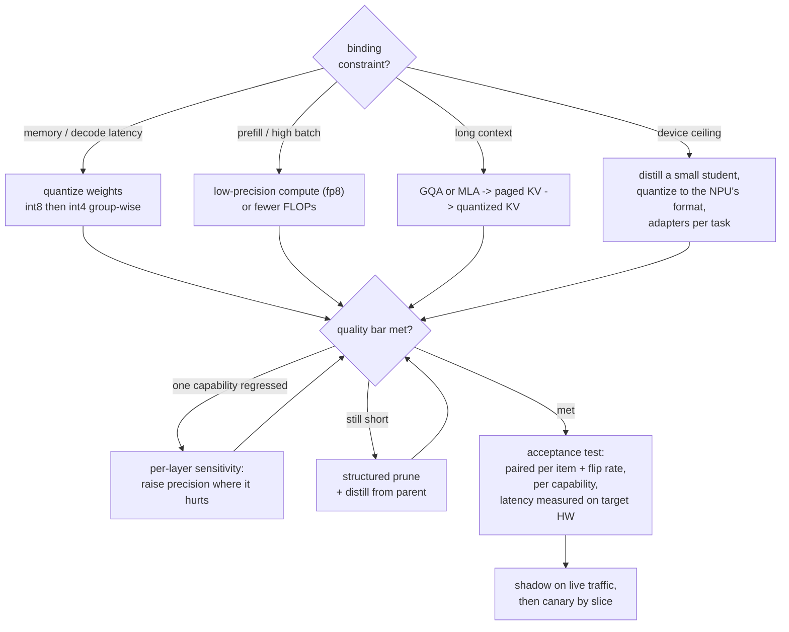

# 9. Summary

## One-page recap

- **Find the binding resource before picking a lever.** Memory ceiling, decode
  latency, prefill or high-batch throughput, and long-context cost are four
  different problems. Weight quantization fixes the first two, low-precision compute
  or a smaller model fixes the third, and KV work fixes the fourth.

- **Decode is bandwidth bound, prefill is compute bound.** Time per decoded token
  tracks bytes read, so halving weight bytes nearly halves it at small batch. FLOPs
  are unchanged by weight-only quantization, so prefill barely moves and the win
  erodes as batch grows.

- **Compression is a hardware question in algorithm's clothing.** A format the
  accelerator does not accelerate is a memory technique. Unstructured sparsity does
  not speed up a dense matmul; 2:4 does on sparse tensor cores; structured pruning
  speeds up everything because the matrices are smaller.

- **Outliers are the whole difficulty in quantization.** A few enormous activation
  channels force a scale that starves everything else. The four fixes are keep them
  high precision (LLM.int8), migrate them into the weights (SmoothQuant), protect
  salient weight channels (AWQ), or rotate them away (QuaRot, SpinQuant), and
  rotation is what unlocked 4-bit activations and KV.

- **Structured pruning plus distillation is how you build a small model without a
  pretraining budget.** Prune the parent to the target shape, then distill the
  parent into it. Depth cuts buy more latency than width cuts and damage multi-step
  behavior more.

- **QLoRA is not a serving quantization.** It is a fine-tuning memory technique.
  PTQ produces the artifact; QAT plus a distillation loss is what you escalate to
  below 4 bits.

- **The order is prune, heal or distill, then quantize**, and you evaluate the
  composition, because pruning and quantization damage the same outlier-sensitive
  paths and their costs are not independent.

- **Accuracy is not the acceptance test.** Compression scatters behavior rather than
  shifting it: the same score with a 12 percent flip rate is a different model. Test
  paired per item, per capability, with measured latency on the target hardware at
  production batch.

## The system on one page

## Test yourself

Answers are collapsed. Attempt each before opening one.

1. A vendor demo shows 3.2x faster decode after int4 quantization. Your production
   service sees 1.3x. Both measurements are honest. What explains the gap?

   

Answer

   Batch size ([2](02-frame-the-compression.md), [6](06-serving-and-scaling.md)).
   The demo ran batch one, where decode is purely bandwidth bound and time per token
   tracks bytes read, so cutting weight bytes about 4x nearly cuts latency by the
   same factor. In production at batch 32 the weight read is amortized across all
   sequences in the step while the KV term scales with batch, so the phase drifts
   toward compute bound and the same change buys far less. The capstone reproduces
   both numbers from the same formula. The follow-up worth volunteering: if
   throughput at production batch is the goal, the lever is a compute-side format
   (fp8) or genuinely fewer FLOPs, not more bits off the weights. Also check the
   kernel: an unfused dequantize-then-matmul path can erase the win entirely.

   

2. Your int4 model holds its benchmark averages but breaks JSON tool calls. What do
   you do, in order?

   

Answer

   Measure, localize, then fix surgically ([8](08-interview-qa.md),
   [6](06-serving-and-scaling.md)). Structured output depends on the model putting
   high probability on a few exact tokens, and low-bit quantization flattens exactly
   those margins, so format breaks before semantics do, which is why an average
   hides it. First, replace the average with the right metric: tool-call validity
   rate, measured paired per item against the uncompressed baseline. Second, run
   per-layer sensitivity: quantize one block at a time and record the delta on a
   tool-call set. Third, raise precision on what the ranking implicates, typically
   the output projection, embeddings, and the first and last blocks, then re-test.
   Reverting the whole quantization is the wrong response, and so is a constrained
   decoder used to hide a regression you have not measured (it is a fine addition
   afterwards).

   

3. You need a model half the size of your parent, you have a few billion tokens of
   budget, and the product depends on multi-step tool use. Which method, and which
   axis?

   

Answer

   Structured pruning along **width** (heads and FFN channels), healed by
   **distillation from the unpruned parent** ([4](04-pruning-and-sparsity.md),
   [5](05-distillation.md)). Width over depth because depth pruning gives better
   latency per unit removed but damages multi-step behavior disproportionately, which
   is precisely what the product depends on. Distillation over plain continued
   pretraining for the healing step because the parent's distributions are a denser
   signal per token and land the child closer to the parent's behavior, which matters
   since prompts and evals were tuned on the parent. Not unstructured pruning, which
   would not speed up dense kernels; not more aggressive quantization, which spends a
   second quality budget on the same constraint. Acceptance is paired against the
   parent on tool-call validity and long-context retrieval, not on a benchmark
   average, and quantization comes after the healing run, not before.

   

4. Two candidates for a compressed deployment: your 70B parent at int4, or the 8B
   model from the same family at int8. How do you decide?

   

Answer

   Run both through the same acceptance test rather than reasoning from parameter
   counts ([8](08-interview-qa.md)). The natively small model has coherently
   allocated capacity and no outlier-sensitivity damage; the compressed parent
   retains more knowledge and the parent's behavioral quirks, which matters when your
   prompts and evals were tuned on it. The tiebreakers are concrete: measured latency
   and memory at production batch and context on the target hardware; per-capability
   paired results on the capabilities you declared load-bearing; and flip rate against
   whatever is in production today. Rules of thumb to state while you set up the test:
   at moderate compression the compressed parent usually wins, at aggressive
   compression or a fixed hardware format the small model wins, and if you need both
   quality and behavioral compatibility, distill the parent into the small model and
   compare that third candidate too.

   

5. Why is "we removed 50 percent of the weights" not a statement about speed, and
   what is the minimum you must add to make it one?

   

Answer

   Because speed depends on the shape of the removal, not the count
   ([4](04-pruning-and-sparsity.md)). Unstructured zeros are multiplied like any
   other value on a dense matmul unit, so a 50 percent unstructured model runs at the
   original speed and only saves memory if stored sparsely. The minimum additions are
   the **pattern** (unstructured, 2:4 semi-structured, or structured) and a
   **measured latency** on the target hardware with the runtime you will deploy. The
   quality ordering runs the other way from the speed ordering, which is the real
   tradeoff: at equal nominal sparsity, unstructured is the most accurate and the
   least useful, 2:4 is a rigid constraint that costs more accuracy and is the one
   sparse tensor cores can skip, and structured pruning costs the most up front but
   yields a smaller dense model that is fast everywhere and heals with a distillation
   run.

   

6. Your compressed model scores identically to the baseline. What single extra
   measurement decides whether that is good news?

   

Answer

   The **paired flip rate**: on a fixed set, record both models' per-item outcomes
   and report the disagreement fraction ([1](01-clarifying-requirements.md),
   [8](08-interview-qa.md)). Identical accuracy with a low flip rate means the
   compression genuinely preserved behavior; identical accuracy with a high flip rate
   means the wins and losses cancelled in the mean and you are shipping a different
   model behind the same number, which breaks prompts, few-shot examples, guardrails,
   and downstream evals that were tuned on the original. Where you have output
   probabilities, add a distributional distance to the baseline. This is the
   compression-specific reason the general rule from
   [benchmarking](../benchmark-eval/06-statistics-and-leaderboards.md) applies with
   extra force: compare paired, per item, and treat divergence from the parent as a
   cost even when the average is unchanged.

   

## Further reading

- The capstone: [the complete build](10-putting-it-together.md), with the memory and
  bandwidth arithmetic, three constraint sets, and a runnable planner.
- Quantization mechanics: [GPTQ](https://arxiv.org/abs/2210.17323), [AWQ](https://arxiv.org/abs/2306.00978), [SmoothQuant](https://arxiv.org/abs/2211.10438), [QuaRot](https://arxiv.org/abs/2404.00456), [SpinQuant](https://arxiv.org/abs/2405.16406).
- Pruning: [SparseGPT](https://arxiv.org/abs/2301.00774), [Wanda](https://arxiv.org/abs/2306.11695), [Sheared LLaMA](https://arxiv.org/abs/2310.06694).
- Prune plus distill: [Compact Language Models via Pruning and Knowledge Distillation](https://arxiv.org/abs/2407.14679).
- On-policy distillation: [On-Policy Distillation of Language Models](https://arxiv.org/abs/2306.13649).
- Evaluating compressed models: [Accuracy is Not All You Need](https://arxiv.org/abs/2407.09141).
- Serving-side context: [inference serving](../inference-serving/), [KV cache](../kv-cache/), [cost optimization](../cost-optimization/).
