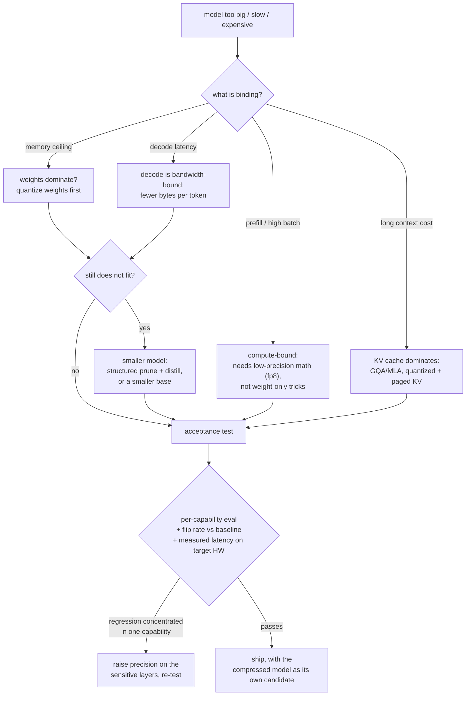

# Model Compression: Quantization, Pruning, and Distillation

An interviewer rarely says "explain GPTQ." They say something like: **"This model
is too big and too slow for where we need to run it. Make it fit, and tell me what
it costs us."** Sometimes the constraint is a GPU bill, sometimes a latency budget,
and increasingly it is a device: a fixed memory ceiling, a thermal envelope, and an
accelerator that only goes fast on certain numeric formats.

That question has a wrong answer that sounds right ("quantize to 4-bit, it is
basically free") and a right answer that is three sentences longer: which resource
is actually binding, which lever moves that resource on *your* hardware, and how you
prove the quality you gave up is quality you can afford. The levers interact, they
are not equally supported by kernels, and the acceptance test is the part most
candidates skip.

## Sections

1. [Clarifying the requirements](01-clarifying-requirements.md) - the dialogue that finds the binding constraint, and the two consequences that fall out.
2. [Framing the problem](02-frame-the-compression.md) - where the bytes and the microseconds go; the four levers; memory-bound decode vs compute-bound prefill.
3. [Quantization](03-quantization.md) - formats, granularity, the outlier problem, GPTQ / AWQ / SmoothQuant / rotations, KV-cache quantization, PTQ vs QAT.
4. [Pruning and sparsity](04-pruning-and-sparsity.md) - unstructured vs 2:4 vs structured, what each actually accelerates, width vs depth, healing runs.
5. [Distillation](05-distillation.md) - soft targets, sequence-level and on-policy distillation, the prune-then-distill recipe, when a student beats a small model trained from scratch.
6. [Serving a compressed model](06-serving-and-scaling.md) - kernel support, mixed precision by layer, adapters over a quantized base, batch-size dependence, on-device constraints.
7. [How teams do it in production](07-how-teams-do-it-in-production.md) - where real compression stacks diverge; named comparison with first-party links.
8. [Interview Q&A](08-interview-qa.md) - commonly asked, tricky, and commonly answered wrong.
9. [Summary](09-summary.md) - one-page recap, mermaid, test-yourself questions, further reading.
10. [Putting it together: the complete build](10-putting-it-together.md) - a default stack, the same model squeezed under three constraint sets, the arithmetic, and a runnable planner plus error simulator.

## The decision on one page

The loop back from the acceptance test is the part that separates a compression
project from a compression demo: the first configuration almost never passes, and
the fix is usually surgical (a few layers at higher precision) rather than
abandoning the lever.

## Companion chapters

- [Serving LLM inference at scale](../inference-serving/) owns the serving-side math and the parallelism and quantization tradeoffs at deployment time.
- [Long-context inference and the KV cache](../kv-cache/) owns everything about the KV cache, including the architectural reductions (GQA, MLA) that beat compressing it after the fact.
- [Cost optimization and model routing](../cost-optimization/) owns the question one level up: maybe you do not need this model for this request at all.
- [Benchmarking a model](../benchmark-eval/) owns the acceptance test: paired comparison, per-slice regressions, and error bars on the gap.
