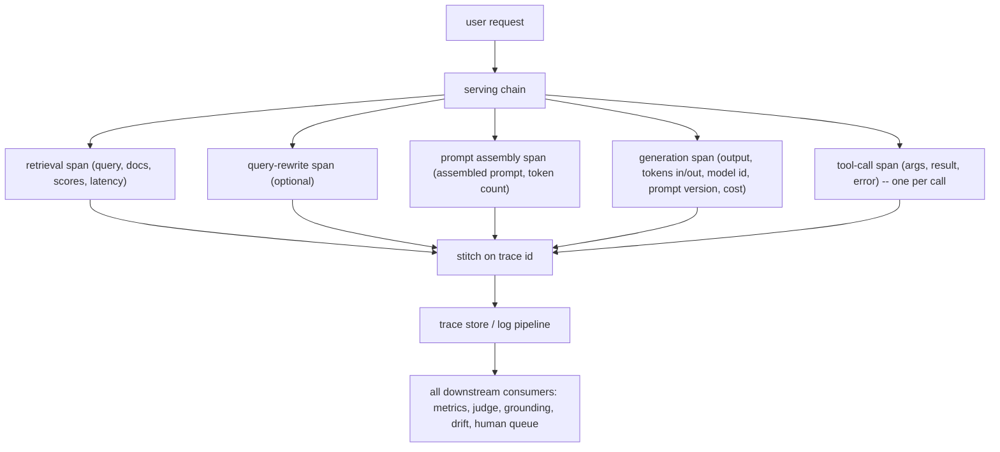
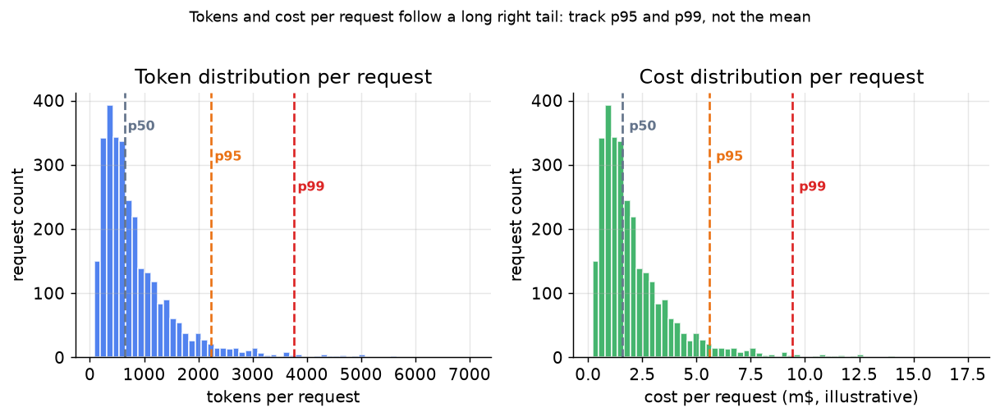

# 2. What to Observe

## The span-first philosophy

A metric tells you something is wrong. A trace tells you where. The foundation of
LLM observability is a **trace per request**, structured as a distributed trace
with one span per step in the chain. Aggregate metrics are derived from span
attributes; dashboards, alerts, and judge scores all live downstream of this one
instrumentation point. Get the trace wrong or incomplete and everything built on
top of it lies.

The pattern is: emit the trace cheaply and synchronously so it never delays the
user's response, then fan all expensive downstream work off that stream
asynchronously.

**How it works.** A single user request enters the serving chain, and each step in that chain emits its own span: retrieval, an optional query rewrite, prompt assembly, generation, and one span per tool call. Every span carries the same trace id, which is how they are stitched back into one ordered timeline for the request rather than floating as disconnected log lines. That stitched trace lands in the trace store, which acts as the single fan-out point: metrics, the LLM judge, grounding checks, drift monitors, and the human-review queue all read from it instead of instrumenting the serving path themselves. Because the spans are emitted cheaply and synchronously while every consumer reads asynchronously off the store, none of that downstream work sits on the user's latency path. This is why the trace is the one instrumentation point to get right: everything above it is derived, so an incomplete span makes a downstream check impossible to reconstruct after the fact.

## The minimum set of span fields

Every span in the chain carries a core set of fields. Dropping any of them makes a
downstream check impossible to recover after the fact.

| Field | Where it lives | Why it is load-bearing |
|---|---|---|
| `trace_id` | every span | stitches all hops of one request into a single timeline |
| `span_id`, `parent_span_id` | every span | reconstructs the call tree (nested tool calls, parallel retrieval) |
| `inputs` verbatim | each step | lets you reproduce a failure and audit the exact context |
| `retrieved_context` verbatim | retrieval span | the single most critical field: without it, grounding checks are impossible after the fact |
| `output` verbatim | generation span | what the user received; required for judge and grounding scoring |
| `latency_ms` | every span | builds the p50/p95/p99 and TTFT dashboards |
| `prompt_tokens`, `completion_tokens` | generation span | per-request cost, context-limit debugging |
| `cost_usd` | generation span | first-class dashboard; a "better model" that triples cost is a regression |
| `model_id` | generation span | lets you diff two model versions in the same trace stream |
| `prompt_version` | generation span | ties a quality change to the exact prompt edit that caused it |
| `error_class` | every span | separates API failures, parse errors, and validation errors |

The retrieved context is the single field no downstream check can recover without.
Log it verbatim at the retrieval span. If you later want to ask "was the answer
grounded in what the system actually retrieved," that context must already be in
the trace store.

## Stitching spans into a timeline

Use OpenTelemetry-style spans with the emerging GenAI semantic conventions so the
trace flows naturally into whatever stack you already run (Datadog, Honeycomb,
Grafana Tempo). The trace id is the key: it stitches a request that fans across
retrieval, reranking, tool calls, and generation back into a single readable
timeline. For a conversational copilot, add a `conversation_id` (stable across
turns) so you can reconstruct a full multi-turn session and inspect edit and
retry behavior across exchanges.

## Tokens and cost per request

*Token counts and cost per request follow a long right tail. The mean understates
typical tail cost by a large factor; always track p95 and p99. Illustrative data,
log-normal distribution.*

This distribution matters for budgeting the observation layer itself: a judge that
costs roughly the same as generation multiplies into a right-tail tail cost that
is much higher than the average judge call cost.

## Privacy: redaction and retention

Verbatim inputs and outputs are unredacted user data. Two rules to set up front:

- **Retention tiering.** Full-fidelity traces for flagged requests (negative
  feedback, judge failures, guardrail hits); truncated or summary-only for
  unflagged ones after a short window. Storage costs are proportional to trace
  volume, and LLM requests are verbose.
- **Redaction and access control.** PII in prompts (names, account numbers,
  medical details) must be redacted before long-term storage, or the observability
  store becomes the largest pool of sensitive data in the infrastructure. Gate
  access to raw traces separately from dashboards.
