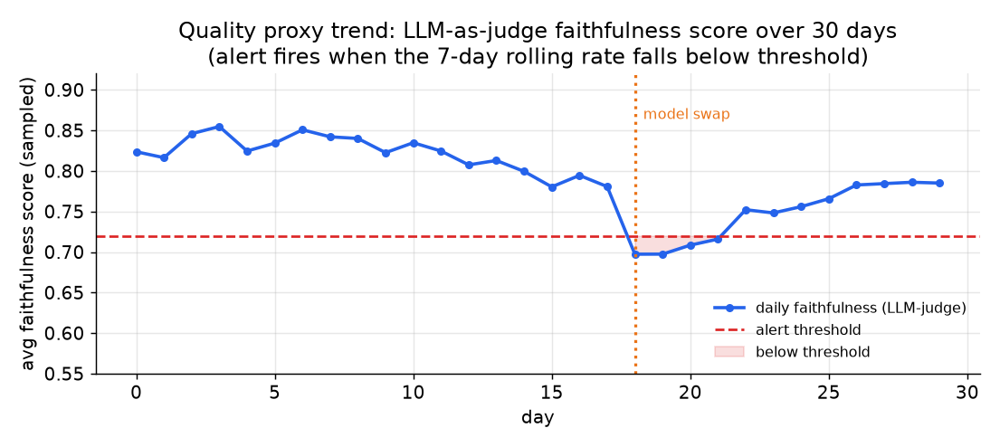

# 3. Online Evaluation Without Labels

## The no-labels reality

Pre-ship evaluation has a labeled dataset; you run the model and compare its
answers to ground truth. Production does not. Nobody grades the thousands of
requests per hour. The standard accuracy computation does not exist online.

What you have instead are three classes of proxy signal, in increasing cost and
decreasing volume:

1. **LLM-as-judge** on a sampled slice of traces: a model scores faithfulness and
   relevance on maybe five to fifteen percent of traffic.
2. **Grounding check** comparing each claim in an answer to the retrieved context
   that was logged: cheaper than a full judge call when the question is specifically
   about ungrounded claims.
3. **User feedback**, both explicit (thumbs, rating) and implicit (accept, discard,
   edit, retry): free, high-volume, and biased in ways you must account for.

None of these is accuracy. They are estimates. The critical discipline is
**calibrating each one against human labels** before you alert on it. An
unchecked judge is a confident guess.

## LLM-as-judge

A judge model receives the question, the retrieved context, and the generated
answer, then scores two dimensions:

- **Faithfulness:** is every claim in the answer supported by the retrieved
  context? This is the primary check for a RAG system.
- **Answer relevance:** does the answer address what the user actually asked?

Datadog's two-stage approach is worth knowing: the first call reasons freely (no
format constraint) to identify disagreements and extract supporting quotes; a
second, smaller model reformats the reasoning into structured output. Separating
reasoning from formatting avoids the accuracy hit of forcing strict JSON structure
mid-reasoning.

The biases are real and must be named: LLM judges favor verbose answers, favor
their own outputs (self-preference), and favor answers that appear early in the
prompt (position bias). A judge is a number that lies until it is calibrated
against human labels. Before paging anyone on a judge score, collect a few hundred
human labels on real traffic and measure agreement:

$$\kappa = \frac{p_o - p_e}{1 - p_e}$$

where $p_o$ is the observed agreement rate and $p_e$ is the rate expected by
chance. $\kappa = 1$ is perfect agreement; $\kappa = 0$ is chance. Datadog
reports $F_1 = 0.810$ on HaluBench and RAGTruth using a GPT-4o judge; note that
the score on the human-labeled RAGTruth set is the honest number, not the
synthetic one.

*Daily faithfulness score (LLM-as-judge, sampled), with an alert threshold line.
A model swap at day 18 triggers a score drop that crosses the threshold and fires
an alert. Score recovers partially as prompt tuning compensates. Illustrative.*

## Grounding check

A grounding check is more targeted than a general judge: it asks whether the
specific claims in an answer are supported by the retrieved documents that were
logged on the trace.

Decompose the answer into atomic claims, then score each claim against the
retrieved context. The groundedness score for one answer is:

$$G(a) = \frac{1}{|C(a)|}\sum_{c \in C(a)} \mathbf{1}[\,\text{context} \models c\,]$$

where $C(a)$ is the set of atomic claims in answer $a$, and the indicator is 1
when the retrieved context entails claim $c$. The ungrounded rate per response is
$1 - G(a)$. Trend that rate per day and alert on the delta after any retrieval or
model change.

Two categories of failure to distinguish: **contradiction** (the claim opposes
the context) and **unsupported** (the claim is absent from the context). An answer
can be technically true yet unsupported if the system had no basis for it in its
retrieved documents. Score and trend both separately.

## User feedback

Users are a free, high-volume signal but with systematic biases you must name.

**Explicit feedback** (thumbs, rating, "report an issue") is cheap to collect but
sparse. A tiny self-selected fraction ever clicks; it is biased toward the very
angry and the very pleased. Treat it as directional, not a percentage. Never read
a low thumbs-down rate as "users are satisfied." For our support copilot, a human
agent accepting the answer is a richer explicit signal than a thumbs widget.

**Implicit signals** are denser and more honest:

- Accept and send without editing: a positive behavioral signal.
- Heavily edit before sending: the model was partially right but not usable as
  written.
- Discard and rephrase the question immediately: almost always a failure.
- Abandon without acting: ambiguous but worth sampling into the review queue.

Attach every signal to the trace via the `trace_id` so the judge and grounding
scores and the behavioral signal for the same request can be joined together.
Downvoted or heavily-edited responses are the highest-yield cases for the
human-review queue and for refreshing the frozen eval set.

## When to use which signal

| Reach for | When | Instead of |
|---|---|---|
| LLM-as-judge (faithfulness + relevance) | you need a general quality proxy on live traffic and can pay a sampled extra call | assuming the pre-ship eval score applies online, where there are no labels |
| Two-stage judge (reasoning then format) | domain requires nuanced grounding checks and you have budget for two calls | a single constrained-output prompt, which degrades reasoning quality |
| Grounding check (claims vs context) | the answer is supposed to be grounded in retrieved documents and you logged the context | a general judge, when the specific failure you fear is ungrounded claims |
| Cohen kappa or F1 against human labels | calibrating whether a judge score is trustworthy before you alert on it | a raw judge score, which is a confident guess until calibrated |
| Implicit user behavior (accept / edit / retry rate) | you want a dense, free signal that is more honest than sparse thumbs | treating thumbs alone as an accuracy measure |
| Human-review queue | nuanced failures that automated scoring misses, and calibrating the judge | reviewing everything, which does not scale |

**Tools for each signal.** Sampled LLM-as-judge and grounding checks on live traces run
on Ragas, DeepEval, and Arize Phoenix, whose faithfulness and answer-relevance scorers
decompose answers into claims against the logged context. Trace capture that carries
the trace_id joining judge score, grounding score, and behavioral feedback comes from
LLM observability platforms such as LangSmith, Arize Phoenix, Langfuse, and Helicone,
often over OpenTelemetry. Cohen's kappa or F1 against human labels is computed with
scikit-learn on a few hundred annotated traces pulled into a labeling tool like Label
Studio, which also backs the human-review queue. Explicit and implicit feedback capture
is instrumented in the app and forwarded to the same observability layer.

**Provenance.** The trace_id join that ties these signals together rides on
OpenTelemetry (CNCF), the vendor-neutral tracing standard the observability platforms
above emit into. The judge and grounding scorers are conventional applications of the
LLM-as-judge pattern rather than a single-origin method, so no further attribution is
claimed here.

**Worked example.** An enterprise-RAG team with no online labels leans first on implicit
user behavior, accept, edit, and retry rates, because it is dense and free and more
honest than the sparse thumbs widget that only the very angry or very pleased ever
click. Since answers are supposed to be grounded in retrieved documents and they log the
context on each trace, they add a targeted grounding check rather than a general judge
for the specific failure they fear, ungrounded claims, and trend the contradiction and
unsupported rates separately. For a broader quality proxy they sample a slice of traffic
through an LLM-as-judge, but they refuse to alert on its score until they have measured
Cohen's kappa against a few hundred human labels, because an uncalibrated judge is a
confident guess. The highest-yield downvoted and heavily-edited traces feed a
human-review queue rather than reviewing everything, which would not scale.
