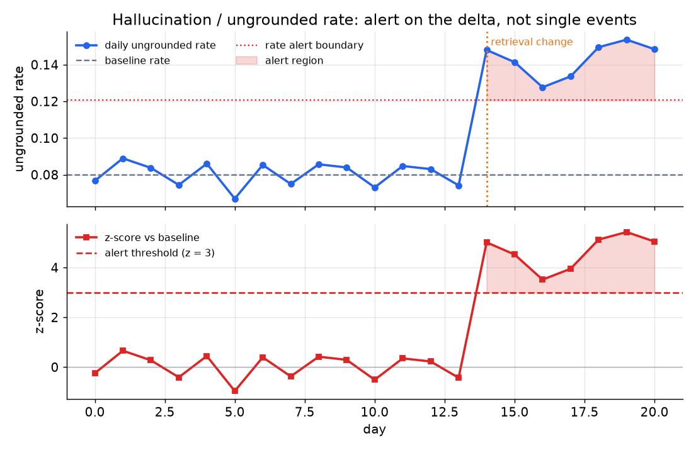

# 4. Detecting Drift and Regressions

A model swap or a prompt edit is exactly the moment quality silently moves. The
purpose of monitoring is to catch it before users do, without requiring a human
to remember to look.

## Two kinds of drift

Drift comes in two flavors that predict and confirm trouble in sequence:

**Input drift** is the traffic changing under you: new topics, languages, longer
documents, or user populations that were not in your training distribution. It
predicts trouble but does not confirm quality has dropped. The check is a cosine
distance between the mean embedding of the current request window and a reference
window:

$$d_t = 1 - \frac{\bar{e}_t \cdot \bar{e}_{\text{ref}}}{\lVert \bar{e}_t \rVert\, \lVert \bar{e}_{\text{ref}} \rVert}$$

```python
import numpy as np
def input_drift(cur, ref):
    # cur, ref: (n, d) arrays of query embeddings for the current and reference windows
    ec, er = cur.mean(0), ref.mean(0)                       # mean embedding of each window
    cos = ec @ er / (np.linalg.norm(ec) * np.linalg.norm(er))
    return 1 - cos                                          # 0 = identical, larger = more drift
# input_drift(np.array([[1.,0.],[1.,0.]]), np.array([[0.,1.],[0.,1.]])) -> 1.0 (orthogonal means)
```

$d_t$ near 0 means no drift; a rising $d_t$ means the input distribution is
moving. Embed the user queries with a cheap encoder (all-MiniLM-L6 runs at a
fraction of the cost of the generation model) and update the reference window
after each deliberate model or prompt change so you are always comparing against
the right baseline.

**Output drift** is quality decaying with inputs held roughly stable: a rising
ungrounded rate, falling judge scores, more retries, more discards. It confirms
that something changed in the system. The connection between the two: input drift
is a leading indicator you should watch to predict when output drift is coming.

## Hallucination detection

Hallucination in a RAG system is best framed as a grounding problem: does the
answer follow from the documents the retriever actually fetched? This is
checkable because you logged the retrieved context.

Per-response groundedness is defined in the previous chapter. For monitoring,
aggregate it to a rate:

$$r_t = \frac{1}{n_t}\sum_{i=1}^{n_t} (1 - G(a_i))$$

where $n_t$ is the number of judged traces in the current window and $G(a_i)$ is
the groundedness score of answer $a_i$. $r_t$ is the ungrounded rate: the
fraction of sampled answers that contain at least one claim not supported by the
retrieved context.

Alert on the **delta in this rate**, not on single flagged events. A single
ungrounded answer is noise at any scale. The signal is a rate shift after a
model or retrieval change. See the alerting chapter for the z-score mechanism.



*Top panel: daily ungrounded rate with baseline and alert boundary. A retrieval
change at day 14 triggers a rate spike that crosses the threshold. Bottom panel:
the z-score versus baseline; the alert fires when z exceeds 3. Illustrative.*

## Regression gates: three mechanisms

A regression is a quality drop introduced by a change you made deliberately. Three
mechanisms catch regressions at different risk levels:

**Frozen eval replay** is the bridge from pre-ship evaluation to live monitoring.
Keep the labeled evaluation set that gated the last deploy and replay it on a
schedule and on every model or prompt change. If a regression appears on the
frozen set it surfaces before it reaches most users. The limitation: the frozen
set goes stale. Refresh it by promoting flagged production traces with bad judge
or grounding scores into the labeled set. This is how the monitoring loop stays
honest as the product evolves.

**Canary deployment** routes a small fraction (five to ten percent) of live traffic
to the candidate model or prompt and compares its proxy scores, feedback, latency,
and cost against the control in real time. A regression that hides from the frozen
set (perhaps because the eval set is stale or the failure is input-distribution
specific) still surfaces at canary scale. The evidence is in user behavior, not a
synthetic benchmark.

**Shadow mode** runs the candidate on every request without showing its output to
users, then diffs the candidate and control answers. The risk to users is zero,
but shadow only measures output divergence, not user reaction. Use it to quantify
how much a new model changes outputs before you decide whether to canary it.

## When to use which regression gate

| Reach for | When | Instead of |
|---|---|---|
| Frozen eval replay (scheduled) | every model or prompt change, as the lowest-cost first check | relying on production traffic alone, which may not cover the failure modes in the eval set |
| Frozen eval replay (on demand) | continuous background monitoring to catch silent model provider regressions | periodic manual reviews, which are skipped under pressure |
| Canary (live traffic slice) | after frozen eval passes and you want real-user evidence before full rollout | a full rollout followed by post-hoc monitoring, which exposes all users to a regression |
| Shadow (zero-risk diff) | when you want output-level evidence before any canary risk | skipping the pre-canary diff and going straight to a canary |
| Input-embedding drift monitor | as a leading indicator that input distribution is moving under you | waiting for output drift metrics to confirm trouble after the fact |

**Tools for each gate.** Input-embedding and output drift monitors are provided by
Evidently, NannyML, and whylogs, embedding queries with a cheap encoder from the
sentence-transformers library and trending cosine distance against a reference window.
Frozen eval replay reuses the same offline runner that gated the last deploy (OpenAI
Evals, Promptfoo, or a custom suite) scheduled through CI or an orchestrator, with
results tracked in MLflow. Canary and shadow routing run on the feature-flag and
experimentation layer (GrowthBook, Statsig, Unleash, or LaunchDarkly), and the
candidate-versus-control proxy scores, latency, and cost surface in an observability
platform such as Arize Phoenix, LangSmith, or Langfuse.

**Worked example.** A chat product shipping a drop-in model swap runs frozen eval replay
first, since it is the lowest-cost check and catches a regression before any user sees
it, and refreshes that set by promoting flagged production traces so it does not go
stale. Because the eval set could miss an input-distribution-specific failure, they then
route five to ten percent of live traffic to a canary and compare proxy scores,
feedback, latency, and cost against control in real time rather than doing a full
rollout followed by post-hoc monitoring that would expose everyone to a regression. When
they only want to know how much the new model changes outputs before taking any canary
risk, they run it in shadow mode and diff candidate against control with zero user
exposure. Alongside all of this they keep an input-embedding drift monitor as the
leading indicator, so a moving query distribution warns them before output drift
confirms the damage.
