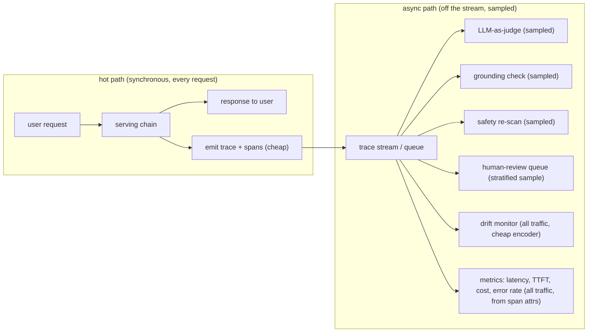
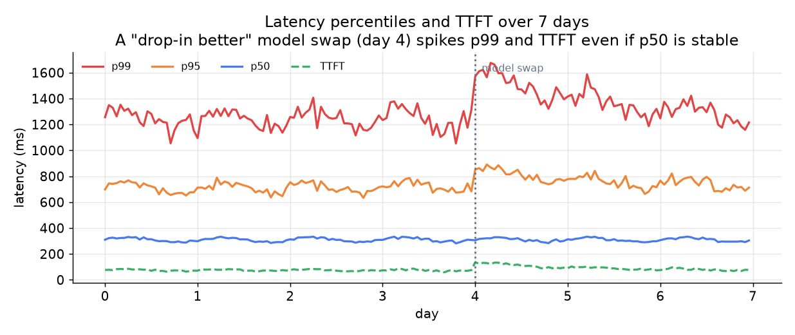

# 6. Serving and Scaling

## The hot path must stay cheap

The serving chain (retrieval, prompt assembly, generation, tool calls) is already
on the critical path of the user's request. Every millisecond of overhead added
by the observability layer is latency the user feels. The rule is strict: emit the
trace synchronously, but do everything heavy asynchronously.

The dividing line is cost: metrics and drift monitoring run on all traffic because
they are derived cheaply from span attributes (no extra model call). Judge,
grounding, and safety re-scans require an extra model call per judged request and
are sampled. Human review is the most expensive (human time) and is most heavily
stratified.

## The sampling cost formula

Observation cost is linear in the sampling rate; detection latency is inverse in
it. There is no free lunch:

$$\mathbb{E}[\text{cost}_{\text{obs}}] = s \cdot \lambda \cdot c_{\text{judge}}$$

$$t_{\text{detect}} \approx \frac{k}{s \cdot \lambda \cdot r_{\text{fail}}}$$

where $s$ is the sampled fraction, $\lambda$ is the request rate, $c_{\text{judge}}$
is the per-call judge cost, $r_{\text{fail}}$ is the failure rate you are trying
to detect, and $k$ is the count of failures needed for statistical confidence.
Halving $s$ halves the observation bill but doubles the expected time to detect a
regression at rate $r_{\text{fail}}$.

The practical implication: when you need fast detection after a high-stakes change
(a model swap on a medical product), temporarily raise $s$ for a detection window,
then lower it once confidence is established.

## Latency percentiles: what users actually feel

*p50, p95, p99, and TTFT over 7 days. A model swap at day 4 doubles TTFT and
sends p99 above the SLO even though p50 barely moves. The mean would have missed
this regression entirely. Illustrative.*

Track latency as percentile distributions, not means. For a streaming UI, time to
first token (TTFT) is what the user perceives as "response speed." A model that
improves answer quality while doubling TTFT is a regression on the user-facing
metric even if it wins on the faithfulness dashboard.

## Bottlenecks and scaling

| Bottleneck | First sign | Fix | Tradeoff |
|---|---|---|---|
| Instrumentation adds latency | p50 serving latency rises without traffic change | emit spans as a fire-and-forget write to a queue; never block the response path | small risk of losing traces if the queue is full |
| Judge cost dominates observation budget | observation cost approaches serving cost | reduce sampling rate; switch to a cheaper fine-tuned encoder for first-pass triage, reserving the full judge for flagged traces | slower detection or lower coverage on the tail |
| Log volume and storage cost | storage bill grows faster than traffic | tier retention (full fidelity for flagged, truncated for clean), redact verbatim prompts after the retention window | less data available for future post-hoc analysis |
| Human review queue overwhelmed | queue depth grows, review latency rises | tighten the stratification criteria; raise the threshold for entering the queue | smaller human-labeled sample; judge calibration drifts more |
| Judge-human disagreement rising | kappa or F1 score against human labels falls | re-label a fresh sample, update the judge rubric and prompt version, pin the new version | short calibration lag after a domain shift |
| Safety re-scan misses harmful outputs | periodic red-team finds outputs the guardrail did not catch | sample allowed traffic into the re-scan queue in addition to guardrail near-misses | extra re-scan cost on non-flagged traffic |

Two details make the top rows concrete. The "instrumentation adds latency" fix works
because the tracing standard the observability stack emits into, OpenTelemetry (CNCF),
is designed for asynchronous span export: the SDK batches spans and flushes them off
the request path, so the fire-and-forget write is the intended usage pattern rather
than a hack, and the only real exposure is dropped spans when the export queue
saturates. The "judge cost dominates" row is really a sampling-math problem: judge
cost scales linearly with sampling rate, so the standard move is a cheap first-pass
triage model that scores everything and escalates only the suspicious tail to the
full judge, which keeps coverage high while cutting the expensive-call volume by the
triage pass rate. Both fixes trade a bounded loss (a few dropped spans, slower
tail detection) for a large constant-factor reduction in observation overhead.
