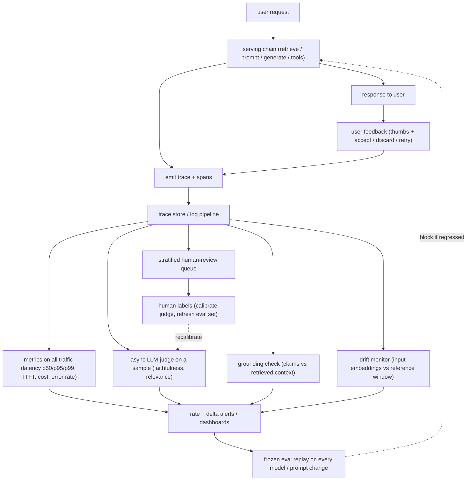

# 9. Summary

## One-page recap

- **Production has no ground truth, so quality is always estimated, never
  measured.** Offline accuracy does not exist online. What you have are proxy
  signals: a sampled LLM judge, a grounding check against logged retrieved
  context, and implicit user behavior (accept, discard, retry). Every proxy is a
  number that lies until calibrated against human labels.
- **The trace is the foundation.** Emit one trace per request with a span per
  step. Log inputs, retrieved context, output, latency, tokens (prompt and
  completion split), cost, model id, and prompt version. The retrieved context is
  the single load-bearing field: without it, grounding checks are impossible after
  the fact.
- **Expensive checks are asynchronous and sampled.** Emit the trace cheaply and
  synchronously; run the judge, grounding scorer, safety re-scan, and human review
  queue off that stream asynchronously. Only cheap span-derived metrics (latency,
  cost, error rate) run on all traffic.
- **Alert on rates and deltas, not on events.** Score groundedness per response,
  aggregate to a windowed ungrounded rate, and page when the z-score versus
  baseline exceeds a threshold after a model or retrieval change. A single flagged
  answer is noise.
- **The frozen eval set is the continuous deploy gate.** Replay it on a schedule
  and on every model or prompt change. Refresh it from flagged production traces
  or it goes stale and misses regressions on current traffic.
- **Sampling rate trades cost against detection latency.** Halving the sample
  halves the observation bill but doubles the expected time to catch a regression.
  Tune both together, and stratify the sample to oversample the suspicious tail.
- **Track the signals quality metrics miss.** A rising refusal or block rate is
  silent degradation (blocked answers never get scored). A "better" model that
  doubles TTFT or triples cost is a regression even if judge scores improve. Report
  guardrail firing rates, latency percentiles, and cost per request as first-class.

## The system on one page

## Test yourself

1. The judge score is rising month over month. How do you tell whether quality
   is genuinely improving or the judge is drifting?
2. What three steps should you run in order before fully rolling out a model swap,
   and what does each one catch that the previous one misses?
3. Why is the retrieved context the single most critical span field to log, and
   what becomes impossible if you drop it?
4. You sample five percent of traffic for judging. A regression emerges at a
   failure rate of two percent. How does your choice of sampling rate affect how
   quickly you detect it?
5. A refusal-rate dashboard shows a stable block rate after a guardrail update.
   Is safety confirmed? What additional check would you run and why?
6. Your implicit user signals (high retry rate, low accept rate) contradict the
   judge score (rising faithfulness). What does that tell you, and what do you
   investigate first?

## Further reading

- Dense reference with all comparisons, math, and production case studies:
  [../../topics/12-production-monitoring-and-observability.md](../../topics/12-production-monitoring-and-observability.md)
- Per-company teardowns (Datadog, Honeycomb, Uber, Grafana, LangChain, Twilio
  Segment): [../../tools/teardowns/12.md](../../tools/teardowns/12.md)
- Tool comparison table, decision math, quadrant plot:
  [../../tools/comparisons/12.md](../../tools/comparisons/12.md)
