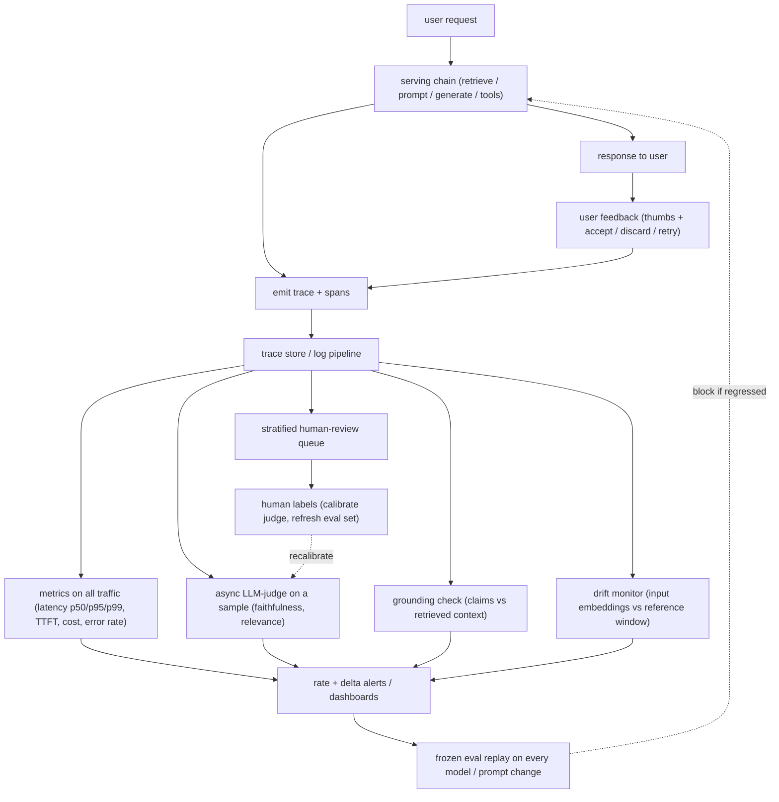

# 9. Summary

## One-page recap

- **Production has no ground truth, so quality is always estimated, never
  measured.** Offline accuracy does not exist online. What you have are proxy
  signals: a sampled LLM judge, a grounding check against logged retrieved
  context, and implicit user behavior (accept, discard, retry). Every proxy is a
  number that lies until calibrated against human labels.
- **The trace is the foundation.** Emit one trace per request with a span per
  step. Log inputs, retrieved context, output, latency, tokens (prompt and
  completion split), cost, model id, and prompt version. The retrieved context is
  the single load-bearing field: without it, grounding checks are impossible after
  the fact.
- **Expensive checks are asynchronous and sampled.** Emit the trace cheaply and
  synchronously; run the judge, grounding scorer, safety re-scan, and human review
  queue off that stream asynchronously. Only cheap span-derived metrics (latency,
  cost, error rate) run on all traffic.
- **Alert on rates and deltas, not on events.** Score groundedness per response,
  aggregate to a windowed ungrounded rate, and page when the z-score versus
  baseline exceeds a threshold after a model or retrieval change. A single flagged
  answer is noise.
- **The frozen eval set is the continuous deploy gate.** Replay it on a schedule
  and on every model or prompt change. Refresh it from flagged production traces
  or it goes stale and misses regressions on current traffic.
- **Sampling rate trades cost against detection latency.** Halving the sample
  halves the observation bill but doubles the expected time to catch a regression.
  Tune both together, and stratify the sample to oversample the suspicious tail.
- **Track the signals quality metrics miss.** A rising refusal or block rate is
  silent degradation (blocked answers never get scored). A "better" model that
  doubles TTFT or triples cost is a regression even if judge scores improve. Report
  guardrail firing rates, latency percentiles, and cost per request as first-class.

## The system on one page

```mermaid
flowchart TD
  U["user request"] --> S["serving chain (retrieve / prompt / generate / tools)"]
  S --> R["response to user"]
  S --> T["emit trace + spans"]
  R --> FB["user feedback (thumbs + accept / discard / retry)"]
  FB --> T
  T --> Q["trace store / log pipeline"]
  Q --> M["metrics on all traffic (latency p50/p95/p99, TTFT, cost, error rate)"]
  Q --> J["async LLM-judge on a sample (faithfulness, relevance)"]
  Q --> G["grounding check (claims vs retrieved context)"]
  Q --> DR["drift monitor (input embeddings vs reference window)"]
  Q --> HR["stratified human-review queue"]
  M --> A["rate + delta alerts / dashboards"]
  J --> A
  G --> A
  DR --> A
  HR --> L["human labels (calibrate judge, refresh eval set)"]
  L -.->|"recalibrate"| J
  A --> RE["frozen eval replay on every model / prompt change"]
  RE -.->|"block if regressed"| S
```

## Test yourself

Answers are collapsed. Attempt each question before opening one.

1. The judge score is rising month over month. How do you tell whether quality
   is genuinely improving or the judge is drifting?

   

Answer

   You cannot tell from the score alone, so you report the **judge-human agreement**
   next to it. Calibration is a mapping from judge scores to human judgments, and
   that mapping is only valid on the distribution it was measured on: a judge that
   agreed at Cohen's kappa 0.82 in January can be systematically flattering by March
   after the domain, the prompt, or the traffic mix has moved, while still emitting
   confident numbers. Collect a few hundred fresh human labels on real traffic,
   recompute kappa or F1, and read the pair together. If the score rises while kappa
   falls, the instrument is lying, not the product improving. Two hygiene rules make
   the diagnosis possible at all: **pin the judge model and prompt version**, because
   a provider-side judge update silently re-scales a pointwise metric and
   manufactures a fake trend, and cross-check against implicit behavioral signals,
   which cover all traffic and fail independently of the judge. Sections
   [3](03-online-eval-without-labels.md) and [8](08-interview-qa.md) work this
   through.

   

2. What three steps should you run in order before fully rolling out a model swap,
   and what does each one catch that the previous one misses?

   

Answer

   In increasing order of user risk: **frozen eval replay**, then **shadow mode**,
   then a **canary**. Frozen eval replay is the lowest-cost gate and runs first,
   because it catches a regression on the known failure modes before any user is
   exposed; its blind spot is staleness, since the set is a fixed sample of a moving
   distribution and every prior change was tuned until it passed. Shadow mode runs
   the candidate on every live request without showing its output, so it catches
   output divergence on the real current traffic distribution at zero user risk; its
   blind spot is that no user ever saw the answer, so it produces no user reaction.
   A canary routes five to ten percent of live traffic to the candidate and compares
   proxy scores, feedback, latency, and cost against control for at least one full
   traffic cycle (twenty-four hours covers a diurnal pattern), which is the only one
   of the three that yields accept, retry, and edit behavior, the closest thing to
   ground truth in production. The distinction that matters at the alert layer: a
   frozen-eval regression **blocks** the deploy, it does not page. See sections
   [4](04-detecting-drift-and-regressions.md) and [5](05-alerting.md).

   

3. Why is the retrieved context the single most critical span field to log, and
   what becomes impossible if you drop it?

   

Answer

   Because every grounding check is a **conditional** check, claims given context,
   and the context has to already be in the trace store when the asynchronous
   scorer runs minutes later. Drop it and the per-answer groundedness score
   $G(a)$ cannot be computed at all, which kills the windowed ungrounded rate, the
   z-score alert built on that rate, and the contradiction-versus-unsupported split
   that tells a triager whether the model opposed the documents or invented
   something absent from them. The LLM judge is hit just as hard: faithfulness is
   scored from the question, the retrieved context, and the answer together, so
   without the context you are left with relevance only. You also lose the ability
   to separate a retrieval failure from a generation failure, which is the first
   fork in any RAG debugging session. This is a hard ordering constraint, not a
   preference: expensive checks run off the stream after the fact, so anything not
   captured verbatim on the retrieval span is unrecoverable. Sections
   [2](02-what-to-observe.md) and [4](04-detecting-drift-and-regressions.md).

   

4. You sample five percent of traffic for judging. A regression emerges at a
   failure rate of two percent. How does your choice of sampling rate affect how
   quickly you detect it?

   

Answer

   Observation cost is **linear** in the sampling rate and detection latency is
   **inverse** in it, so the two move against each other:
   $\mathbb{E}[\text{cost}_{\text{obs}}] = s \cdot \lambda \cdot c_{\text{judge}}$
   and $t_{\text{detect}} \approx k / (s \cdot \lambda \cdot r_{\text{fail}})$. With
   $s = 0.05$ and $r_{\text{fail}} = 0.02$, only one request in a thousand is a
   judged failure, so if you need $k = 30$ flagged traces for statistical confidence
   you must wait for roughly thirty thousand requests. Halving the sample to 2.5
   percent halves the observation bill and doubles that wait. The same tension shows
   up in the alert itself: $n_t$ sits in the denominator of the z-score standard
   error, so a thinner sample widens the interval and raises the minimum rate shift
   you can detect at all, which is why sampling rate and window size must be tuned
   together rather than independently. Two practical moves: temporarily raise $s$
   for a detection window after a high-stakes change and lower it once confidence is
   established, and **stratify** the sample so the suspicious tail (low feedback,
   high retry, low retrieval score, guardrail near-misses) is oversampled instead of
   spending the budget on easy requests. Sections
   [6](06-serving-and-scaling.md) and [5](05-alerting.md).

   

5. A refusal-rate dashboard shows a stable block rate after a guardrail update.
   Is safety confirmed? What additional check would you run and why?

   

Answer

   No. A stable block rate is consistent with harmful outputs flowing through
   uncaught, because the block rate measures the guardrail's recall **against what
   it can already detect**, not against the true harm base rate. A jailbreak family
   the classifier was never trained on produces zero blocks and a perfectly flat
   dashboard while the dangerous outputs ship. The additional check is a **sampled
   safety re-scan on allowed traffic**, the responses the guardrail passed, ideally
   with a different model or a human, which is the only way to estimate the miss
   rate on the stream the primary filter called safe; the tradeoff named in the
   scaling table is extra re-scan cost on non-flagged traffic. Watch the rate in
   both directions while you are there: a *rising* refusal or block rate is silent
   degradation, since blocked answers never get quality-scored and the quality
   dashboard reads healthy while good traffic is being rejected. This is also the
   one signal that pages immediately rather than filing a ticket. Sections
   [8](08-interview-qa.md), [6](06-serving-and-scaling.md), and
   [5](05-alerting.md).

   

6. Your implicit user signals (high retry rate, low accept rate) contradict the
   judge score (rising faithfulness). What does that tell you, and what do you
   investigate first?

   

Answer

   It tells you one of the two instruments is wrong, and that is informative
   precisely because they **fail independently**: the judge scores a controlled
   sample and can drift or be flattered by well-formed verbose output, while
   behavioral signals are noisy per event but come from all traffic and from users
   who are not performing for a metric. Agreement between them would be evidence;
   divergence means do not claim improvement yet. Investigate the judge first, since
   it is the cheaper thing to falsify: recompute kappa against a fresh batch of
   human labels, confirm the judge model and prompt version are still pinned, and
   check for the known biases (verbosity, self-preference, position). If the judge
   holds up, the failure is in what faithfulness structurally cannot see, so look
   there next: **wrong context retrieved** (faithful to the wrong document),
   answers that are technically grounded but off-topic, tone or format or
   register failures, and context that was accurate six months ago and is now stale.
   Then pull the discarded and heavily-edited traces into the stratified
   human-review queue, since they are the highest-yield cases for diagnosis and for
   refreshing the frozen eval set. Sections
   [3](03-online-eval-without-labels.md), [8](08-interview-qa.md), and
   [5](05-alerting.md).

   

## Further reading

- The capstone: [the complete build](10-putting-it-together.md), where every
  choice in this chapter is committed once for the scenario, costed, rebuilt
  under two other constraint sets, and compressed into a runnable one-file drift detector.
- Dense reference with all comparisons, math, and production case studies:
  [../../topics/12-production-monitoring-and-observability.md](../../topics/12-production-monitoring-and-observability.md)
- Per-company teardowns (Datadog, Honeycomb, Uber, Grafana, LangChain, Twilio
  Segment): [../../tools/teardowns/12.md](../../tools/teardowns/12.md)
- Tool comparison table, decision math, quadrant plot:
  [../../tools/comparisons/12.md](../../tools/comparisons/12.md)
