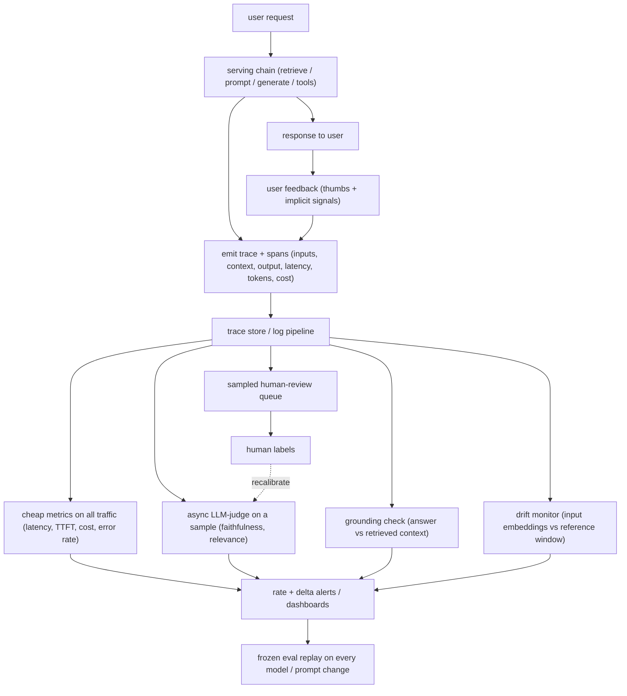

# Production Monitoring and Observability for LLM Systems

An interviewer rarely says "set up monitoring." They say: **"Your LLM app is live
and taking real traffic. There are no labels on production requests, nobody grades
the answers, and next week someone swaps the model and edits the prompt. How do
you know it is still working today, and how do you catch a hallucination spike or
a quality regression before your users do?"**

The trap is that the offline muscle everyone trains, run the suite and read the
score, does not exist online. Production has no ground truth, so you cannot
compute accuracy the way you did pre-ship. What you can do is instrument every
call into structured traces, proxy quality with cheap automatic checks, and sample
real traffic into a human-review queue. The senior framing: evaluation does not
stop at the deploy gate. Online it becomes a continuous, sampled, proxy-driven
activity rather than a one-time pass or fail.

## Sections

1. [Clarifying the requirements](01-clarifying-requirements.md) - the dialogue that scopes the problem.
2. [What to observe](02-what-to-observe.md) - traces, spans, tokens, cost, latency, and the one field you cannot drop.
3. [Online evaluation without labels](03-online-eval-without-labels.md) - LLM-as-judge, grounding check, user feedback, and calibration.
4. [Detecting drift and regressions](04-detecting-drift-and-regressions.md) - input and output drift, hallucination detection, canary and shadow gates.
5. [Alerting](05-alerting.md) - rate thresholds, z-score detection, on-call tiers, and replay on change.
6. [Serving and scaling](06-serving-and-scaling.md) - trace sampling cost, async off the hot path, and bottlenecks.
7. [How teams do it in production](07-how-teams-do-it-in-production.md) - Datadog, Honeycomb, Uber, Grafana, LangChain, Twilio Segment, and where they diverge.
8. [Interview Q&A](08-interview-qa.md) - commonly asked, tricky, and commonly answered wrong.
9. [Summary](09-summary.md) - the one-page recap, mermaid, and self-test.

## The whole system on one page

Two things an interviewer listens for: the expensive checks are **asynchronous
and sampled** so they do not tax the serving path, and human labels loop back to
**calibrate the proxy** rather than dead-ending as an audit.

Read the sections in order the first time; they build on each other. Each opens
with the question an interviewer actually asks, then answers it with the reasoning
behind the design choice.
