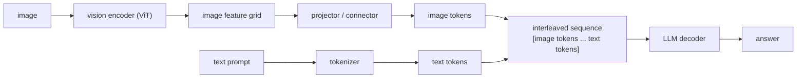

# 2. Frame the system

## The three-stage pipeline

A vision-language model is three components wired in sequence. Naming them
clearly and saying what each does is the first thing to put on the whiteboard.

1. **Vision encoder.** A ViT-style model (Vision Transformer) divides the image
   into a grid of patches and produces one feature vector per patch. For a 336px
   image with 14-pixel patches, that is a 24x24 = 576-vector grid. The encoder
   runs once per image; it does not depend on the text.

2. **Projector (connector).** Maps the encoder's feature grid into the LLM's
   token embedding space, producing a block of "image tokens." This is the design
   choice where the systems diverge most: a lightweight MLP, a cross-attention
   resampler, or a Q-Former each make different tradeoffs between detail preserved
   and tokens produced. The next section covers this in depth.

3. **LLM decoder.** Consumes the image tokens and text tokens as one interleaved
   sequence and generates the answer autoregressively. From the decoder's
   perspective, an image is just a chunk of tokens spliced into the input at the
   image placeholder position. The decoder does not know or care that those tokens
   came from a picture.

## What the system takes as input and returns

**Input at the API boundary.** An image (JPEG/PNG, up to the resolution cap),
plus a text prompt, plus optional conversation history for multi-turn chat.
Internally, the system runs image validation and downscaling before encoding, so
one malformed or oversized upload cannot blow the token budget.

**Output.** A streamed text response. Streaming matters because the first token
takes the longest (prefill dominates); streaming surfaces progress to the user
rather than making them wait for the full response.

## Why this framing is the right one to state first

The framing clarifies three things that change the rest of the design.

**Cost lives in the projector and the decoder, not the encoder.** The encoder is
a bounded, batchable pass that runs once per image and can be cached. The decoder
is autoregressive and memory-bandwidth-bound; every image token that lands in the
sequence hits prefill and the KV cache at every layer. The encoder is fast; the
decoder is the bottleneck.

**The text-only path skips the encoder and projector entirely.** Routing text-only
requests directly to the decoder avoids paying for vision infrastructure on 70
percent of traffic. This is a structural serving win, not an optimization.

**Image tokens are the unit of cost.** Once you know that one high-resolution
image can produce thousands of tokens that land in the most expensive stage, the
rest of the design follows: pick a connector that controls the token count, pick a
resolution that fits the task, and scale the encoder independently from the
decoder.
