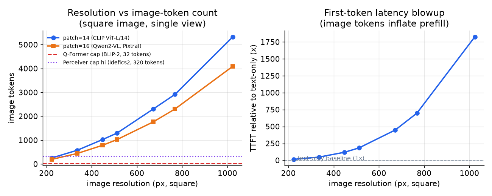
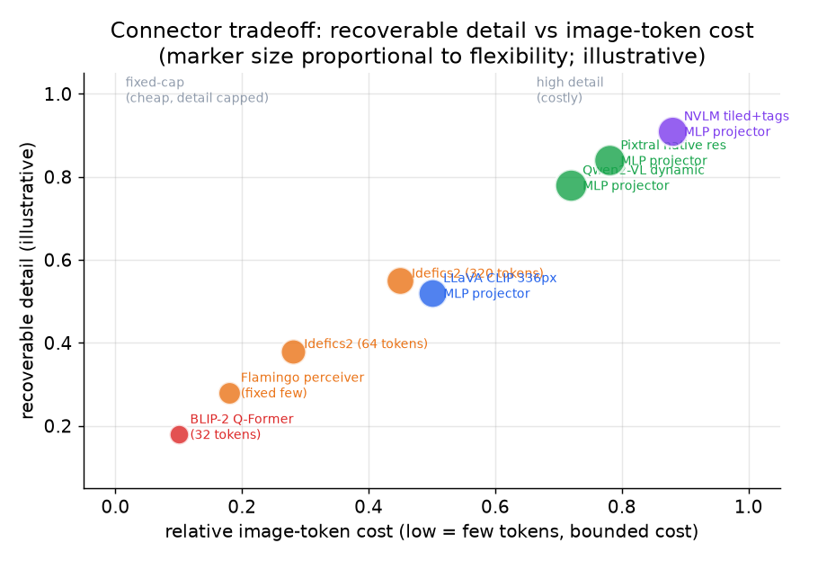

# 3. The projector and tokens

## How an image becomes tokens

The vision encoder produces one feature vector per image patch. For a square image
of side $H$ pixels and patch size $p$ pixels, the patch grid is:

$$\text{image tokens} = \left\lfloor \frac{H}{p} \right\rfloor \times \left\lfloor \frac{W}{p} \right\rfloor$$

Concrete numbers: a 336px image with patch size 14 (CLIP ViT-L/14, used in
LLaVA) gives $24 \times 24 = 576$ tokens. A 1024px image with patch size 16
(Pixtral-style) gives $64 \times 64 = 4096$ tokens. Neither of those is
"one token."

Those tokens then land in the LLM's input sequence alongside the text. Prefill
compute scales with the square of sequence length, so a high-resolution image
dominates first-token latency quickly:

$$\text{prefill compute} \approx O\!\left((n_\text{text} + n_\text{img})^2 \cdot d\right)$$

KV cache memory grows linearly with sequence length at every layer:

$$M_{\text{kv}} = 2 \cdot (n_{\text{text}} + n_{\text{img}}) \cdot L \cdot n_{\text{kv}} \cdot d_{\text{head}} \cdot p_{\text{bytes}}$$

where $L$ is the number of decoder layers, $n_{\text{kv}}$ is the number of KV
heads (1 for MQA, $h_q / g$ for GQA), $d_{\text{head}}$ is the per-head
dimension, and $p_{\text{bytes}}$ is bytes per value (2 for fp16). A 4096-token
image in a 32-layer GQA model with $n_{\text{kv}} = 8$ and $d_{\text{head}} =
128$ in fp16 adds roughly 512 MB to the KV cache per request (8x the 64 MB a
single-head MQA model would need for the same image).

For $k$ images in one request, cost stacks linearly:

$$\text{multi-image image tokens} = \sum_{i=1}^{k} n_{\text{img},i}$$

*Left: image-token count vs resolution for patch-14 (CLIP ViT-L/14 style) and
patch-16 (Qwen2-VL/Pixtral style), with the fixed caps of BLIP-2 (32 tokens)
and Idefics2 hi mode (320 tokens) shown for comparison. Right: illustrative
first-token latency blowup relative to a text-only baseline, showing how quickly
image tokens dominate prefill at high resolution.*

## Tiling for high-resolution input

To recover fine detail without a single giant patch grid, several systems tile the
image: split it into sub-images, encode each independently, then concatenate the
token sequences. This recovers OCR-level resolution but multiplies the token count
by the number of tiles.

$$\text{tiled token count} = T \cdot \frac{H_t \cdot W_t}{p^2} + \text{tile tags}$$

NVLM adds spatial tile tags to each patch so the decoder can reconstruct the
layout. Without tags, the decoder sees a flat bag of tile tokens and loses spatial
order, which destroys chart and table comprehension.

## The projector is where the design lives

The projector maps the encoder's patch features into the decoder's embedding space.
It also sets the image-token budget, which is the lever that controls cost.

**MLP projector (LLaVA, Qwen2-VL, Pixtral).** A simple linear layer or two-layer
MLP maps each patch feature to one decoder token. Token count equals patch count;
detail scales with cost. This is the simplest and most common choice. Training
only the projector (while keeping the encoder frozen) is cheap.

**Cross-attention resampler, a.k.a. Perceiver (Flamingo, Idefics2).** A small set
of learned query vectors attends over the encoder's patch features and produces a
fixed-size output regardless of input resolution. Flamingo and Idefics2 compress
to a few dozen tokens. Cost is bounded, but recoverable detail is capped.

**Q-Former (BLIP-2).** A variant of cross-attention where 32 learned query tokens
attend to the encoder features and produce exactly 32 output tokens for the
decoder. The cost is constant and tiny, but 32 tokens is a hard detail ceiling.
Dense content like charts and OCR is lost.

*Each point is a connector type placed by its image-token cost (x-axis) and the
detail it can recover (y-axis). MLP projectors sit upper-right: costly but
detail-preserving. Q-Former and Perceiver-style resamplers sit lower-left: cheap
but detail-capped. Illustrative positions based on reported task performance.*

## When to use which connector and resolution

| Reach for | When | Instead of |
|---|---|---|
| MLP projector (LLaVA, Qwen2-VL, Pixtral) | Detail should scale with cost; tasks need rich visual understanding | A resampler when fine detail matters and you can afford the tokens |
| Perceiver / Q-Former resampler (Flamingo, BLIP-2, Idefics2) | Per-request cost and latency must be strictly bounded | An MLP when the image-token budget cannot float |
| Tiling with tile tags (NVLM, Idefics2 split mode) | OCR, charts, or dense text require sub-word detail | A single fixed-resolution crop when the task is not detail-bound |
| Fixed 336px resolution (LLaVA CLIP ViT-L/14) | The task is general visual QA and cost sensitivity is high | Tiling when the task does not need fine text or small objects |
| Dynamic native resolution (Qwen2-VL, Pixtral) | Images vary widely in size and aspect ratio, or high detail is required | Fixed resolution that crops or squashes unusual aspect ratios |
| Image-token formula before serving | Capacity-planning prefill and KV before a new model is deployed | Assuming every image costs a fixed small number of tokens |

**Tools.** The reference encoder is CLIP (OpenAI), and open vision-language stacks such as LLaVA, BLIP-2, Flamingo/Idefics2, Qwen2-VL, and Pixtral ship the MLP-projector, Q-Former, and Perceiver-resampler connectors described above, all built on PyTorch (Meta) and distributed through Hugging Face Transformers. Tiling with spatial tags follows the NVLM approach and is implemented in the model's own preprocessing code. Serving these models with the image-token budget in mind is handled by vLLM and SGLang, which account for image tokens in their prefill and KV-cache planning.

**Worked example.** A vision-language app must read scanned invoices where small printed line items and totals matter. Because detail should scale with the token budget, it chooses an MLP projector that maps every patch to a decoder token rather than a Q-Former resampler that would compress to a fixed few dozen tokens and lose the dense text. It enables tiling with tile tags so the sub-word OCR detail survives and the decoder can still reconstruct table layout, accepting the higher token count that fine text demands. Since invoices arrive at varied sizes and aspect ratios, it serves at dynamic native resolution instead of a fixed 336px crop that would squash unusual pages, and it runs the image-token formula ahead of deployment to capacity-plan prefill and KV rather than assuming a flat per-image cost. A different product doing only coarse general visual QA under tight latency would make the opposite calls: a resampler and a fixed low resolution to keep the per-request budget bounded.

The Model Zoo for these architectures:
[LLaVA-1.5 7B](https://www.neurarch.com/?import=https://raw.githubusercontent.com/neurarch-ai/awesome-llm-model-zoo/main/architectures/llava-1.5-7b/model.json)
and
[CLIP ViT-B/32](https://www.neurarch.com/?import=https://raw.githubusercontent.com/neurarch-ai/awesome-llm-model-zoo/main/architectures/clip-vit-b32/model.json)
let you trace the encoder, projector, and the point where image tokens join text
tokens in the decoder at real dimensions.
