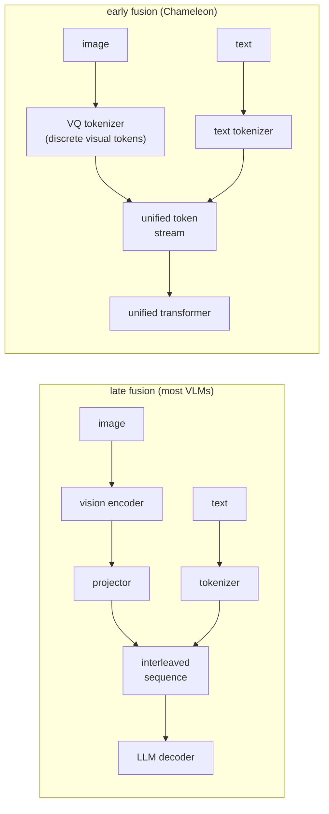

# 4. Model choices

## Late fusion vs early fusion

The framing in the last two sections assumed **late fusion**: the image and text
are encoded separately, then joined only at the point where they enter the LLM
decoder as an interleaved token sequence. Almost all deployed vision-language
models use late fusion. But there is an alternative worth understanding.

**Early fusion (Chameleon, tokenized images).** The image is discretized into a
vocabulary of visual tokens, the same way text is tokenized. A single transformer
then processes a mixed stream of image and text tokens from the very first layer,
with no separate encoder or projector. The model can generate images as outputs
too, not just read them.

Early fusion is cleaner architecturally but harder to train: keeping continuous
visual detail in a discrete vocabulary is difficult, and training over mixed
modalities requires careful data balancing. Late fusion lets you reuse a
pre-trained vision encoder (CLIP, SigLIP) and a pre-trained LLM, reducing the
training budget substantially.

## Vision encoder families

The choice of vision encoder sets the resolution, the token count, and what kinds
of visual features reach the decoder.

**CLIP ViT variants (OpenAI).** The most widely reused encoders. CLIP was trained
with image-text contrastive loss on 400 million pairs, so its features are
semantically rich for natural images. LLaVA-1.5 uses CLIP ViT-L/14 at 336px.
The main limitation is fixed resolution (336px) and that the model was not
designed for OCR or fine geometric detail.

**SigLIP (Google).** A successor to CLIP using a sigmoid contrastive loss instead
of softmax over all negatives. SigLIP can train on larger batches more stably and
tends to produce stronger image features at comparable compute. Several newer open
VLMs (Idefics3, PaliGemma) use SigLIP as the vision backbone.

**Custom ViT trained from scratch (Pixtral).** Pixtral trains its own vision
encoder from scratch rather than reusing CLIP or SigLIP, enabling native-resolution
input with flexible patch handling and aspect-ratio preservation. The cost is that
you lose the head-start from a pre-trained CLIP backbone.

**Audio encoder (Whisper-style, Qwen2-Audio).** For audio modalities, a spectrogram
encoder plays the same role as the ViT: it produces a feature sequence that a
projector maps into the LLM embedding space. The token-cost math is identical;
long audio inflates the frame-token count exactly as high resolution inflates the
image-token count.

## When to use which encoder and fusion strategy

| Reach for | When | Instead of |
|---|---|---|
| Frozen CLIP ViT-L/14 (LLaVA) | Training budget is small; task is natural-image QA | Training from scratch when a strong pre-trained encoder exists |
| SigLIP encoder (Idefics3, PaliGemma) | You want stronger image features with better large-batch training stability | CLIP when SigLIP-based backbones are available and training budget allows |
| Custom ViT from scratch (Pixtral) | Native-resolution and aspect-ratio handling are critical; training budget is available | Frozen CLIP when fine-grained layout matters more than training cost |
| Late fusion (most VLMs) | Reusing pre-trained components; training budget is limited; the task is read-only VQA | Early fusion when the model must also generate images or operate over mixed-modal streams |
| Early fusion (Chameleon) | You need unified text-and-image generation in one model | Late fusion when you only need to read images, not generate them |
| Audio encoder plus projector (Qwen2-Audio) | The task includes voice input or audio understanding | Attempting to tokenize raw audio waveforms directly into the LLM |

**Tools.** The reusable vision backbones are CLIP (OpenAI) and SigLIP (Google), and Whisper (OpenAI) is the standard audio encoder; all are available through Hugging Face Transformers and built on PyTorch (Meta). Late-fusion VLMs like LLaVA, Idefics3, PaliGemma, and Pixtral compose one of these encoders with a projector and a pre-trained LLM, while early-fusion models like Chameleon use a VQ tokenizer to fold images into a single token stream. Training only the projector or light adapters on top of a frozen encoder is done with PEFT/LoRA in the same ecosystem.

**Worked example.** A document-AI team building an image-reading assistant has a small training budget and only needs to read images, not generate them. That points to late fusion so it can reuse a pre-trained LLM and a pre-trained vision encoder rather than paying to train a unified early-fusion transformer it does not need. Between encoders it starts from a frozen CLIP backbone because the task is largely natural-image understanding and training from scratch is unjustified, but if benchmark image features prove weak it would swap to a SigLIP backbone for better large-batch stability before ever considering a custom ViT. It would only train a ViT from scratch, as Pixtral does, if native-resolution and aspect-ratio fidelity became critical enough to give up the pre-trained head start. If the product later added voice input, it would attach an audio encoder plus projector rather than trying to feed raw waveforms into the LLM.

**Model Zoo.** For CLIP and LLaVA-1.5, traced at real dimensions:
[CLIP ViT-B/32](https://www.neurarch.com/?import=https://raw.githubusercontent.com/neurarch-ai/awesome-llm-model-zoo/main/architectures/clip-vit-b32/model.json),
[LLaVA-1.5 7B](https://www.neurarch.com/?import=https://raw.githubusercontent.com/neurarch-ai/awesome-llm-model-zoo/main/architectures/llava-1.5-7b/model.json).
SigLIP and Whisper-small are also in the
[Model Zoo](https://github.com/neurarch-ai/awesome-llm-model-zoo).
