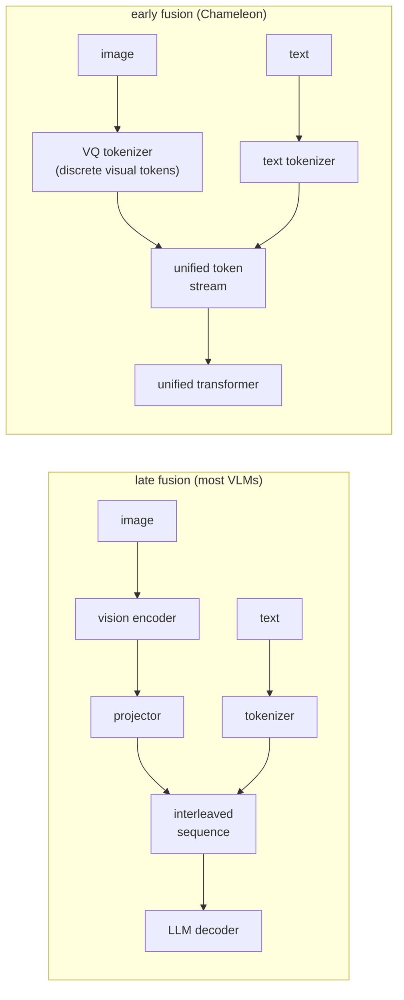

# 4. Model choices

## Late fusion vs early fusion

The framing in the last two sections assumed **late fusion**: the image and text
are encoded separately, then joined only at the point where they enter the LLM
decoder as an interleaved token sequence. Almost all deployed vision-language
models use late fusion. But there is an alternative worth understanding.

**Early fusion (Chameleon, tokenized images).** The image is discretized into a
vocabulary of visual tokens, the same way text is tokenized. A single transformer
then processes a mixed stream of image and text tokens from the very first layer,
with no separate encoder or projector. The model can generate images as outputs
too, not just read them.

**How it works.** The two subgraphs differ in where the image stops being continuous. In late fusion, the top path, a vision encoder produces continuous patch features, a projector maps them into the decoder's embedding space, and those image tokens are interleaved with the tokenizer's text tokens into one sequence that the LLM decoder consumes. Nothing about the image is ever discretized: the projector's output is a block of real-valued vectors spliced in beside the text embeddings. In early fusion, the bottom path, a VQ tokenizer instead quantizes the image into discrete visual tokens drawn from a fixed codebook, so both image and text become entries in a single unified vocabulary and flow into one transformer with no separate encoder or projector. That unified stream is what lets an early-fusion model both read and generate images, at the cost of squeezing continuous visual detail through a discrete codebook, which is the training difficulty the next paragraph describes.

Early fusion is cleaner architecturally but harder to train: keeping continuous
visual detail in a discrete vocabulary is difficult, and training over mixed
modalities requires careful data balancing. Late fusion lets you reuse a
pre-trained vision encoder (CLIP, SigLIP) and a pre-trained LLM, reducing the
training budget substantially.

## Compare and contrast: late fusion vs. early fusion

From the outside the two look interchangeable: both end with one transformer
consuming a single interleaved sequence of image and text tokens, and both answer
questions about images. The confusion comes from that shared surface. Underneath,
one is an assembly of pre-trained parts and the other is a single jointly trained
model, and that changes what each can do.

| Dimension | Late fusion (LLaVA-style) | Early fusion (Chameleon-style) |
|---|---|---|
| What the decoder sees | One interleaved token sequence mixing image and text | One interleaved token sequence mixing image and text |
| How image becomes tokens | Continuous patch features projected into the embedding space; never discretized | Quantized by a VQ tokenizer into discrete codebook entries in the shared vocabulary |
| How the model is built | Assembled: pre-trained encoder plus pre-trained LLM, glued by a small trained projector | Trained jointly from the start over the unified vocabulary |
| Training cost | Small; mostly the projector or light adapters | A full pretraining run with careful modality balancing |
| Can it generate images | No; the output head only covers the text vocabulary | Yes; it can sample visual tokens and decode them through the codebook |
| Detail bottleneck | The projector's token budget (MLP vs. resampler) | The codebook: continuous detail squeezed through discrete quantization |

The difference changes the design at one question: must the model produce images or
mixed-modal output? If yes, only early fusion works, and you accept the pretraining
bill; if the product only reads images, late fusion delivers the capability for a
fraction of the training cost.

## Vision encoder families

The choice of vision encoder sets the resolution, the token count, and what kinds
of visual features reach the decoder.

**CLIP ViT variants (OpenAI).** The most widely reused encoders. CLIP was trained
with image-text contrastive loss on 400 million pairs, so its features are
semantically rich for natural images. LLaVA-1.5 uses CLIP ViT-L/14 at 336px.
The main limitation is fixed resolution (336px) and that the model was not
designed for OCR or fine geometric detail.

**SigLIP (Google).** A successor to CLIP using a sigmoid contrastive loss instead
of softmax over all negatives. SigLIP can train on larger batches more stably and
tends to produce stronger image features at comparable compute. Several newer open
VLMs (Idefics3, PaliGemma) use SigLIP as the vision backbone.

**Custom ViT trained from scratch (Pixtral).** Pixtral trains its own vision
encoder from scratch rather than reusing CLIP or SigLIP, enabling native-resolution
input with flexible patch handling and aspect-ratio preservation. The cost is that
you lose the head-start from a pre-trained CLIP backbone.

**Audio encoder (Whisper-style, Qwen2-Audio).** For audio modalities, a spectrogram
encoder plays the same role as the ViT: it produces a feature sequence that a
projector maps into the LLM embedding space. The token-cost math is identical;
long audio inflates the frame-token count exactly as high resolution inflates the
image-token count.

## When to use which encoder and fusion strategy

| Reach for | When | Instead of |
|---|---|---|
| Frozen CLIP ViT-L/14 (LLaVA) | Training budget is small; task is natural-image QA | Training from scratch when a strong pre-trained encoder exists |
| SigLIP encoder (Idefics3, PaliGemma) | You want stronger image features with better large-batch training stability | CLIP when SigLIP-based backbones are available and training budget allows |
| Custom ViT from scratch (Pixtral) | Native-resolution and aspect-ratio handling are critical; training budget is available | Frozen CLIP when fine-grained layout matters more than training cost |
| Late fusion (most VLMs) | Reusing pre-trained components; training budget is limited; the task is read-only VQA | Early fusion when the model must also generate images or operate over mixed-modal streams |
| Early fusion (Chameleon) | You need unified text-and-image generation in one model | Late fusion when you only need to read images, not generate them |
| Audio encoder plus projector (Qwen2-Audio) | The task includes voice input or audio understanding | Attempting to tokenize raw audio waveforms directly into the LLM |

**Tools.** The reusable vision backbones are CLIP (OpenAI) and SigLIP (Google), and Whisper (OpenAI) is the standard audio encoder; all are available through Hugging Face Transformers and built on PyTorch (Meta). Late-fusion VLMs like LLaVA, Idefics3, PaliGemma, and Pixtral compose one of these encoders with a projector and a pre-trained LLM, while early-fusion models like Chameleon use a VQ tokenizer to fold images into a single token stream. Training only the projector or light adapters on top of a frozen encoder is done with PEFT/LoRA in the same ecosystem.

**Provenance.** The frozen-encoder-plus-projector late-fusion recipe was popularized by LLaVA (2023) over a CLIP (OpenAI, 2021) backbone; SigLIP (Google, 2023) is the sigmoid-loss encoder that replaces CLIP in newer stacks for better large-batch stability. The multimodal cross-attention lineage traces to Flamingo (DeepMind, 2022) and the query-token bridge to BLIP-2 (Salesforce, 2023). The light-adapter training path uses LoRA (Microsoft, 2021).

**Recent directions (2024-2025).** Three shifts have moved the frontier past the
fixed-resolution frozen-CLIP recipe. **Dynamic resolution**: Qwen2-VL processes images
at their native resolution and aspect ratio, producing a variable number of visual
tokens, and adds M-RoPE to share positions across text, image, and video (Qwen team,
Alibaba, [arXiv:2409.12191](https://arxiv.org/abs/2409.12191)). **Native multimodal
pretraining**: instead of gluing a vision encoder onto a finished LLM, models train on
interleaved text and image data from scratch (the InternVL line,
[arXiv:2312.14238](https://arxiv.org/abs/2312.14238)). **Any-to-any early fusion**:
Chameleon tokenizes images and text into one stream and can both read and generate
images (Meta, [arXiv:2405.09818](https://arxiv.org/abs/2405.09818)). The late-fusion
recipe in this chapter remains the cheap, sample-efficient default; these are the
directions to name when the task needs native resolution, image generation, or a
single model trained jointly rather than assembled.

**Worked example.** A document-AI team building an image-reading assistant has a small training budget and only needs to read images, not generate them. That points to late fusion so it can reuse a pre-trained LLM and a pre-trained vision encoder rather than paying to train a unified early-fusion transformer it does not need. Between encoders it starts from a frozen CLIP backbone because the task is largely natural-image understanding and training from scratch is unjustified, but if benchmark image features prove weak it would swap to a SigLIP backbone for better large-batch stability before ever considering a custom ViT. It would only train a ViT from scratch, as Pixtral does, if native-resolution and aspect-ratio fidelity became critical enough to give up the pre-trained head start. If the product later added voice input, it would attach an audio encoder plus projector rather than trying to feed raw waveforms into the LLM.

**Model Zoo.** For CLIP and LLaVA-1.5, traced at real dimensions:
[CLIP ViT-B/32](https://www.neurarch.com/?import=https://raw.githubusercontent.com/neurarch-ai/awesome-llm-model-zoo/main/architectures/clip-vit-b32/model.json),
[LLaVA-1.5 7B](https://www.neurarch.com/?import=https://raw.githubusercontent.com/neurarch-ai/awesome-llm-model-zoo/main/architectures/llava-1.5-7b/model.json).
SigLIP and Whisper-small are also in the
[Model Zoo](https://github.com/neurarch-ai/awesome-llm-model-zoo).

## Implementation and training pitfalls

Encoder and fusion choices look clean on a diagram and then break at the seam where
one modality is spliced into the decoder. The failures below are the recurring ones
when wiring a vision or audio stack to an LLM.

| Problem | Symptom | Fix |
|---|---|---|
| Image-token budget blowup | high resolution or tiling floods the context with vision tokens, cost and latency spike and text gets truncated | cap tiles and resolution, pool or resample patch tokens, budget image tokens against text tokens explicitly |
| Projector/decoder dim mismatch | the projector output does not match the decoder hidden size, load error or garbage generations | set the projector output dimension to the decoder hidden size and verify shapes before training |
| Encoder resolution too low for the task | a frozen 336px CLIP cannot read small text or fine layout | use a native-resolution encoder or tiling, or pick SigLIP; do not just upscale into a fixed-resolution encoder |
| Freezing the encoder on a far domain | projector-only training never adapts features for documents, medical, or satellite imagery | unfreeze the encoder or add LoRA adapters when the target domain is far from the encoder's pretraining |
| Modality data imbalance | the model takes the text-only shortcut and ignores images, or text quality degrades | balance and interleave mixed-modal training data and watch per-modality loss |
| Image-placeholder template drift | image tokens land in the wrong positions between training and serving and alignment breaks | pin the exact image-placeholder chat template and keep it identical train and serve |
| Early-fusion codebook squeeze | discretizing images through a VQ codebook loses fine visual detail and destabilizes training | prefer late fusion unless image generation is required; when using early fusion, balance modality data carefully |
| Audio frame-token inflation | long audio inflates frame tokens the same way high resolution inflates image tokens and blows the context | segment or downsample audio and cap the frame-token count per request |

The through-line: the encoder and projector are a shape-and-budget contract with the
decoder, so most multimodal breakage is a dimension mismatch, a token budget nobody
capped, or a train-versus-serve template that quietly drifted.
