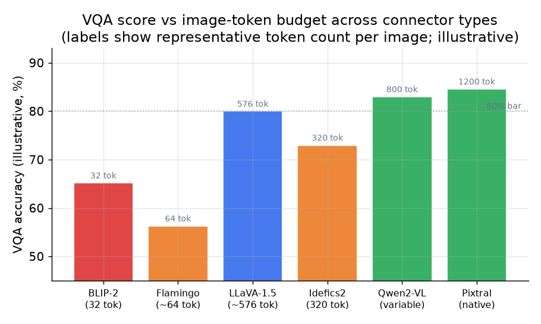

# 5. Evaluation

Vision-language models have no single metric that covers all tasks; the right eval
depends on what the model must do. Naming the right benchmark for the right task,
and knowing exactly how it is scored, is a concrete signal in an interview. For
each metric below, the input the model receives and the output it must produce are
what determine how you score it.

## Task-specific offline metrics

**VQA accuracy (VQAv2, the standard).**
- **Input / output.** The model is given an image plus a natural-language question
  ("What color is the bus?") and must produce a short free-form answer (a word or
  phrase). It is not multiple choice.
- **How it is computed.** VQAv2 collects **10 human answers per question**, so the
  metric is a soft consensus, not exact match. After normalizing the answer
  (lowercase, strip punctuation and articles, canonicalize number words), the score
  for a predicted answer is

$$\text{VQA-Acc}(\hat{a}) = \min\left(\frac{\lvert \lbrace \text{humans who gave } \hat{a} \rbrace \rvert}{3}, 1\right)$$

  so an answer that matches at least 3 of the 10 humans scores 1.0, and fewer
  scores proportionally. The reported number is this averaged over all questions.
  (A common interview error is to describe VQA accuracy as exact match; it is the
  soft `min(n/3, 1)` voting metric.)

**TextVQA.** Same input/output and same soft VQA-accuracy scoring as VQAv2, but the
questions require **reading text inside the image** (a sign, a label). It stresses
OCR, so a model strong on VQAv2 can score far lower here if its input resolution is
too coarse to read small text.

**DocVQA and ChartQA (document and chart understanding).**
- **Input / output.** A document or chart image plus a question; output is a short
  answer string (DocVQA) or a value (ChartQA).
- **How it is computed.** DocVQA uses **ANLS (Average Normalized Levenshtein
  Similarity)**, not exact match: it scores `1 - (edit distance / max length)`
  between the predicted and ground-truth answer (zeroed below a threshold), so minor
  OCR slips are tolerated. ChartQA uses **relaxed accuracy**: a numeric answer
  counts as correct if it is within a small tolerance (about 5 percent) of the
  ground truth.

**Grounding and localization (RefCOCO).**
- **Input / output.** An image plus a referring expression ("the dog on the left");
  output is a **bounding box**.
- **How it is computed.** Accuracy at an IoU threshold: a prediction is correct when
  its intersection-over-union with the ground-truth box is at least 0.5. A model
  that describes the right object but boxes the wrong one scores well on VQA and
  fails grounding, which is why the two are separate metrics.

**Multi-discipline reasoning (MMMU).** College-level multiple-choice questions
across many subjects, with images. Because it is multiple choice, it is scored as
plain **choice accuracy** (fraction of questions whose selected option is correct),
so it is not comparable to the free-form VQA number despite both being "accuracy."

**Hallucination rate (POPE).**
- **Input / output.** POPE (Polling-based Object Probing Evaluation) turns
  hallucination into a yes/no test: for an image it asks a series of questions of
  the form "Is there a {object} in the image?" Half the objects are truly present
  (from the image annotations) and half are absent, where the absent ones are
  sampled three ways of increasing difficulty: **random**, **popular** (frequent
  objects), and **adversarial** (objects that commonly co-occur with what is
  present). The model answers yes or no.
- **How it is computed.** Treat the answers as binary classification and report
  **accuracy, precision, recall, and F1**. The hallucination signal is the
  **false-positive rate**, saying "yes" to an absent object; a model that confidently
  hallucinates has high recall but low precision. Higher F1, especially on the
  adversarial split, means less hallucination. This is why a model that scores
  higher on VQA can be worse in practice: VQA rewards a confident answer, POPE
  catches the confident-but-invented ones.

*Illustrative VQA scores alongside representative image-token counts for different
connector designs. Fixed-cap connectors (BLIP-2, Flamingo) are cheapest but score
lower on detail-heavy tasks. MLP projectors with dynamic resolution reach higher
scores at proportionally higher token cost. Scores are illustrative composites from
published benchmarks.*

## Latency and cost metrics

**Time to first token (TTFT).** For interactive use, TTFT is the user-facing latency
that matters most. It measures from request receipt to the first generated token and
is dominated by prefill over the full image-plus-text sequence, so it grows with the
image-token count. Track TTFT separately at each resolution tier.

**Cost per request.** Because image-token blowup is easy to ship and hard to notice
in offline evals, track compute cost per request explicitly (roughly proportional to
the image-token count times the model's per-token cost). A model that scores 3 points
higher on VQAv2 but costs 4x more to serve is not always a good tradeoff.

**Throughput under load.** Image requests are heterogeneous in size; a dynamic-
resolution model makes every request a different length. Measure tokens per second at
the p50 and p99, not just on a single short request.

## Online metrics

**User engagement.** In a product that shows VLM answers, do users rate answers as
helpful? Do they ask follow-up questions, or do they drop? Offline accuracy on
benchmarks does not perfectly predict user satisfaction.

**Refusal and hallucination rate in production.** Log cases where the model refuses
to answer or users flag an answer as wrong. Hallucination shows up here long before
it shows up in offline POPE scores.

## When to use which metric

| Reach for | When | Instead of |
|---|---|---|
| VQAv2 soft accuracy | General natural-image question answering | TextVQA or DocVQA when the task is not the right stress test |
| TextVQA | The answer requires reading text in a natural image (signs, labels) | VQAv2 alone, which does not force OCR |
| DocVQA (ANLS) or ChartQA (relaxed acc) | Documents and charts, where exact match is too strict on OCR slips | Plain exact match, which punishes trivial string differences |
| RefCOCO (accuracy at IoU 0.5) | The model must locate or refer to specific regions | Caption quality, which does not test spatial reference |
| POPE F1 (adversarial split) | You need to quantify how often the model invents objects | VQA accuracy alone, which rewards hallucinated-but-confident answers |
| TTFT at target resolution | Interactive serving with a latency contract | Offline accuracy only, which ignores serving cost |
| Cost per request alongside accuracy | Any deployment decision | Accuracy alone, since image-token blowup makes it easy to ship something correct but unaffordable |

The guardrail to state out loud: an offline VQA gain that doubles the image-token
budget should survive a cost analysis and an online TTFT check before it ships.
Accuracy and cost must both pass; optimizing one while ignoring the other is the
classic mistake.
