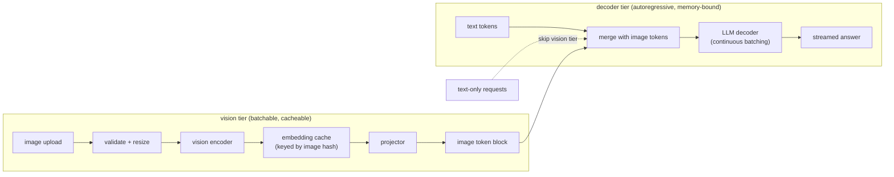
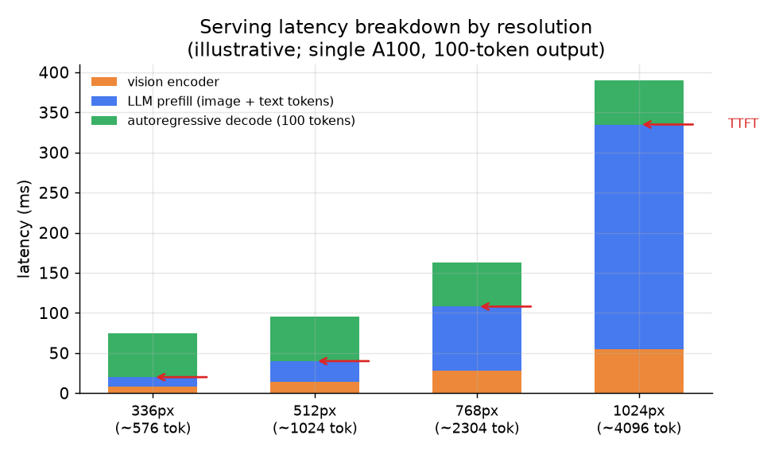

# 6. Serving and scaling

## Two workloads, not one

A multimodal serving stack has two fundamentally different workloads that should
not share a single server.

**Vision encoder tier.** The encoder takes an image and produces a fixed feature
grid. It runs once per image, is embarrassingly parallel across images in a batch,
and its output can be cached by image hash. The compute cost is bounded and
independent of the conversation. This tier should be independently scaled and can
run on a separate pod.

**LLM decoder tier.** The decoder is the autoregressive, memory-bandwidth-bound
generation loop. It handles the continuous batching and KV cache management that
every LLM serving stack already needs. Image tokens from the vision tier arrive as
a prefix and are indistinguishable from text tokens by the time they reach the
decoder.

Text-only requests bypass the vision tier entirely. In a workload where 70 percent
of requests carry no image, this avoids paying for a vision encoder on most
traffic.

## Caching image embeddings

The same image often reappears: a product photo queried from a catalog, the same
document uploaded in a multi-turn conversation, a static image behind a recurring
QA widget. Caching the vision encoder output by image hash means repeated images
skip the encoding pass entirely and land directly in the projector.

This is a clean win because the encoder output is deterministic given the image,
and encoder passes are the expensive batched GPU compute. vLLM V1 implements both
encoder output caching and prefix caching (folding the image hash into the KV
prefix key) to recover recompute across turns in a multi-turn chat.

## Parallelism strategies

On multi-GPU deployments, the vision encoder and LLM decoder have different
parallelism needs.

**Tensor parallelism on the encoder is wasteful.** A vision encoder is typically
0.2 to 2.3 percent of total model parameters. Sharding it across GPUs with TP
adds 58 to 126 per-layer all-reduces while saving almost no compute. AMD's ROCm
team measured up to 44 percent throughput improvement by switching the encoder to
data parallelism (each GPU holds a full encoder copy and processes a different
batch of images) and letting the decoder keep tensor parallelism. A single
all-gather at the end replaces dozens of mid-encoder synchronizations.

**Continuous batching on the decoder.** The decoder runs standard continuous
batching over the interleaved token sequences. Image requests carry longer prefixes
and vary in length with resolution; the scheduler must handle variable-length
visual blocks without starving text-only requests.

## Handling oversized and malformed images

A single oversized upload can OOM the encoder GPU. Validate dimensions and file
size at the API gateway before encoding, and downscale to the resolution cap
before the encoder sees it. One malformed upload should not affect other requests
in the batch.

## Bottlenecks

| Bottleneck | Cause | Fix | Tradeoff |
|---|---|---|---|
| High TTFT | Large image-token prefill dominates first-token latency | Lower resolution; use a fixed-cap connector (resampler); cache encoder output | Less detail per image |
| KV cache memory pressure | Image tokens inflate cache at every layer | Cap resolution; quantize KV cache (fp8 or int4) | Detail or numeric precision |
| Vision encoder throughput | Encoding every unique image inline on the decoder GPU | Separate encoder tier with data-parallel batching; cache by image hash | More infra; cold images see no cache gain |
| Mixed-traffic head-of-line blocking | Large image requests hold up text-only requests in one queue | Separate queues or tiers; route text-only past the vision tier | Routing logic and two-tier ops |
| Variable-length batch inefficiency | Dynamic-resolution models make every image a different token count | Cap max image tokens per request; pad or bucket batches | Wasted compute on padding |
| Multi-image token blowup | k images stack token cost linearly into prefill and KV | Cap images per request; compress with a resampler for the extra images | Capability limit |

*Illustrative stacked latency at four resolution tiers on a single A100, with a
100-token output. At 336px, prefill and decode are roughly balanced. At 1024px,
LLM prefill over image tokens dominates; the vision encoder and decode are nearly
constant. TTFT arrows mark where the user sees the first token.*
