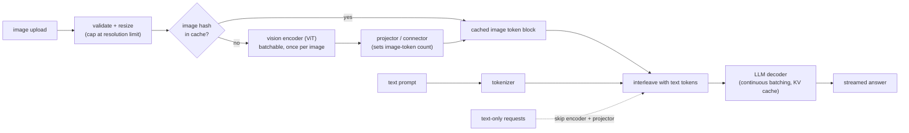

# 9. Summary

## One-page recap

- **The image-token budget is the whole cost story.** An image is not one token;
  it is hundreds or thousands, and they land in the most expensive stage of the
  pipeline. A 1024x1024 image at patch-16 is 4096 tokens. Prefill compute scales
  with the square of sequence length, so image tokens dominate first-token latency
  at high resolution.
- **The three-stage pipeline: encoder, projector, decoder.** The vision encoder
  runs once per image and can be cached and batched. The projector sets the
  image-token count. The LLM decoder is autoregressive and memory-bound; scale it
  separately from the encoder.
- **The projector is the design choice.** An MLP projector passes one token per
  patch (detail scales with cost). A resampler or Q-Former compresses to a fixed
  few tokens (cost bounded, detail capped). Picking the projector is picking the
  quality-cost operating point for every request.
- **Resolution is a quality-cost knob, not a default.** Serve general visual QA
  at low resolution; accept higher tokens only when the task genuinely needs fine
  detail, such as document OCR or chart reading. Never max resolution by default.
- **The serving split is structural, not an optimization.** Run the vision encoder
  as a separate batchable tier; cache encoder output by image content hash; route
  text-only requests past the encoder entirely. These three moves recover most of
  the unnecessary cost in a naive single-server deployment.
- **Evaluate both accuracy and cost.** Offline VQA accuracy does not capture
  token-budget blowup. Track TTFT at each resolution tier and cost per request
  alongside benchmark scores. A model that scores 3 points higher on VQAv2 but
  costs 4x more to serve is not always a good tradeoff.

## The system on one page

## Test yourself

1. Why does a 1024x1024 image with 16-pixel patches produce 4096 tokens, not one
   token, and where exactly do those tokens land in the serving pipeline?
2. What is the difference between an MLP projector and a Q-Former resampler in
   terms of image-token count and recoverable detail? When would you choose each?
3. A prefix cache that works perfectly for text prompts starts returning wrong
   answers for image requests. Why, and how do you fix it?
4. Your TTFT is 3 seconds on image requests and 0.5 seconds on text-only requests.
   What is the first thing to check, and what is the cheapest fix?
5. How does data-parallel (DP) vision encoding differ from tensor-parallel (TP)
   vision encoding, and why does DP win for a component that is 1 percent of
   model parameters?
6. When would you use tiling with tile tags over a single fixed-resolution crop,
   and what does adding tile tags actually do?

## Further reading

- Dense reference with math, all case studies, and per-company teardowns:
  [topics/09-multimodal-serving.md](../../topics/09-multimodal-serving.md).
- Comparison table and connector math: [tools/comparisons/09.md](../../tools/comparisons/09.md).
- Per-company teardowns: [tools/teardowns/09.md](../../tools/teardowns/09.md).
- Trace a real VLM graph live:
  [LLaVA-1.5 7B](https://www.neurarch.com/?import=https://raw.githubusercontent.com/neurarch-ai/awesome-llm-model-zoo/main/architectures/llava-1.5-7b/model.json)
  and
  [CLIP ViT-B/32](https://www.neurarch.com/?import=https://raw.githubusercontent.com/neurarch-ai/awesome-llm-model-zoo/main/architectures/clip-vit-b32/model.json)
  in the [Model Zoo](https://github.com/neurarch-ai/awesome-llm-model-zoo).
