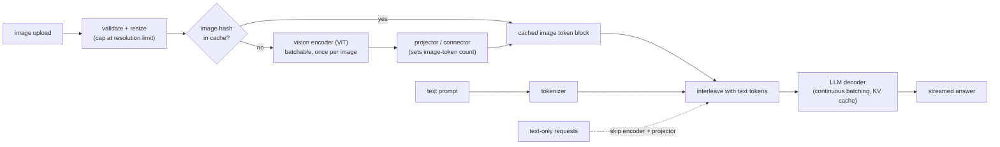

# 9. Summary

## One-page recap

- **The image-token budget is the whole cost story.** An image is not one token;
  it is hundreds or thousands, and they land in the most expensive stage of the
  pipeline. A 1024x1024 image at patch-16 is 4096 tokens. Prefill compute scales
  with the square of sequence length, so image tokens dominate first-token latency
  at high resolution.
- **The three-stage pipeline: encoder, projector, decoder.** The vision encoder
  runs once per image and can be cached and batched. The projector sets the
  image-token count. The LLM decoder is autoregressive and memory-bound; scale it
  separately from the encoder.
- **The projector is the design choice.** An MLP projector passes one token per
  patch (detail scales with cost). A resampler or Q-Former compresses to a fixed
  few tokens (cost bounded, detail capped). Picking the projector is picking the
  quality-cost operating point for every request.
- **Resolution is a quality-cost knob, not a default.** Serve general visual QA
  at low resolution; accept higher tokens only when the task genuinely needs fine
  detail, such as document OCR or chart reading. Never max resolution by default.
- **The serving split is structural, not an optimization.** Run the vision encoder
  as a separate batchable tier; cache encoder output by image content hash; route
  text-only requests past the encoder entirely. These three moves recover most of
  the unnecessary cost in a naive single-server deployment.
- **Evaluate both accuracy and cost.** Offline VQA accuracy does not capture
  token-budget blowup. Track TTFT at each resolution tier and cost per request
  alongside benchmark scores. A model that scores 3 points higher on VQAv2 but
  costs 4x more to serve is not always a good tradeoff.

## The system on one page

```mermaid
flowchart LR
  IMG["image upload"] --> VAL["validate + resize<br/>(cap at resolution limit)"]
  VAL --> CACHE_CHECK{"image hash<br/>in cache?"}
  CACHE_CHECK -- yes --> ITOK["cached image token block"]
  CACHE_CHECK -- no --> ENC["vision encoder (ViT)<br/>batchable, once per image"]
  ENC --> PROJ["projector / connector<br/>(sets image-token count)"]
  PROJ --> ITOK
  ITOK --> MERGE["interleave with text tokens"]
  TXT["text prompt"] --> TOK["tokenizer"]
  TOK --> MERGE
  TXT_ONLY["text-only requests"] -. "skip encoder + projector" .-> MERGE
  MERGE --> DEC["LLM decoder<br/>(continuous batching, KV cache)"]
  DEC --> ANS["streamed answer"]
```

## Test yourself

Answers are collapsed. Attempt each question before opening one.

1. Why does a 1024x1024 image with 16-pixel patches produce 4096 tokens, not one
   token, and where exactly do those tokens land in the serving pipeline?

   

Answer

   The vision encoder does not see an image, it sees a **patch grid**: it emits one
   feature vector per patch, and the count is
   $\lfloor H/p \rfloor \times \lfloor W/p \rfloor$, so 1024 over 16 is 64 per side
   and $64 \times 64 = 4096$. An MLP projector then maps each of those patch
   features to exactly one decoder token, which is why the token count equals the
   patch count. Those tokens land in the **LLM decoder's input sequence**, spliced in
   at the image placeholder position, which means they hit the prefill pass (compute
   grows with the square of sequence length) and the KV cache at every layer. In the
   reference 32-layer GQA decoder from
   [section 3](03-the-projector-and-tokens.md) with 8 KV heads, head dimension 128,
   and fp16, those 4096 tokens add roughly 512 MB of KV cache per request. One token
   cannot work because a single embedding vector has nowhere near the capacity to
   represent a scene at answerable detail, and one-token-per-patch is what preserves
   the spatial correspondence attention exploits
   ([section 8](08-interview-qa.md)). Treating an image as one token is the mistake
   that makes cost estimates wrong by three orders of magnitude: a 30-token text
   question with one high-resolution image attached is over 130x more expensive at
   prefill ([section 1](01-clarifying-requirements.md)).

   

2. What is the difference between an MLP projector and a Q-Former resampler in
   terms of image-token count and recoverable detail? When would you choose each?

   

Answer

   An **MLP projector** produces one decoder token per encoder patch, so the token
   count floats with resolution (576 at 336px with patch 14, 4096 at 1024px with
   patch 16) and detail scales with cost. A **Q-Former** (BLIP-2) instead lets 32
   learned query tokens cross-attend the patch grid and emits exactly 32 output
   tokens no matter how large the input was, so cost is constant and tiny while 32
   tokens is a hard detail ceiling. The mechanism explains the ceiling: everything
   the decoder will ever know about the image has to pass through that fixed-width
   bottleneck, and a 4096-patch grid summarized into a few dozen vectors cannot
   preserve every glyph and edge, so the queries keep global semantics and drop dense
   text ([section 8](08-interview-qa.md)). Choose the MLP when detail should scale
   with cost and you can afford variable token counts: rich visual understanding,
   invoices, small printed line items. Choose the resampler (Q-Former, or a
   Perceiver-style one as in Flamingo and Idefics2) when per-request cost and latency
   must be strictly bounded regardless of what the user uploads. The capstone shows
   both ends: the consumer photo-QA build takes the MLP at 576 tokens, while the
   catalog batch-captioning build takes a resampler at a fixed 32 to 64 tokens
   because captions need gist, not glyphs
   ([sections 3](03-the-projector-and-tokens.md) and
   [10](10-putting-it-together.md)).

   

3. A prefix cache that works perfectly for text prompts starts returning wrong
   answers for image requests. Why, and how do you fix it?

   

Answer

   A text prefix cache keys on **token IDs**, and in a multimodal model the image
   placeholder is a fixed set of special tokens that look identical no matter which
   image is inserted. Two different images therefore produce the same placeholder
   token sequence, the key matches, and the cache silently hands back KV entries
   computed from the *other* image. This is a **collision, not a miss**, which is the
   dangerous direction: a miss costs one redundant encode, while a collision makes
   the decoder answer confidently about the wrong picture with no error signal
   anywhere in the pipeline. The fix is to fold the **image content hash** into the
   prefix-cache key, which is what vLLM V1 does so multi-turn conversations about one
   image still reuse KV without ever crossing images
   ([sections 6](06-serving-and-scaling.md) and [7](07-how-teams-do-it-in-production.md)).
   The general rule behind it: a cache key must be derived from everything the cached
   value actually depends on, which for encoder output is the pixels, not the
   filename or the URL ([section 8](08-interview-qa.md)).

   

4. Your TTFT is 3 seconds on image requests and 0.5 seconds on text-only requests.
   What is the first thing to check, and what is the cheapest fix?

   

Answer

   Check the **image-token count per request** first: run the token formula for your
   actual serving resolution and patch size before touching anything else. The gap is
   almost never the encoder, which is a bounded pass of tens of milliseconds; it is
   LLM prefill over the image tokens, and the
   [section 6](06-serving-and-scaling.md) latency breakdown shows exactly this shape,
   with prefill and decode roughly balanced at 336px and prefill dominating at
   1024px while the encoder and decode stay nearly constant. The cheapest fix is to
   **lower the serving resolution and downscale at the gateway**: 1024px at patch 16
   is 4096 tokens against 576 for 336px at patch 14, a 7x cut, and because prefill
   compute grows with the square of sequence length the latency falls by more than
   7x. Next cheapest, in order: cache encoder output by image content hash so repeat
   images skip encoding entirely, then move to a fixed-cap connector if the budget
   must stop floating at all. Expose resolution as a per-request or per-task knob
   rather than a global constant so general QA runs cheap and only OCR-style requests
   pay for detail ([section 8](08-interview-qa.md)). What will *not* help is adding
   GPU memory to the decoder box: image-heavy prefill is compute-bound, so more
   memory buys more concurrent sessions, not a lower TTFT.

   

5. How does data-parallel (DP) vision encoding differ from tensor-parallel (TP)
   vision encoding, and why does DP win for a component that is 1 percent of
   model parameters?

   

Answer

   **DP gives every GPU a full copy of the encoder** and hands each a different batch
   of images, so the only synchronization is a single all-gather at the end. **TP
   shards the encoder's weights across GPUs**, which forces a per-layer all-reduce,
   58 to 126 of them across a typical encoder. TP earns its synchronization cost when
   a component is too large to fit or too slow to run on one GPU, and a vision
   encoder is neither: it is typically 0.2 to 2.3 percent of total model parameters,
   so sharding saves almost no compute or memory while paying the full communication
   bill. AMD's ROCm team measured up to a **44 percent throughput improvement** by
   switching the encoder to data parallelism and letting the decoder keep tensor
   parallelism ([sections 6](06-serving-and-scaling.md) and
   [7](07-how-teams-do-it-in-production.md)). The encoder also suits DP structurally:
   it is a stateless feed-forward pass, embarrassingly parallel across images, so
   throughput scales almost linearly with replica count and any replica can serve any
   request, whereas the decoder holds per-session KV state that pins a sequence to
   one GPU. That asymmetry is the real reason the two tiers get separate parallelism
   policies rather than one shared setting.

   

6. When would you use tiling with tile tags over a single fixed-resolution crop,
   and what does adding tile tags actually do?

   

Answer

   Use tiling when the task needs **sub-word detail**: OCR, dense document text,
   charts, and tables, where a fixed 336px crop simply cannot resolve small print and
   upscaling into a fixed-resolution encoder does not recover it. Tiling splits the
   image into sub-images, encodes each independently, and concatenates the token
   sequences, so the bill is
   $T \cdot \frac{H_t \cdot W_t}{p^2} + \text{tile tags}$: cost grows only linearly
   with tile count and no encoder retraining is needed
   ([section 3](03-the-projector-and-tokens.md)). **Tile tags tell the decoder where
   each tile sat in the original layout.** Without them the decoder sees a flat bag
   of tile tokens with no spatial order, which destroys chart and table
   comprehension. They are necessary because each tile is encoded on its own, so a
   patch in one tile can never attend to a patch in another, and any structure that
   spans a boundary (a table row, a diagram arrow) arrives fragmented and has to be
   re-stitched by the decoder, usually with the tags plus a low-resolution thumbnail
   as a global map ([section 8](08-interview-qa.md)). Prefer a single
   fixed-resolution crop when the task is not detail-bound, since tiling multiplies
   the token count by the number of tiles and quantizes cost into steps: a 672px
   upload can spill into the same four padded tiles as a full 1024px page and pay the
   identical bill, which is why resolution caps belong at tile boundaries
   ([section 10](10-putting-it-together.md)). For cross-region geometry over a whole
   page, native high resolution (or very careful tagging) beats tiling, because a
   native encoder runs self-attention over the full grid.

   

## Further reading

- The capstone: [the complete build](10-putting-it-together.md), where every
  choice in this chapter is committed once for the scenario, costed, rebuilt
  under two other constraint sets, and compressed into a runnable one-file
  token-budget calculator.
- Dense reference with math, all case studies, and per-company teardowns:
  [topics/09-multimodal-serving.md](../../topics/09-multimodal-serving.md).
- Comparison table and connector math: [tools/comparisons/09.md](../../tools/comparisons/09.md).
- Per-company teardowns: [tools/teardowns/09.md](../../tools/teardowns/09.md).
- Trace a real VLM graph live:
  [LLaVA-1.5 7B](https://www.neurarch.com/?import=https://raw.githubusercontent.com/neurarch-ai/awesome-llm-model-zoo/main/architectures/llava-1.5-7b/model.json)
  and
  [CLIP ViT-B/32](https://www.neurarch.com/?import=https://raw.githubusercontent.com/neurarch-ai/awesome-llm-model-zoo/main/architectures/clip-vit-b32/model.json)
  in the [Model Zoo](https://github.com/neurarch-ai/awesome-llm-model-zoo).
