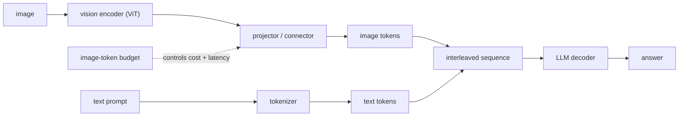

# Multimodal Serving (Vision-Language Models)

> **Style note.** This chapter follows the same teach-first, book-like arc as the
> candidate-retrieval sample: a dialogue to gather requirements, a consistent
> frame-architecture-connector-evaluate-serve arc, one small figure per idea,
> real production case studies, a "when to use which" table per method group,
> worked figures (mermaid and matplotlib), and an interview Q&A. Split into one
> file per section so no single file gets long.

An interviewer rarely says "design a vision-language model." They say **"design a
service that answers questions about images."** That looks simple until you realize
an image is not one token, it is hundreds or thousands of tokens, and those tokens
land in the most expensive part of the pipeline. This chapter builds the system
end to end and shows how LLaVA, BLIP-2, Flamingo, Qwen2-VL, Pixtral, NVLM, and
production deployments at Red Hat, AMD, Dropbox, NVIDIA, and Hugging Face actually
ship it.

## Sections

1. [Clarifying the requirements](01-clarifying-requirements.md) - the dialogue that scopes the image-token budget.
2. [Frame the system](02-frame-the-system.md) - vision encoder, projector, and LLM decoder; input and output.
3. [The projector and tokens](03-the-projector-and-tokens.md) - how images become tokens, resolution vs token count, and "when to use which."
4. [Model choices](04-model-choices.md) - early vs late fusion, image encoder families, and "when to use which."
5. [Evaluation](05-evaluation.md) - VQA accuracy, grounding, hallucination, and "when to use which."
6. [Serving and scaling](06-serving-and-scaling.md) - image-token cost, caching, two-tier serving, and bottlenecks.
7. [How teams do it in production](07-how-teams-do-it-in-production.md) - named company divergence table and first-party links.
8. [Interview Q&A](08-interview-qa.md) - commonly asked, tricky, and commonly answered wrong, with clear answers.
9. [Summary](09-summary.md) - one-page recap, mermaid, and test-yourself questions.

## The whole system on one page

The central insight: from the decoder's point of view, an image is a block of
tokens spliced into the sequence alongside the text. That is why image cost is
token cost, and why the projector, not the encoder, is where the serving design
lives.

Read the sections in order the first time; they build on each other. Each opens
with the question an interviewer actually asks, then answers it.
