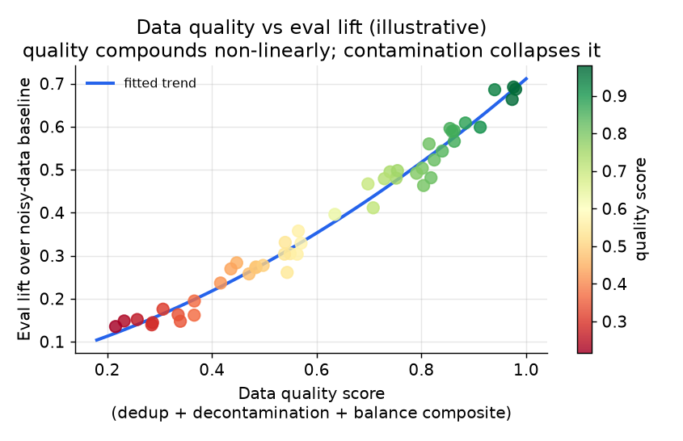
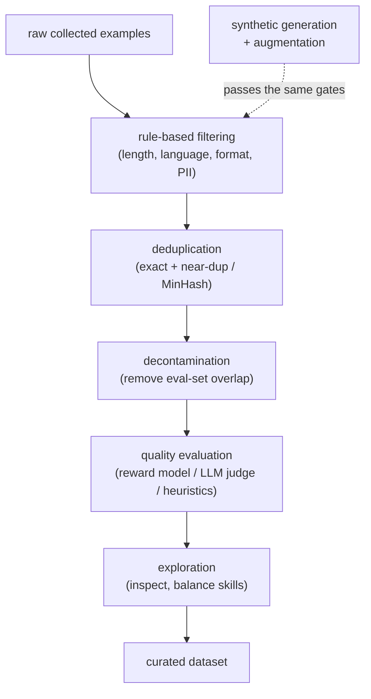
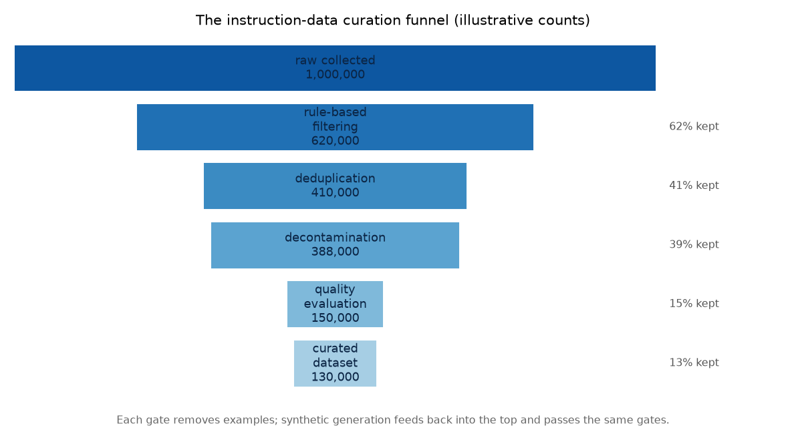

# 3. Data curation

Fine-tuning is a data problem wearing a compute costume. The model imitates
exactly what you show it, including the mistakes. A small, clean dataset beats
a large, noisy one, and it is not close. This is the most underestimated part of
the pipeline, and the one that decides everything downstream.

*Illustrative scatter across training runs at different quality levels. Eval lift
compounds non-linearly with quality: the jump from 0.4 to 0.8 quality score
produces roughly double the lift of the jump from 0.0 to 0.4. Contamination
collapses the curve entirely.*

## SFT data: the five rules

**Quality over quantity.** The classic open instruction-tuning result was that
aggressive filtering down to a small, high-quality set was what worked: a few
thousand carefully curated examples often outperform tens of thousands of scraped
ones. Treat the exact count as task-specific; earn your number on your task. Do not
pad the dataset to make it look bigger.

**Deduplicate and balance.** Near-duplicates waste model capacity and skew outputs
toward whatever is over-represented. A dataset of ten thousand examples where three
thousand cover one skill and one hundred cover another is a dataset of one thousand
effective examples with a hidden blind spot. Balance explicitly across the skills
and edge cases you care about.

**Decontaminate.** Make sure your eval set has not leaked into training. This is
the single most common way teams fool themselves: eval numbers look great, the
model ships, and production disappoints because the model memorized the test. Check
disjointness before every training run, not once at dataset creation.

**Format consistency.** One prompt template, one response shape. The model learns
the template as hard as it learns the content. A dataset with five different prompt
styles trains five competing behaviors; it also inflates apparent diversity while
hiding that the model has not generalized. Pin the template and use it everywhere,
training and serving.

**Synthetic data, used carefully.** A stronger model can generate or augment
examples, and this is often the bootstrap when real logs are thin. The risks are:
(a) the generator's biases propagate, (b) diversity collapses as the distribution
converges on the generator's mode, and (c) judge-model circularity if the same
model grades what it generated. The fix: filter synthetic data through the same
quality and dedup gates as human data, keep a human-labeled core, and calibrate
any automated judge to human preference scores periodically.

## The curation funnel: the order the gates run in

The five rules become a pipeline when you fix their **order**. The *LLM Engineer's
Handbook* frames curation as a funnel: cheap deterministic filters first, expensive
model-based judgments last, so you never pay a reward model to score examples a
one-line regex would have dropped.

Two properties make this ordering non-negotiable. **Cost climbs left to right:** a
length or language filter is microseconds, MinHash dedup is cheap, but a
reward-model or LLM-judge quality pass is a forward pass per example. Run the cheap
gates first and the expensive gate sees a fraction of the data. **Decontamination
must precede the quality gate,** because a leaked eval example is often *high*
quality; scoring it first would keep exactly the examples that poison your
benchmark. Synthetic generation is not a separate track: it feeds back into the top
of the funnel and passes the identical gates, which is what stops generator bias
and judge circularity from leaking in.

*Illustrative counts. Each gate removes examples; the steepest drop is usually the
quality gate, which is why it runs last on the smallest surviving set. The exact
retention at each stage is task- and source-specific; earn your own numbers.*

## Preference data: building comparison pairs

Preference data is the fuel for DPO and RLHF. Where SFT data is (prompt, ideal
response), preference data is (prompt, chosen response, rejected response): two
responses for the same prompt where one is judged better on some axis.

**Sources of comparison pairs:**

- **Human pairwise annotation.** The gold standard; expensive and slow. Worth it
  for the core safety and helpfulness axes where getting it wrong matters most.
- **Production logs plus corrections.** A thumbs-down on a response, or a human
  editor rewriting a model output, is a free (prompt, rejected, chosen) pair.
  Mine it. The correction is the chosen; the original is the rejected.
- **LLM-as-judge.** A stronger model scores or ranks multiple candidate responses.
  Anyscale built their entire preference pipeline this way: sample ten summaries
  per article, have a 70B judge score them via multiple-choice questions, apply a
  preference rule ("if both answer three or more correctly, prefer the shorter
  one"). The risk is circularity: if you train on the judge's scores and evaluate
  with the same judge, you optimize the judge, not real quality. Calibrate the
  judge to human preferences on a held-out set.
- **Rejection-sampling SFT.** Generate many candidates per prompt, score them by a
  real signal (downstream retrieval rank, Spotify-style), and train on the best
  one. A useful warmup before DPO that gives a stable starting policy.

## Versioning

Version the dataset like code. Every model artifact must name the exact data
snapshot it came from, or you cannot reproduce it, debug it, or prove disjointness
from the eval set. A model version without a data version is a liability.

The minimal tag: `{task}-{date}-{size}-{split_hash}`. Store it in the model card
alongside the base model name and hyperparameters. This is the record that lets
you answer "did this training run see the eval data?" definitively.
