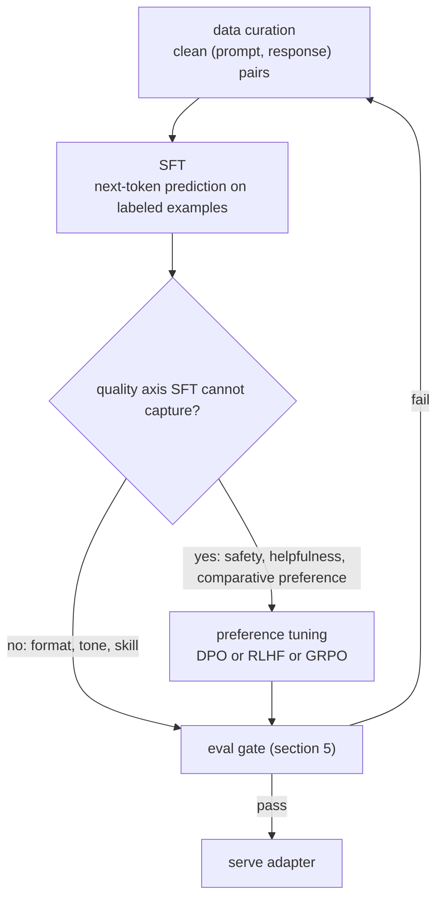

# 4. Methods

## The SFT-to-preference pipeline



## Supervised fine-tuning (SFT)

SFT is plain next-token prediction on `(prompt, ideal response)` pairs. Show the
model the input and the output you want, and minimize the negative log-likelihood
over the response tokens:

$$L_{\text{SFT}} = -\frac{1}{T}\sum_{t=1}^{T} \log p_\theta\!\left(y_t \,\middle|\, x,\, y_{\lt t}\right)$$

where $x$ is the prompt, $y_1, \ldots, y_T$ is the ideal response, and $\theta$
are the model parameters. The loss is computed over response tokens only; the
prompt tokens are masked out.

SFT is the workhorse and usually the only training step you need. It teaches
format, tone, and task-specific behavior directly. The two failure modes to name:

**Catastrophic forgetting.** Over-training on a narrow set degrades general
ability. Keep learning rates modest (often around 2e-5 to 1e-4), epochs few (one
to three), and mix in a small fraction of general data if breadth matters. A LoRA
adapter avoids this more naturally because the base weights stay frozen.

**Eval contamination.** Training on examples that overlap your eval set inflates
the metrics. Decontaminate every time, not once.

## Parameter-efficient fine-tuning: LoRA and QLoRA

Full fine-tuning updates every weight in the model. For a 7B or 70B parameter
model that means optimizer state (typically two copies of the gradients in Adam),
activations, and a fresh full-size checkpoint per task. You rarely need it.

**LoRA (low-rank adaptation)** freezes the base weights and learns a small pair of
low-rank matrices for each target weight matrix:

$$W = W_0 + \frac{\alpha}{r}\, B A,\qquad B \in \mathbb{R}^{d \times r},\ A \in \mathbb{R}^{r \times k},\ r \ll \min(d, k)$$

$W_0$ is frozen; only $B$ and $A$ train. Trainable parameters drop from $dk$ to
$r(d + k)$. At $r = 16$ on the attention and FFN projections of a 7B model, this
is roughly 0.08 percent of the total, and the task quality is nearly
indistinguishable from full fine-tuning on most behavior-and-format tasks.

**QLoRA** quantizes the frozen base to 4-bit to slash its memory footprint, then
trains the LoRA adapter on top in BFloat16. The approximate memory budget is:

$$M \approx \underbrace{4\text{-bit}\cdot N_{\text{base}}}_{\approx 0.5\ \text{byte/param, frozen}} \;+\; \underbrace{16\text{-bit}\cdot 2\,r(d+k)\,L}_{\text{trainable adapter, tiny}}$$

This is what lets you fine-tune a 7B (or larger) model on a single commodity GPU.
Mercari used QLoRA to fine-tune a 2B model on one A100 and beat GPT-3.5 on their
task at roughly 14x lower inference cost.


*Trainable parameter counts (log scale) for LoRA at three ranks versus full
fine-tune, across model sizes from 1B to 70B. LoRA r=16 trains roughly 0.08% of
the weights; QLoRA fits the entire frozen base plus the adapter on a single GPU.*

When is full fine-tuning justified? A large dataset, a large behavior shift from
the base, or cases where a LoRA adapter at high rank still drifts out of
distribution (Anyscale found exactly this on their DPO task). For the standard
"adapt a base model to our domain" prompt, LoRA or QLoRA is almost always the
right call, and saying so plainly is the senior answer.

## Preference optimization: DPO, RLHF, and GRPO

SFT teaches the model to imitate good answers. It cannot teach the model to
*prefer* one acceptable answer over another, avoid a tempting-but-wrong style, or
pick a safer response when two responses are both plausible. That is what
preference training does, by training on comparisons rather than imitations.

### DPO (direct preference optimization)

DPO skips the separate reward model and the RL loop entirely. It optimizes the
policy directly on `(prompt, chosen response, rejected response)` triples with a
classification-style loss:

$$\mathcal{L}_{\text{DPO}} = -\mathbb{E}_{(x,\, y_w,\, y_l)} \!\left[\log \sigma\!\left(\beta \log \frac{\pi_\theta(y_w \mid x)}{\pi_{\text{ref}}(y_w \mid x)} - \beta \log \frac{\pi_\theta(y_l \mid x)}{\pi_{\text{ref}}(y_l \mid x)}\right)\right]$$

$y_w$ is the chosen (winning) response; $y_l$ is the rejected (losing) response;
$\pi_{\text{ref}}$ is the frozen reference model (the SFT checkpoint); and $\beta$
is the KL penalty coefficient that controls how far the policy may move from the
reference. A small $\beta$ (Anyscale used 0.03) keeps the policy close and stable.

The reference model is the load-bearing piece. Without it, the policy could
trivially score $y_w$ higher than $y_l$ by collapsing to degenerate text that
gets arbitrarily high log-probability. The $\pi_{\text{ref}}$ anchor prevents that.

The loss itself is a few lines: take the sequence log-probs of the chosen and
rejected responses under the policy and the frozen reference, then push a
log-sigmoid on their difference.

```python
import torch.nn.functional as F
# each arg: summed log-prob of that response under that model, shape (batch,)
def dpo_loss(pol_chosen, pol_rejected, ref_chosen, ref_rejected, beta=0.1):
    pol_logratio = pol_chosen - pol_rejected   # how much the policy prefers chosen
    ref_logratio = ref_chosen - ref_rejected   # the reference's built-in preference
    return -F.logsigmoid(beta * (pol_logratio - ref_logratio)).mean()
```

### RLHF (reinforcement learning from human feedback)

RLHF trains a separate reward model $r_\phi$ on human preference comparisons, then
optimizes the policy against that reward using reinforcement learning (commonly
PPO), subject to a KL penalty:

$$\max_{\pi_\theta}\;\mathbb{E}_{x,\, y \sim \pi_\theta}\!\left[r_\phi(x, y)\right] - \beta\;\text{KL}\!\left[\pi_\theta(y \mid x)\;\Vert\;\pi_{\text{ref}}(y \mid x)\right]$$

The KL term plays the same anchoring role as DPO's $\beta$: drop it and the
policy reward-hacks $r_\phi$ into degenerate output. RLHF is more powerful when
you need a reusable reward signal, but it is a complex, multi-model pipeline
(SFT model, reward model, reference model, value network, policy), and it is
harder to stabilize than DPO.

### GRPO (group relative policy optimization)

GRPO, used in DeepSeek R1 and variants, eliminates the value network by computing
advantages within a *group* of responses sampled for the same prompt. For a group
of $G$ outputs $\{o_1, \ldots, o_G\}$ per query $q$, the group-normalized
advantage is:

$$\hat{A}_i = \frac{r_i - \text{mean}(r_{1:G})}{\text{std}(r_{1:G})}$$

and the training objective maximizes the clipped ratio of new to old policy,
weighted by these advantages, minus the same KL penalty on the reference:

$$\mathcal{L}_{\text{GRPO}} = -\mathbb{E}\!\left[\sum_{i=1}^{G} \min\!\left(\frac{\pi_\theta(o_i \mid q)}{\pi_{\text{old}}(o_i \mid q)}\hat{A}_i,\; \text{clip}\!\left(\cdot,\, 1-\epsilon,\, 1+\epsilon\right)\hat{A}_i\right) - \beta\;\text{KL}[\pi_\theta \Vert \pi_{\text{ref}}]\right]$$

The appeal is that you do not need a learned value function: the group mean acts as
a baseline. GRPO works well when you can run the model many times per prompt and
score the outputs with a verifiable reward (math correctness, code test pass, etc.).
It is less well suited to open-ended generation where such a ground-truth signal is
not available.

### The KL leash in all three methods

All three methods share the same underlying tension: you want to move the policy
toward a better behavior, but you cannot let it drift so far that it loses its
baseline ability or degenerates into reward-hacking gibberish. The $\beta$
coefficient (or its equivalent KL coefficient) is the leash.


*Illustrative: task reward peaks near beta ~ 0.03 to 0.1, then falls as the leash
tightens the policy back toward the SFT reference. Too small a beta and the policy
reward-hacks into degenerate text; too large and it over-steers into sycophancy or
evasion. The DPO beta plays the identical anchoring role as the RLHF KL
coefficient.*


*DPO trains two models (policy + frozen reference) and no RL loop. RLHF requires
five components. The simplicity of DPO is why it is the common first choice when
preference tuning is needed.*

## When to use which

| Reach for | When | Instead of |
|---|---|---|
| SFT only | format, tone, or skill gap with clean labeled examples; behavior is stable | preference tuning, which adds cost for a problem SFT already solves |
| LoRA adapter (r=8 to 64) | small-to-moderate behavior shift; many tenants share one base; fast rollback matters | full fine-tuning, which costs more and blocks hot-swappable adapters |
| QLoRA | same as LoRA but the frozen base must fit a single consumer GPU | 16-bit full weights, which will not fit the memory budget |
| Full fine-tune | large dataset, large behavior shift, or LoRA drifts out of distribution | raising LoRA rank arbitrarily, which rarely fixes an OOD result |
| DPO | preference axis SFT cannot capture; want no separate reward model; simple, stable pipeline | full RLHF, when a classification-style loss over (chosen, rejected) is sufficient |
| RLHF | you need a reusable reward signal or finer control via learned reward model | DPO, when you do not need online RL or a separate reward model |
| GRPO | verifiable reward exists (math, code, retrieval rank); no value function available | RLHF when the reward is not cheaply verifiable per sample |
| Small beta (0.03 to 0.1) | first run; stability matters; Anyscale and Spotify both used this range | large beta, which over-steers the policy back to the SFT reference |

> **Open the graph.** LoRA adapts a small fraction of these stacks, and "a small
> fraction" is abstract until you see the real dimensions. The attention query,
> key, value, and output projections plus the FFN up and down matrices are where
> the learned low-rank update lives; the rest is frozen. Open
> [Llama-3 8B live](https://www.neurarch.com/?import=https://raw.githubusercontent.com/neurarch-ai/awesome-llm-model-zoo/main/architectures/llama3-8b/model.json)
> and find those weight matrices to see how little of the network an adapter
> actually moves. All reference graphs are in the
> [Model Zoo](https://github.com/neurarch-ai/awesome-llm-model-zoo).
