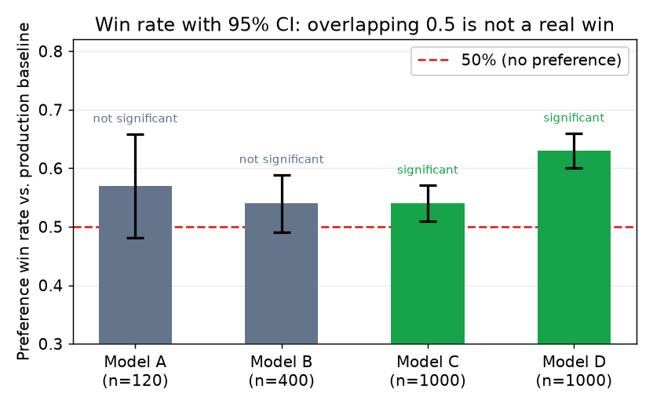

# 5. Evaluation and gates

The eval gate is the load-bearing component of the pipeline. A candidate model
does not reach users until it passes a set of checks against the current
production model. Without the gate, "newer" quietly ships "worse." Without the
comparison to *current production* (not just an absolute bar), a model that
regressed on a secondary skill can still look fine on the primary metric.

## The mandatory gates

**Task quality on a held-out set.** Measure the primary metric (exact match, BLEU,
task-specific accuracy, LLM-as-judge score) on a labeled set the model never saw
during training. The set must be:

- **Time-separated or randomly held out from the training data**, not drawn from
  the same pool after training.
- **Decontaminated**: verify disjointness from training examples. One overlapping
  example can inflate a metric by a surprising amount on small eval sets.
- **Large enough to detect the effect size you care about**: if a one-point
  accuracy gain is the shipping threshold, you need enough examples to detect
  it with statistical confidence.

The primary metrics used in this gate each measure something different.

**Exact match** treats each prediction as correct if and only if its normalized form
equals the normalized ground truth (lowercase, strip punctuation and whitespace), and
wrong otherwise. Input: a prompt. Output: a predicted string. Score: fraction of
exactly correct predictions over the set. Use exact match for structured outputs such
as extraction labels, classification codes, or arithmetic answers where partial credit
is meaningless.

**BLEU** measures n-gram precision overlap between a generated sequence and one or
more reference sequences, multiplied by a brevity penalty that discourages very short
outputs:

$$\text{BLEU} = \text{BP} \cdot \exp\!\left(\sum_{n=1}^{4} \tfrac{1}{4}\log p_n\right), \qquad
\text{BP} = \min\!\left(1,\, \exp\!\left(1 - \frac{|r|}{|c|}\right)\right)$$

where $p_n$ is the clipped n-gram precision for order $n$ (the fraction of candidate
n-grams that appear in the reference, capped so no reference n-gram is matched more
than once), $|c|$ is the candidate length in tokens, and $|r|$ is the reference
length. BLEU rewards n-gram copying and under-rewards semantic correctness; it is
appropriate for translation but should always be paired with a semantic judge for
summarization or instruction following.

**LLM-as-judge score** uses a capable model (e.g., GPT-4 or a similarly calibrated
evaluator) as an automated scorer. The judge receives the original prompt, the
candidate response, and optionally a reference, and outputs a scalar rating (commonly
1 to 10) or a binary preference. The reported metric is the mean rating over the eval
set. Calibrate the judge periodically against human labels on a random sample; LLM
judges systematically over-rate longer and more formatting-heavy responses.

**Regression check vs current production.** The new model must beat the model
currently serving users on the *same* eval set. A new model that improves the
target metric by two points while degrading a secondary skill by five points
should fail the gate. Run a full battery, not just the primary task.

**Safety and refusal eval after preference tuning.** DPO and RLHF can shift what
the model is willing to say in ways that are hard to anticipate from the task
metric alone. A preference-tuned model may become sycophantic, evasive, or
over-refusing. Always re-run safety eval after any alignment step; do not assume
that a model that passed safety before DPO still passes after.

**No contamination.** Before declaring a result, confirm that the eval set is
disjoint from all training data, including synthetic augmentations. This check
should be automated and mandatory, not a manual spot-check.

## Preference win rate

For tasks where quality is easier to assess by comparison than by absolute
scoring (writing, summarization, tone alignment), use **pairwise win rate**: show
human or LLM judges two responses (new model vs current model, in randomized
order) and report the fraction of cases where the new model is preferred:

$$\text{win rate} = \frac{\text{prompts where model A is preferred}}{\text{total evaluated prompts}}$$

Report with a 95 percent confidence interval (Wilson or Clopper-Pearson). A win rate
of 0.55 on 100 prompts has confidence bounds that overlap 0.50; the same rate on
1000 prompts is statistically meaningful.

Win rate above 50 percent means the new model is preferred on average. The bar
to set depends on the application, but 55 percent is a reasonable minimum for
a non-trivial improvement; 70 percent or above is a clear win. Randomize
presentation order and occasionally send identical responses as attention checks.

When the judge is an LLM: calibrate it periodically to human labels on a
randomly sampled subset. LLM judges over-rate formatting and length; humans
often prefer conciseness. A judge that favors longer responses will inflate
win rate for a model that learned to pad.

*How win rate is read: the bar height is the fraction of comparisons where the
new model was preferred; error bars are the 95% CI (normal approximation).
A bar whose lower CI bound clears 0.50 (dashed) is a statistically significant
win; an overlapping bar is not, regardless of the point estimate. Increasing n
shrinks the interval. Illustrative.*

## Tiered eval: speed vs coverage

Running a full eval suite on every training checkpoint is slow and expensive.
A tiered structure lets you iterate quickly and pay the full cost only when a
candidate looks promising.

| Tier | When to run | What it checks | Cost |
|---|---|---|---|
| Smoke set (50 to 200 examples) | after every checkpoint | primary task accuracy; catches obvious regressions | seconds |
| Core gate (1k to 5k examples) | before a candidate is considered for promotion | primary task + secondary tasks + safety; the real bar | minutes |
| Full eval (10k+ examples, live-slice) | before shipping to all users | everything above + win rate + online A/B on a traffic slice | hours to days |

Shopify found a 35 percent gap between their offline benchmark score and the live
activation rate when they did their first 1 percent traffic deployment. The lesson:
offline metrics overstate readiness; always gate on a live slice before scaling
traffic.

## When to use which evaluation approach

| Reach for | When | Instead of |
|---|---|---|
| Exact-match or task accuracy | the output is structured (JSON, code, attribute extraction) | BLEU or LLM-judge alone, which are imprecise on structured outputs |
| LLM-as-judge pairwise win rate | the output is prose and quality is comparative | absolute BLEU, which under-rewards fluency and over-rewards n-gram overlap |
| Regression check vs current prod | every promotion decision | comparing to an absolute bar only, which misses secondary regressions |
| Live 1% traffic slice | the final promotion gate before scaling | offline numbers alone, which cannot capture production distribution |
| Safety eval re-run | after any preference tuning step | assuming a pre-DPO safety pass carries over |
| Time-based or randomly held-out split | any offline eval | a random split drawn from the same sampling as training, which can leak |
