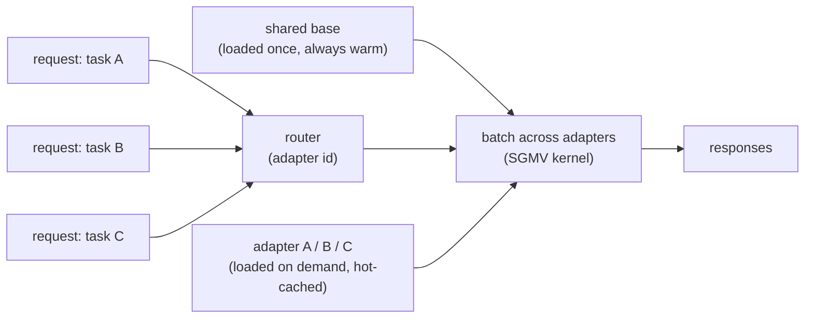

# 6. Serving adapters

## Multi-LoRA serving: one base, many tasks

The LoRA choice pays off at serving time in a way that full fine-tuning cannot.
Because every task adapter shares the same frozen base, you load the base into
GPU memory once and keep many small adapters resident alongside it. At request
time you route to the correct adapter and run base-plus-adapter. This is
**multi-LoRA serving**.

The economics: instead of N full model copies for N tasks or N customers, you pay
for one base plus N tiny adapters. You can batch requests that use *different*
adapters together against the shared base (the Punica SGMV kernel does exactly
this). Compare that with full fine-tuning, where each task is a separate
multi-gigabyte model that needs its own memory and serving slot. For a product
with many domains or many customers, multi-LoRA is the difference between
affordable and not.

Swapping adapters is also your fast rollback and your A/B mechanism: promote a
new adapter, route a traffic slice to it, revert by pointing the route back.
No redeploy of the base. Cloudflare's Workers AI ships this at the edge: base
models always warm on GPU, customer LoRA matrices loaded on demand from object
storage, adapter swap at millisecond scale.

## The data flywheel

The pipeline is a loop, not a line. Production is your richest source of training
data because it is real distribution, not guessed distribution:

1. Log production inputs and outputs (with consent and privacy handling; scrub PII
   before anything else).
2. Mine them for failures: thumbs-down, escalations, corrections, retries, low
   confidence, fallback hits.
3. Have humans label or fix the hard ones. Those become gold SFT examples. The
   "model output vs human correction" pairs are preference data for free.
4. Fold them into the next dataset version and retrain.
5. Gate, promote, repeat.

Each turn of this loop targets exactly where the current model is weakest, which
is why a mediocre first model plus a tight flywheel beats a great first model with
no feedback path. Shopify's weekly retraining cycle (12-hour FSDP run on two H200
nodes) closed the 35-point gap between their synthetic benchmark score and the
live activation rate in the first few flywheel turns.

**The collapse risk.** Training on the model's own unfiltered output narrows
diversity over time. The generator's biases reinforce and authentic edge cases
disappear. The fix: keep a human-labeled core in every training run, route
production data through a calibrated judge that quarantines low-quality examples,
and hold a fixed fraction of each dataset as human-authored.

## Bottlenecks

| Bottleneck | First sign | Fix | Tradeoff |
|---|---|---|---|
| Data quality | eval gate pass rate falls despite more data | curate, dedup, decontaminate; fewer but better examples | labeling cost |
| Training memory or cost | OOM on fine-tune; slow iteration | LoRA or QLoRA; quantize the frozen base | slight accuracy loss vs full FT on very large shifts |
| Catastrophic forgetting | task improves but secondary metrics regress | fewer epochs (1 to 3); modest LR; mix in general data; use a LoRA adapter | longer tuning or more data needed for the task |
| Eval gate is slow | candidates queue; iteration pace drops | tiered eval: smoke set per checkpoint, full gate before promotion | risk of missing regressions in the smoke set |
| Many domain variants | N full models, N serving slots, N memory budgets | multi-LoRA: one warm base plus N small adapters | adapter rank caps and SGMV kernel constraints |
| Stale knowledge in weights | tuned facts go stale; retraining needed weekly | move facts to retrieval (RAG); tune behavior only | adds a retrieval path |
| Flywheel drift or model collapse | diversity narrows; tail cases disappear | keep human-labeled core; quarantine unfiltered synthetic data | labeling overhead each cycle |
| Silent promotion regression | "better" model ships worse on secondary task | regression check vs current prod (not absolute bar) | wider eval suite per candidate |
