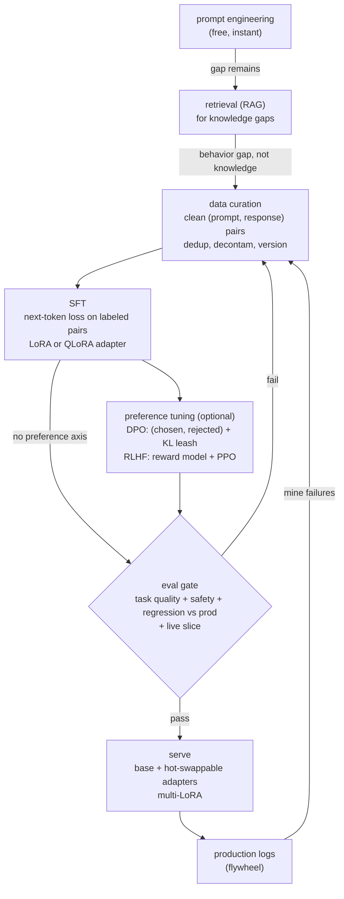

# 9. Summary

## One-page recap

- **Fine-tuning is the last lever, not the first.** Walk the ladder in order:
  prompt engineering, retrieval (RAG), supervised fine-tuning (SFT), preference
  tuning. Stop at the first rung that clears the quality bar. The strongest
  interview answer argues for not fine-tuning first, then designs the pipeline
  anyway.
- **The problem type decides the tool.** Knowledge gaps want retrieval, not training
  (baked-in facts go stale and hallucinate). Behavior, format, and skill gaps want
  fine-tuning. The two compose: tune for style, retrieve for facts, on the same base.
- **Data quality dominates volume.** A few thousand curated examples beat tens of
  thousands of noisy ones. Deduplicate, balance, decontaminate, version. The model
  imitates exactly what you show it, including the mistakes.
- **LoRA and QLoRA are the default.** Freeze the base, train a tiny low-rank
  adapter, keep many adapters for one base. QLoRA fits a billions-parameter model
  plus its adapter on a single GPU. Full fine-tuning is justified only when the
  behavior shift is large or LoRA drifts out of distribution.
- **DPO before RLHF.** If preference tuning is needed (after SFT), start with DPO:
  no separate reward model, no RL loop, one frozen reference model, a
  classification-style loss. The beta term is the KL leash; get it wrong in either
  direction and the model reward-hacks or over-steers. Reserve full RLHF for when
  you need a reusable reward signal or finer control.
- **The eval gate is the promotion authority.** A candidate model does not reach
  users until it beats the current production model on a held-out, decontaminated
  set, clears a safety pass, and survives a live traffic slice. Offline metrics
  overstate readiness; the gate is not optional.
- **Multi-LoRA serving is the serving endgame.** One warm base, many small adapters,
  ms-scale swap. The economics only work if the base is frozen; full fine-tuning
  throws this away by producing a fresh full model per task.
- **The flywheel is the compounding advantage.** Mine production failures, label
  the hard ones, fold them into the next dataset, gate, promote, repeat. A tight
  loop plus a mediocre first model beats a great first model with no feedback path.

## The system on one page

## Test yourself

1. The base model writes in the wrong tone for your brand. Walk the ladder: what
   do you try first, second, and third, and what would make you stop before
   fine-tuning?
2. What exactly does the LoRA rank $r$ control, and why does raising it not always
   fix a quality gap? When would you switch to full fine-tuning instead?
3. DPO and RLHF both use a reference model and a KL penalty. What role does that
   reference play, and what happens if you remove the KL term?
4. A candidate model beats the current production model on the offline eval set by
   three points. Is it ready to ship? What would you still check before scaling
   traffic?
5. You have ten domain variants to serve, each needing a different fine-tuned
   behavior. Should you run ten separate fine-tunes on ten separate model copies?
   What is the alternative, and what does it require?
6. A weekly retraining flywheel feeds production logs back into training. What can
   go wrong over time, and what safeguards prevent it?

## Further reading

- Dense reference (comparison table, all math, all case studies):
  [topics/05-post-training-pipeline.md](../../topics/05-post-training-pipeline.md).
- Evaluation system deep dive:
  [topics/06-evaluation-system.md](../../topics/06-evaluation-system.md).
- Per-company teardowns:
  [tools/teardowns/05.md](../../tools/teardowns/05.md).
- Trace fine-tune targets live in the
  [Model Zoo](https://github.com/neurarch-ai/awesome-llm-model-zoo): open the
  Llama-3 8B or Mistral 7B graphs and find the attention projections and FFN
  matrices where a LoRA adapter's low-rank update actually lives.
