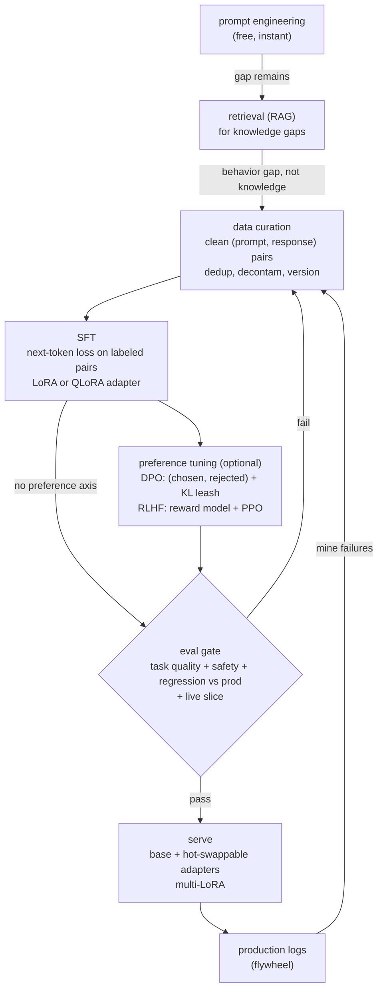

# 9. Summary

## One-page recap

- **Fine-tuning is the last lever, not the first.** Walk the ladder in order:
  prompt engineering, retrieval (RAG), supervised fine-tuning (SFT), preference
  tuning. Stop at the first rung that clears the quality bar. The strongest
  interview answer argues for not fine-tuning first, then designs the pipeline
  anyway.
- **The problem type decides the tool.** Knowledge gaps want retrieval, not training
  (baked-in facts go stale and hallucinate). Behavior, format, and skill gaps want
  fine-tuning. The two compose: tune for style, retrieve for facts, on the same base.
- **Data quality dominates volume.** A few thousand curated examples beat tens of
  thousands of noisy ones. Deduplicate, balance, decontaminate, version. The model
  imitates exactly what you show it, including the mistakes.
- **LoRA and QLoRA are the default.** Freeze the base, train a tiny low-rank
  adapter, keep many adapters for one base. QLoRA fits a billions-parameter model
  plus its adapter on a single GPU. Full fine-tuning is justified only when the
  behavior shift is large or LoRA drifts out of distribution.
- **DPO before RLHF.** If preference tuning is needed (after SFT), start with DPO:
  no separate reward model, no RL loop, one frozen reference model, a
  classification-style loss. The beta term is the KL leash; get it wrong in either
  direction and the model reward-hacks or over-steers. Reserve full RLHF for when
  you need a reusable reward signal or finer control.
- **The eval gate is the promotion authority.** A candidate model does not reach
  users until it beats the current production model on a held-out, decontaminated
  set, clears a safety pass, and survives a live traffic slice. Offline metrics
  overstate readiness; the gate is not optional.
- **Multi-LoRA serving is the serving endgame.** One warm base, many small adapters,
  ms-scale swap. The economics only work if the base is frozen; full fine-tuning
  throws this away by producing a fresh full model per task.
- **The flywheel is the compounding advantage.** Mine production failures, label
  the hard ones, fold them into the next dataset, gate, promote, repeat. A tight
  loop plus a mediocre first model beats a great first model with no feedback path.

## The system on one page

```mermaid
flowchart TD
  PROMPT["prompt engineering<br/>(free, instant)"]
  RAG["retrieval (RAG)<br/>for knowledge gaps"]
  DATA["data curation<br/>clean (prompt, response) pairs<br/>dedup, decontam, version"]
  SFT["SFT<br/>next-token loss on labeled pairs<br/>LoRA or QLoRA adapter"]
  PREF["preference tuning (optional)<br/>DPO: (chosen, rejected) + KL leash<br/>RLHF: reward model + PPO"]
  GATE{"eval gate<br/>task quality + safety + regression vs prod<br/>+ live slice"}
  SERVE["serve<br/>base + hot-swappable adapters<br/>multi-LoRA"]
  LOGS["production logs<br/>(flywheel)"]

  PROMPT -->|"gap remains"| RAG
  RAG -->|"behavior gap, not knowledge"| DATA
  DATA --> SFT
  SFT --> PREF
  SFT -->|"no preference axis"| GATE
  PREF --> GATE
  GATE -->|"pass"| SERVE
  GATE -->|"fail"| DATA
  SERVE --> LOGS
  LOGS -->|"mine failures"| DATA
```

## Test yourself

Answers are collapsed. Attempt each question before opening one.

1. The base model writes in the wrong tone for your brand. Walk the ladder: what
   do you try first, second, and third, and what would make you stop before
   fine-tuning?

   

Answer

   **First, prompt engineering**: rewrite the system prompt, add few-shot examples
   in the target voice, pin an output schema. It is free, instant to iterate, and it
   is the measured baseline you need before you can claim training helped anything.
   **Second, diagnose knowledge versus behavior**, which for tone immediately rules
   out the RAG rung: retrieval teaches the model what it does not know, and this
   model already knows the domain, so the next real rung is **supervised fine-tuning
   on a LoRA or QLoRA adapter** over a few thousand curated (prompt, ideal response)
   pairs. **Third, preference tuning with DPO**, and only if the residual failure is
   plausible-but-worse (a tempting phrasing SFT's positive-only examples cannot rule
   out). You stop before fine-tuning if the tuned prompt already clears the quality
   bar, if you have no clean labeled examples and no path to getting them, or if the
   desired behavior churns often enough that baked-in weights become a treadmill.
   The ladder and its stopping rule are in
   [2](02-decide-prompt-rag-or-train.md); the scoping questions that produce the
   diagnosis are in [1](01-clarifying-requirements.md).

   

2. What exactly does the LoRA rank $r$ control, and why does raising it not always
   fix a quality gap? When would you switch to full fine-tuning instead?

   

Answer

   The rank sets **how many independent directions the weight update is allowed to
   span**: LoRA freezes $W_0$ and learns $BA$, so trainable parameters per adapted
   matrix drop from $dk$ to $r(d+k)$. At $r = 16$ on the attention and FFN
   projections of a 7B model that is roughly 0.08 percent of the weights, about a
   12 MB bf16 artifact, and on most format-and-tone tasks it is nearly
   indistinguishable from full fine-tuning. Raising $r$ does not always close a gap
   because rank is a **hard cap on the subspace, not a knob on effort**: a large
   behavior shift spreads its energy across many directions with a slowly decaying
   tail, so each added rank buys only the next small increment while the tail stays
   unreachable, and the adapter gets the right direction without the right
   magnitude. The tell is a loss that converges while downstream accuracy plateaus
   or token log-likelihoods drift out of distribution, which is exactly what Anyscale
   hit at $r = 64$ on their DPO task. Switch to full fine-tuning when the dataset is
   large, the behavior shift from the base is large, or a high-rank adapter still
   drifts OOD. The cost of that switch is real: a fresh multi-gigabyte checkpoint per
   task and the loss of hot-swappable multi-LoRA serving
   ([4](04-methods.md), [6](06-serving-adapters.md)).

   

3. DPO and RLHF both use a reference model and a KL penalty. What role does that
   reference play, and what happens if you remove the KL term?

   

Answer

   The frozen reference $\pi_{\text{ref}}$ (normally the SFT checkpoint) is the
   **anchor that makes the preference objective mean something**. DPO's loss
   constrains only the *margin* between the chosen and rejected log-ratios, and
   RLHF's PPO step only maximizes a learned reward, so in both cases the policy could
   satisfy the objective by collapsing to degenerate text that happens to score well.
   The $\beta$ coefficient is the leash length: it is the same KL penalty in both
   methods, expressed in closed form inside DPO's loss and as an explicit term in the
   RLHF objective. Remove it and the policy **reward-hacks**: outputs get shorter,
   repetitive, or sycophantic while the training reward climbs, because any pattern
   that widens the margin counts as improvement even if no annotator ever compared
   it. Set it too large and you have re-run SFT with extra bookkeeping. The chapter
   puts the usable band at roughly 0.03 to 0.1, with Anyscale at 0.03 and Spotify in
   the same range. Related edge case worth naming: even with the leash, DPO can drag
   the chosen response's absolute log-probability down (likelihood displacement),
   which DPO-Positive addresses ([4](04-methods.md), [8](08-interview-qa.md)).

   

4. A candidate model beats the current production model on the offline eval set by
   three points. Is it ready to ship? What would you still check before scaling
   traffic?

   

Answer

   No. A single primary-metric win is the weakest of the gate's signals, and offline
   numbers systematically overstate readiness. Still to check, in order: **is the
   eval set decontaminated** and disjoint from every training source including
   synthetic augmentations, rechecked for this run rather than once at dataset
   creation; **the regression battery against current production on the same set**,
   because a two-point primary gain that costs five points on a secondary skill
   should fail; **statistical significance**, since a win rate of 0.55 on 100 prompts
   has confidence bounds that overlap 0.50 while the same rate on 1000 prompts does
   not, so report a 95 percent interval and size the set to the effect you care
   about; **a safety and refusal re-run** if any preference-tuning step was involved,
   because DPO and RLHF shift what the model is willing to say in ways the task metric
   does not see; and finally **a live 1 percent traffic slice** before scaling.
   Shopify found a 35 point gap between their offline benchmark and live activation
   rate on exactly that first slice, which is the canonical reminder that the offline
   gate measured the wrong population, not the wrong model
   ([5](05-evaluation-and-gates.md)).

   

5. You have ten domain variants to serve, each needing a different fine-tuned
   behavior. Should you run ten separate fine-tunes on ten separate model copies?
   What is the alternative, and what does it require?

   

Answer

   No. Ten full fine-tunes means ten multi-gigabyte checkpoints, ten serving slots,
   and ten memory budgets, which is the failure the bottleneck table calls "many
   domain variants." The alternative is **multi-LoRA serving**: one frozen base
   loaded once and kept warm, ten small adapters resident alongside it, and a router
   that picks the adapter per request. It requires four things. All ten variants must
   share the **same frozen base**, which is precisely what full fine-tuning throws
   away. The adapters must stay within the serving stack's **rank cap** (Cloudflare
   caps customer adapters at rank 8 and 100 MB). You need a **grouped-GEMM kernel**
   such as Punica SGMV so requests using different adapters batch together against
   the shared base, since the expensive matmuls are identical across adapters and only
   a skinny low-rank detour differs. And each behavior shift must actually fit a
   low-rank update; a variant that drifts OOD at high rank needs a full fine-tune and
   leaves the shared-base economics. The payoff beyond cost is operational: promotion,
   A/B, and rollback all become route changes with no base redeploy
   ([6](06-serving-adapters.md), [7](07-how-teams-do-it-in-production.md)).

   

6. A weekly retraining flywheel feeds production logs back into training. What can
   go wrong over time, and what safeguards prevent it?

   

Answer

   The dominant risk is **model collapse**: training on the model's own unfiltered
   output narrows diversity turn over turn, the generator's biases reinforce
   themselves, and authentic tail cases disappear. Two failures ride alongside it.
   **Judge circularity**, where an LLM judge scores what the model generated and you
   end up optimizing the judge rather than real quality. And **creeping
   contamination**, where recycled production data quietly overlaps the eval set, so
   the gate starts measuring memorization and every promotion decision after that is
   made on a lie. The safeguards are concrete: keep a **human-labeled core** in every
   training run and hold a fixed fraction human-authored; route production data
   through a **calibrated judge that quarantines** low-quality examples; recalibrate
   that judge against human labels and a real product signal (Shopify used live
   activation rate) on a held-out sample, since the whole point is that the grounding
   signal originates outside the model-judge loop; scrub PII before anything else;
   recheck **decontamination before every training run**; and version each dataset as
   `{task}-{date}-{size}-{split_hash}` so any artifact can be traced to the exact
   snapshot it saw ([6](06-serving-adapters.md), [3](03-data-curation.md)).

   

## Further reading

- The capstone: [the complete build](10-putting-it-together.md), where every
  choice in this chapter is committed once for the scenario, costed, rebuilt
  under two other constraint sets, and compressed into a runnable one-file preference tuner.
- Dense reference (comparison table, all math, all case studies):
  [topics/05-post-training-pipeline.md](../../topics/05-post-training-pipeline.md).
- Evaluation system deep dive:
  [topics/06-evaluation-system.md](../../topics/06-evaluation-system.md).
- Per-company teardowns:
  [tools/teardowns/05.md](../../tools/teardowns/05.md).
- Trace fine-tune targets live in the
  [Model Zoo](https://github.com/neurarch-ai/awesome-llm-model-zoo): open the
  Llama-3 8B or Mistral 7B graphs and find the attention projections and FFN
  matrices where a LoRA adapter's low-rank update actually lives.
