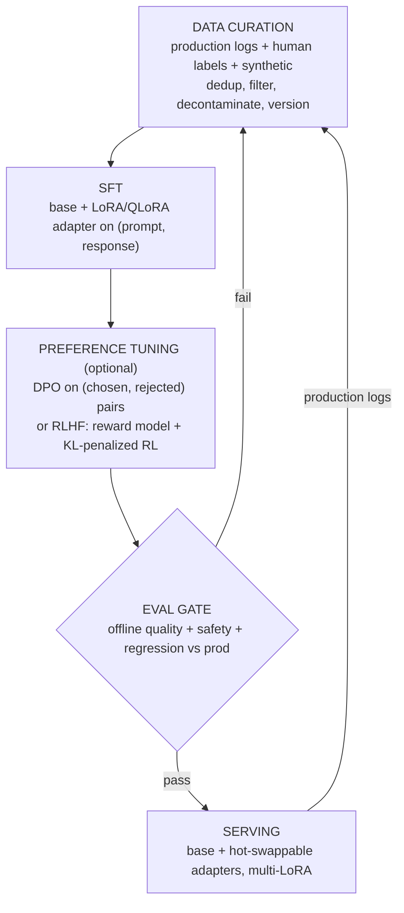

# Fine-tuning and Post-training Pipeline

An interviewer rarely says "design a fine-tuning system." They say **"our base
model is not good enough at our domain task; design the pipeline to adapt it,
get it into production safely, and keep it improving over time."** That is the
post-training pipeline: the sequence of decisions, training steps, eval gates,
and serving choices that take a general-purpose base model and turn it into a
reliable, cost-controlled specialist. This chapter builds it end to end, and
shows how Grammarly, Anyscale, Shopify, Mercari, Grab, LinkedIn, Cloudflare, and
Spotify actually ship it.

The strongest answer in an interview spends its first minute arguing you probably
should *not* fine-tune yet, then designs the pipeline anyway. Candidates who
reach for a training run on the first sentence lose the plot.

## Sections

1. [Clarifying the requirements](01-clarifying-requirements.md) -- the dialogue that scopes the problem and names the two immediate consequences.
2. [Decide: prompt, RAG, or train](02-decide-prompt-rag-or-train.md) -- the decision ladder in cost order; input and output for each rung.
3. [Data curation](03-data-curation.md) -- SFT data quality, preference pairs, and why quality dominates volume.
4. [Methods](04-methods.md) -- SFT, LoRA/QLoRA, DPO, RLHF, GRPO; the losses in KaTeX; a when-to-use-which table.
5. [Evaluation and gates](05-evaluation-and-gates.md) -- the gate a candidate model must clear before it reaches a user; preference win rate.
6. [Serving adapters](06-serving-adapters.md) -- multi-LoRA serving, the flywheel, and the bottleneck table.
7. [How teams do it in production](07-how-teams-do-it-in-production.md) -- where named companies diverge, plus the first-party write-ups.
8. [Interview Q&A](08-interview-qa.md) -- commonly asked, tricky, and commonly answered wrong, with clear answers.
9. [Summary](09-summary.md) -- the one-page recap, mermaid diagram, and self-test.

## The whole system on one page

Read the sections in order the first time; they build on each other. Each opens
with the question an interviewer actually asks, then answers it.
