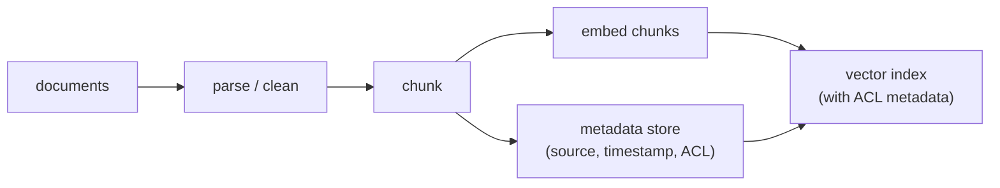
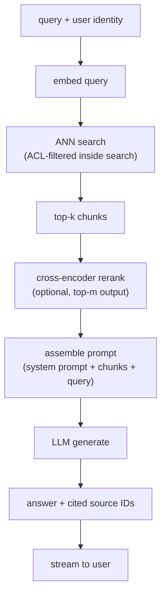

# 2. Framing the system

## Input and output

The system takes a **natural-language query plus the querying user's identity**
and returns a **grounded natural-language answer with cited source IDs**, or an
explicit abstention when retrieval is too weak to ground a confident reply.

The user identity travels through the whole pipeline because ACL enforcement is
a retrieval constraint, not a post-processing step.

## Two paths: keep them strictly separate

RAG has an offline (write) path and an online (read) path. Keeping them separate
is the key architectural commitment: the offline path pays the expensive embedding
cost once per document change; the online path pays only a single query embedding
plus a fast index lookup per request.

### Write path (offline)

Documents arrive from the knowledge base, either through a bulk ingest or a
change-driven freshness loop. Each goes through parsing, chunking, embedding,
and upsert into the vector index with its metadata (ACL, source URL, timestamp).

A document update re-chunks and re-embeds only the changed document and upserts
the new chunks into the index (deleting the old ones by document ID). This is
what makes sub-hour freshness achievable without a full rebuild.

### Read path (online)

A query arrives, is embedded, and is compared against the index with an ACL
filter baked in. The top-k chunks are optionally reranked, assembled into a
prompt alongside the original query and source IDs, and sent to the LLM for
generation. The answer streams back with inline citations.

## The retrieve-then-generate contract

The two stages have different jobs and different cost profiles.

**Retrieval** is cheap and optimizes for recall. It runs in tens of milliseconds.
Its failure mode is missing a relevant chunk (false negative), because no
downstream stage can recover a chunk that was never retrieved.

**Generation** is expensive and optimizes for answer quality given what retrieval
provided. Its failure mode is hallucinating when the retrieved context is weak
or absent.

The contract between them is simple: retrieval must get the relevant chunk into
the context window; generation must not invent facts outside that context. When
answers are wrong, always ask "was the relevant chunk retrieved?" before "was
the generator weak?"

## Why this framing matters in an interview

The candidate who draws one box labeled "RAG" and moves on has said nothing. The
candidate who separates the write path from the read path, identifies the ACL
constraint as a retrieval problem not a post-processing problem, and names
retrieval recall as the quality ceiling has already answered the hardest part
of the question before touching a single component.
