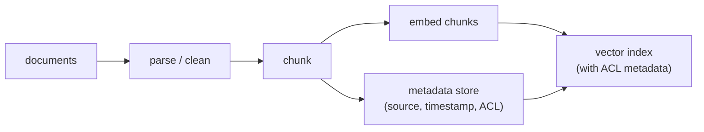
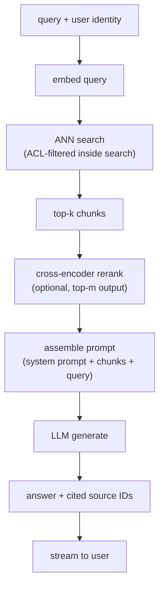

# 2. Framing the system

## Input and output

The system takes a **natural-language query plus the querying user's identity**
and returns a **grounded natural-language answer with cited source IDs**, or an
explicit abstention when retrieval is too weak to ground a confident reply.

The user identity travels through the whole pipeline because ACL enforcement is
a retrieval constraint, not a post-processing step.

## Two paths: keep them strictly separate

RAG has an offline (write) path and an online (read) path. Keeping them separate
is the key architectural commitment: the offline path pays the expensive embedding
cost once per document change; the online path pays only a single query embedding
plus a fast index lookup per request.

### Write path (offline)

Documents arrive from the knowledge base, either through a bulk ingest or a
change-driven freshness loop. Each goes through parsing, chunking, embedding,
and upsert into the vector index with its metadata (ACL, source URL, timestamp).

A document update re-chunks and re-embeds only the changed document and upserts
the new chunks into the index (deleting the old ones by document ID). This is
what makes sub-hour freshness achievable without a full rebuild.

### Read path (online)

A query arrives, is embedded, and is compared against the index with an ACL
filter baked in. The top-k chunks are optionally reranked, assembled into a
prompt alongside the original query and source IDs, and sent to the LLM for
generation. The answer streams back with inline citations.

## The retrieve-then-generate contract

The two stages have different jobs and different cost profiles.

**Retrieval** is cheap and optimizes for recall. It runs in tens of milliseconds.
Its failure mode is missing a relevant chunk (false negative), because no
downstream stage can recover a chunk that was never retrieved.

**Generation** is expensive and optimizes for answer quality given what retrieval
provided. Its failure mode is hallucinating when the retrieved context is weak
or absent.

The contract between them is simple: retrieval must get the relevant chunk into
the context window; generation must not invent facts outside that context. When
answers are wrong, always ask "was the relevant chunk retrieved?" before "was
the generator weak?"

## Why this framing matters in an interview

The candidate who draws one box labeled "RAG" and moves on has said nothing. The
candidate who separates the write path from the read path, identifies the ACL
constraint as a retrieval problem not a post-processing problem, and names
retrieval recall as the quality ceiling has already answered the hardest part
of the question before touching a single component.

## Compare and contrast: RAG vs long-context stuffing

Both approaches solve the same problem the same way at the final step: put the
relevant documents into the prompt so the model can answer from them rather than
from its weights. The confusion is treating a million-token context window as a
replacement for retrieval. The mechanics differ in who selects the evidence and
when the cost is paid.

| Dimension | RAG | Long-context stuffing |
|---|---|---|
| Where evidence ends up | in the prompt, as retrieved chunks | in the prompt, as raw documents |
| Grounding story | same: the model answers from provided text and can cite it | same: the model answers from provided text and can cite it |
| Who selects the relevant evidence | the retrieval stack, before the LLM sees anything | the model's attention, during generation |
| When the selection cost is paid | mostly at index build time, amortized over all queries | at every query, as prefill compute over the full stuffed context |
| Scaling behavior | per-query cost roughly flat as the corpus grows | per-query cost and latency grow with everything you stuff |
| Failure mode | relevant chunk never retrieved (a measurable recall miss) | relevant span present but lost among distractors (an attention miss, invisible to any retrieval metric) |

The difference changes the design at corpus scale and query volume: for a
handful of documents read once, stuffing is simpler and skips the whole indexing
pipeline, but the moment the corpus outgrows the window or the same corpus
serves many queries, selection must move out of the model and into an index that
pays its cost once.

## The RAG paradigm ladder

Naive "embed, retrieve top-k, stuff into the prompt" is the bottom rung. When it
plateaus (wrong chunks retrieved, multi-hop questions, a noisy corpus), teams climb
a ladder of paradigms. Naming the rungs, and knowing which failure each one fixes,
is a strong senior-level signal.

| Paradigm | What it adds over naive RAG | Reach for it when |
|---|---|---|
| Naive RAG | embed, retrieve top-k, generate | a clean corpus and single-fact questions |
| Advanced RAG | pre-retrieval (query rewriting/expansion) plus post-retrieval (rerank, compress) | retrieval recall or precision is the bottleneck |
| Modular RAG | swappable modules (router, memory, fusion) composed per query | different query types need different pipelines |
| Self-RAG | the model emits reflection tokens deciding when to retrieve and whether a passage is relevant and supported | the model should retrieve only when needed and self-check its own grounding |
| Corrective RAG (CRAG) | a lightweight retrieval evaluator grades the hits; a low-confidence grade triggers a fallback search | the corpus is patchy and wrong retrievals must be caught before generation |
| GraphRAG | an LLM-built entity graph plus community summaries used as context | whole-corpus sensemaking and multi-hop questions that flat vector search misses |
| Agentic RAG | retrieval becomes a tool an agent calls in a loop, rewriting the query and retrieving repeatedly | complex multi-step questions that need iterative retrieval |

**Provenance.** The naive, advanced, and modular framing is from the RAG survey
(Gao et al., 2023). Self-RAG's reflection-token approach is from Asai et al.
(University of Washington and Allen AI, 2023); Corrective RAG (CRAG) from Yan et al.
(2024); GraphRAG from Microsoft Research (2024). Agentic RAG is the pattern where an
[agent loop](../agents/) drives retrieval, deployed for example in Uber's support
chatbot (section 7).

Climb only as far as the failure mode demands: each rung up the ladder adds latency,
cost, and moving parts, so a clean single-fact FAQ should stay near the bottom while
a noisy multi-hop knowledge base earns the graph or agentic rungs.
