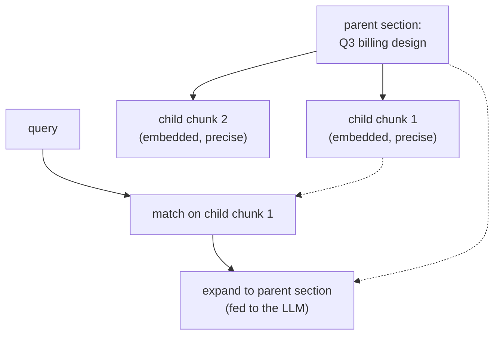
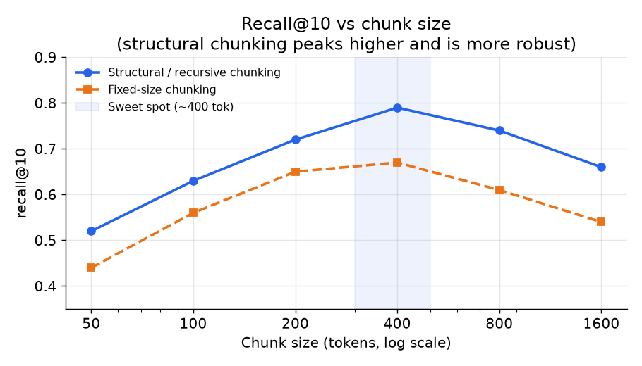

# 3. Indexing and chunking

## Parsing: from raw files to clean text (before you chunk)

Chunking assumes you already have clean text, but real corpora arrive as PDFs, HTML,
scanned images, slides, and spreadsheets. Parsing (turning those raw files into
faithful text) is the quiet stage that decides the ceiling for everything after it:
garbage extraction cannot be fixed by a better embedder or reranker. The recurring
hazards:

- **Reading order.** Multi-column PDFs and newspapers interleave columns if you read
  top to bottom; the parser must recover the true reading order or the text becomes
  scrambled nonsense.
- **Tables.** A table flattened to a run of numbers loses the row and column meaning,
  so a question about a specific cell can never be answered. Preserve table structure
  (as markdown or HTML) instead of flattening.
- **Boilerplate.** Headers, footers, page numbers, and navigation chrome pollute
  every chunk; strip them or they dominate the embedding.
- **Scanned documents.** Image-only PDFs need OCR (optical character recognition,
  turning pixels of text into characters) before any of this applies.

**Tools.** Layout-aware PDF parsing comes from libraries such as PyMuPDF, pdfplumber,
Unstructured, and Docling; table extraction from Camelot or a vision model; OCR from
Tesseract or a cloud document-AI service. The practical rule: budget real effort here,
because in most production RAG failures the answer was never retrievable, it was
mangled at parse time.

## Chunking is a real design decision

Naive fixed-size chunking (say, every 512 tokens) splits mid-sentence, mid-table,
and mid-code block. The resulting chunk embeds poorly because its meaning is
incomplete, and the answer it enables is often wrong at boundaries. Chunking is
not a detail to defer; it is one of the two places where the most leverage lives
(the other is reranking hardness).

The options, in increasing sophistication:

**Recursive structural chunking.** Split on document structure first: headings,
paragraphs, code fences, table boundaries. Then size-cap. A chunk that respects
structure embeds better and answers more precisely. This is the recommended
default for heterogeneous corpora with wikis, design docs, and tickets.

**Overlap window.** A sliding window with an overlap of 10-15% of the chunk size
so that an answer spanning a boundary is still fully contained in at least one
chunk. Overlap inflates index size by the overlap fraction, so cap it.

**Contextual chunking.** Prepend a short machine-generated summary of the
parent document or section to each chunk before embedding: "This is from the
Q3 billing design doc, section on refunds." A standalone chunk that contains
pronouns and references ("this system", "the above design") would otherwise lose
its meaning when retrieved without context.

**Parent-child retrieval.** Embed small chunks (one or two paragraphs) for
precision but expand the retrieved chunk at read time to its surrounding section
for richer context. This separates the retrieval unit from the context unit.



*The small child chunk wins the match on precision, but the LLM reads the whole
parent section: retrieval and context are two different units.*



*Structural / recursive chunking peaks at recall@10 higher than fixed-size and
is more robust to chunk size; fixed-size is more sensitive and peaks lower.
The sweet spot for structural chunking is around 400 tokens. Illustrative.*

The formula for how many chunks a document of length $L$ tokens produces with
chunk size $s$ and overlap $o$ is:

$$n_{\text{chunks}} = \left\lceil \frac{L}{s - o} \right\rceil$$

For 50 million documents averaging 300 tokens with $s = 400$ and $o = 50$, the
index holds roughly 40 to 50 million chunks. Dimension times four bytes times
chunk count sets your index memory budget directly.

The fixed-size-with-overlap splitter that produces those chunks is a sliding
window advanced by the net stride $s - o$:

```python
def chunk_with_overlap(tokens, size, overlap):   # tokens: list of token ids; size, overlap in tokens
    step = size - overlap                          # net advance per chunk; must be > 0
    # slide a window of `size` forward by `step`, so consecutive chunks share `overlap` tokens
    chunks = [tokens[i:i + size] for i in range(0, len(tokens), step)]
    return chunks
# chunk count matches ceil(L / (s - o)); chunk_with_overlap(list(range(10)), 4, 1) -> 4 chunks (ceil(10/3))
```

**When to use which chunking strategy.**

| Reach for | When | Instead of |
|---|---|---|
| Recursive structural chunking | Docs carry headings, tables, or code blocks that a fixed window would split | Fixed-size, which destroys structure and poisons the chunk embedding |
| Overlap window | Answers commonly straddle chunk boundaries (long prose) | High overlap on short chunks, which inflates the index for little gain |
| Contextual chunking (prepend summary) | Chunks lose meaning in isolation (pronoun references, section headers) | Bare chunks that embed well in context but retrieve poorly when standalone |
| Parent-child retrieval | You want high precision on retrieval but richer context at generation time | Forcing a single chunk to serve both roles, which trades one for the other |
| Fixed-size with overlap (baseline) | Simple unstructured text corpus, fast prototyping | Structural chunking when documents have clear sections to exploit |

## The embedding service

Every chunk and every query passes through a **text embedding model**: a
transformer encoder that maps a variable-length text to a fixed-dimension
dense vector. Key decisions here:

**Model choice.** Embedding dimension ranges from 384 (MiniLM-L6) to 1536
(OpenAI text-embedding-3-large). Larger dimensions improve recall slightly but
multiply index memory and search time directly. For a 50-million-chunk corpus
with 768-dimension vectors at float32, the raw vector storage is around 150 GB
before quantization. Domain-tuned models (legal, finance, code) often outperform
general models even when smaller.

Open the validated MiniLM-L6 encoder graph in the Model Zoo to see how a
sentence encoder pools its hidden states into a single vector and how embedding
dimension flows through the stack:
[open MiniLM-L6 live](https://www.neurarch.com/?import=https://raw.githubusercontent.com/neurarch-ai/awesome-llm-model-zoo/main/architectures/all-minilm-l6/model.json).


*MiniLM-L6: 6-layer encoder, 384-dimension pooled output. The embedding dimension
here sets the index memory budget per chunk. Browse the full embedding model
catalog at the [Model Zoo](https://github.com/neurarch-ai/awesome-llm-model-zoo).*

**It is its own service.** The embedding model runs on the write path (batch
embedding millions of chunks at ingest) and on the read path (one query per
request, latency-sensitive). These have different batching requirements and SLAs.
Keep them separate and autoscale independently.

**Cache query embeddings.** Internal queries repeat frequently. A cache keyed
on the normalized query string cuts a significant fraction of embedding latency
and compute at low infrastructure cost.

## The vector index

Exact nearest-neighbor search over 50 million chunks is too slow for a 1.5-second
first-token budget. Use an **approximate nearest-neighbor (ANN)** index (one that
trades a little accuracy for a large speedup by not scanning every vector).

**HNSW (Hierarchical Navigable Small World).** A graph-based index (vectors are
nodes linked to their nearest neighbors, and search walks the graph greedily)
with excellent recall and latency. Higher memory footprint: each vector keeps a list of graph
neighbors in addition to the raw vector. Works well when the corpus is stable.

**IVF-PQ (Inverted File Index with Product Quantization).** Clusters vectors
into $n_{\text{list}}$ buckets (inverted file) and compresses each vector with
product quantization. Memory footprint is dramatically lower (up to 32x for
binary quantization) at some recall cost. The right choice when 50 million
vectors cannot fit HNSW comfortably in RAM.

**ACL filtering must run inside the search, not after.** Push per-user
permission filters into the ANN query itself so results come back pre-authorized.
Post-filtering the top-k empties results when the user's visible set is small
and can leak document existence through abstentions.

## Freshness

The freshness requirement (one hour) means new chunks must be upserted into the
live index without a full rebuild. On a document change event (webhook or poll):

1. Parse and chunk the changed document.
2. Embed the new chunks.
3. Delete old chunks by document ID from the index.
4. Insert new chunks.

Incremental upsert adds write-path complexity but is the only way to avoid
stale answers in a high-churn internal knowledge base. Tombstoning deleted
documents immediately prevents retrieval of expired content.
