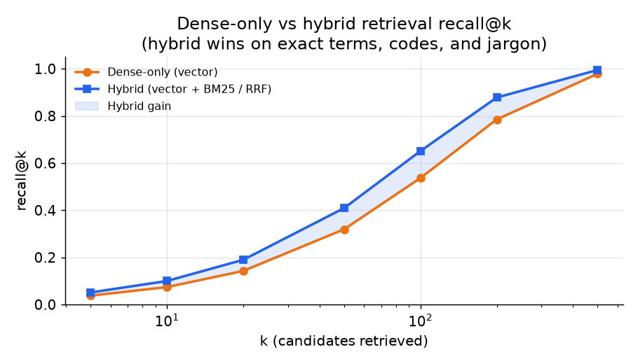
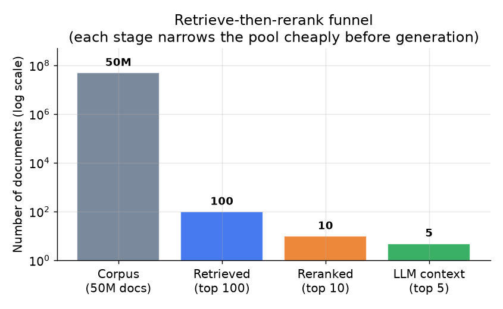

# 4. Retrieval and reranking

## Dense retrieval: the baseline

**Dense retrieval** embeds the query into the same vector space as the indexed
chunks and runs an approximate nearest-neighbor search for the closest chunks
by cosine or dot-product similarity.

$$\text{sim}(q, d) = \frac{\langle e_q, e_d \rangle}{\|e_q\| \cdot \|e_d\|}$$

where $e_q$ and $e_d$ are the query and document chunk embeddings respectively.
The top-k (the k highest-scoring chunks) by this score are the candidates passed
downstream.

```python
import numpy as np
def cosine_sim(e_q, e_d):              # e_q, e_d: 1-D embedding vectors (query, doc chunk)
    e_q, e_d = np.asarray(e_q, float), np.asarray(e_d, float)
    # dot product divided by the product of the two vector lengths (L2 norms)
    return float(e_q @ e_d / (np.linalg.norm(e_q) * np.linalg.norm(e_d)))
# cosine_sim([1, 0, 1], [1, 0, 0]) -> 0.7071067811865475
```

Dense retrieval captures semantic similarity and handles paraphrase well: a
query "how do I reset my password" will retrieve a chunk titled "Account
credential recovery" even if those words never appear together. Its weakness is
with exact terms: product codes, rare jargon, version numbers, and proper nouns
that the embedding model has not seen often enough to place close to their
variants in the vector space.

## Sparse retrieval: BM25 catches what dense misses

**BM25** is a classical term-frequency scoring function that rewards chunks
containing the query's exact tokens, weighted by how rare those tokens are
across the corpus (inverse document frequency, or idf: a term appearing in few
documents carries more weight than a common one).

Dense retrieval misses "incident-2847" or "gophermod v3.1.2" if those strings
are rare in the embedding model's pretraining data. BM25 nails them. For an
internal knowledge base full of ticket IDs, system names, and internal codes,
lexical (exact-word, as opposed to semantic) search fills a real gap.

The scoring combines idf with a saturating term-frequency term and a
length-normalization term, so repeats help with diminishing returns and long
documents do not win by sheer size:

```python
import math
def bm25_score(query_terms, doc_terms, corpus, k1=1.5, b=0.75):
    N = len(corpus)                                   # number of docs in the corpus
    avgdl = sum(len(d) for d in corpus) / N           # average document length
    score = 0.0
    for t in query_terms:
        n_t = sum(1 for d in corpus if t in d)        # docs containing term t
        idf = math.log((N - n_t + 0.5) / (n_t + 0.5) + 1)   # rarer term -> higher idf
        tf = doc_terms.count(t)                        # term frequency in this doc
        denom = tf + k1 * (1 - b + b * len(doc_terms) / avgdl)
        score += idf * (tf * (k1 + 1)) / denom
    return score
# bm25_score(["incident"], ["incident", "2847"], [["incident","2847"],["refund","policy"],["login"]]) -> 0.8998433513869051
```

## Hybrid retrieval: fuse both signals with RRF

**Hybrid retrieval** (combining semantic dense search with exact-word sparse
search) runs dense and sparse in parallel and merges their ranked lists. The
standard fusion method is **Reciprocal Rank Fusion (RRF)**:

$$\text{RRF}(d) = \sum_{r \in \{\text{bm25},\,\text{vec}\}} \frac{1}{k_{\text{rrf}} + \text{rank}_r(d)}$$

where $k_{\text{rrf}}$ (typically 60) dampens the influence of very high ranks.
RRF requires no score normalization across the two systems: it fuses ranks, not
raw scores. Studies across many corpora consistently find hybrid adds 3 to 5
percentage points of recall over dense-only, particularly at small k.

```python
def rrf(rank_lists, k0=60):        # rank_lists: one ranked list of doc ids per channel
    scores = {}
    for lst in rank_lists:
        for rank, doc in enumerate(lst, start=1):     # rank is 1-based
            scores[doc] = scores.get(doc, 0.0) + 1.0 / (k0 + rank)
    return sorted(scores, key=scores.get, reverse=True)   # fuses ranks, never raw scores
# rrf([["a", "b", "c"], ["a", "c"]]) -> ['a', 'c', 'b']
```



*Hybrid retrieval (dense + BM25) consistently outperforms dense-only across all
values of k. The gap is largest at small k, where exact-term matches matter most
for jargon-heavy internal corpora. Illustrative.*

## Recall as the quality ceiling

End-to-end answer quality is bounded by retrieval recall (the fraction of the
relevant chunks that actually make it into the top-k):

$$Q_{\text{e2e}} \leq \text{recall@}k \times Q_{\text{gen} \mid \text{retrieved}}$$

```python
def recall_at_k(retrieved, relevant, k):   # retrieved: ranked doc ids; relevant: set of gold ids
    top_k = retrieved[:k]                    # keep only the first k retrieved
    hits = sum(1 for d in top_k if d in relevant)
    return hits / len(relevant)              # fraction of gold docs found in the top k
# recall_at_k(["a", "x", "b", "y"], {"a", "b", "c"}, 3) -> 0.6666666666666666
```

If the right chunk was never retrieved, no generator can fix it. This inequality
is the single most important fact in RAG system design. Measure retrieval recall
separately from answer quality. If recall is the bottleneck, fix chunking and
the embedding model before touching the generator.

## Cross-encoder reranking: the precision lever

Vector search optimizes for cheap recall. After retrieving top-n candidates
(n typically 50 to 100), a **cross-encoder re-ranker** (a model that reads the
query and one chunk together in a single pass and outputs one relevance score)
scores each (query, chunk) pair jointly and returns the top-m (m typically 5 to
10). Reranking here means reordering the shortlist by that fresh score. The
cross-encoder sees both texts together, so it captures exact query-passage
interaction that a bi-encoder embedding model (which embeds the query and the
chunk separately, then compares the two vectors) cannot.

The cost is proportional to n, but each cross-encoder call is roughly 75 times
cheaper than a generation call:

$$C_{\text{rerank}} \approx \frac{1}{75} \cdot C_{\text{gen}}$$

So reranking 50 candidates costs less than one generation call, while keeping the
top 5 cuts the prompt length dramatically and reduces the "lost in the middle"
effect where a buried relevant passage lowers answer quality despite being
present in the context.



*The funnel from 50M corpus chunks to 100 retrieved candidates to 10 reranked
to 5 in the LLM context. Each stage is dramatically cheaper than the previous
one per document scored. Illustrative counts.*

**When to use which retrieval and reranking strategy.**

| Reach for | When | Instead of |
|---|---|---|
| Dense-only retrieval | Purely semantic matching; queries and docs share a common vocabulary; no rare codes | Hybrid, when the corpus is clean and keyword overlap is already high |
| Hybrid vector + BM25 via RRF | Corpus has exact IDs, product codes, jargon, or version numbers that dense vectors blur | Dense-only, which misses literal-term matches on rare or out-of-vocabulary tokens |
| BM25 alone | Exact-match search on a small, structured corpus (taxonomy, code index) | Dense, when semantic variation is the hard problem |
| HNSW index | Stable corpus; RAM budget is comfortable; top recall per millisecond is the priority | IVF, when frequent updates or geo-style filters make HNSW rebuild cost too high |
| IVF-PQ index | 50M+ chunks where index memory is the dominant constraint | HNSW, when quantization recall loss is unacceptable and memory is available |
| Cross-encoder rerank (NVIDIA, Dropbox) | First-stage recall is fine but top-5 precision is the quality ceiling | Sending all top-n to the LLM, which inflates prompt cost and buries relevant passages |
| No reranker | Hard first-token latency budget leaves no slack; first-stage recall is already very high | A cross-encoder, when the latency penalty matters more than precision gain |

**Provenance.** Dense retrieval traces to DPR (Meta FAIR, 2020); the lexical side is
BM25 (Robertson and Walker, 1994), fused with dense scores by Reciprocal Rank Fusion
(Cormack et al., 2009). The two index choices are HNSW (Malkov and Yashunin, 2016)
and IVF-PQ (Jegou et al.; FAISS by Meta). Cross-encoder reranking descends from
Sentence-BERT (UKP Darmstadt, 2019); a late-interaction alternative is ColBERT
(Stanford, 2020), and Cohere Rerank (Cohere) is a hosted option.
