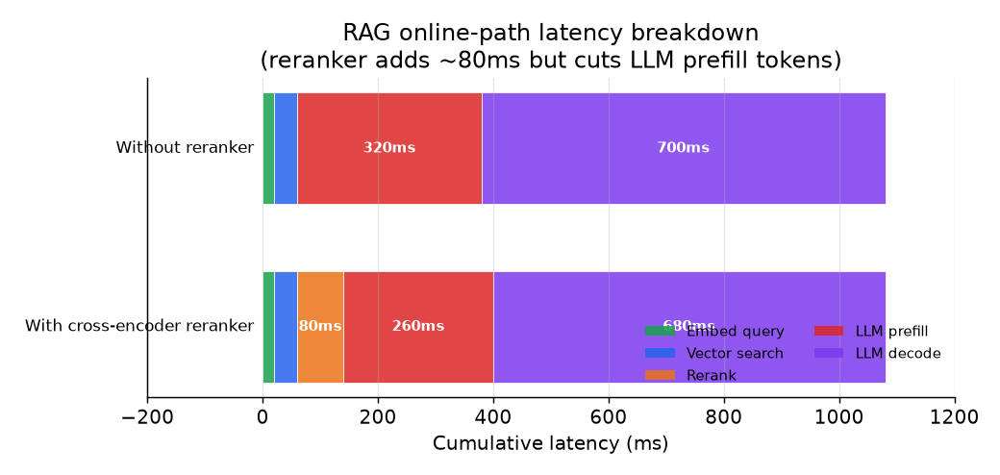

# 6. Serving and scaling

## Latency budget

The requirement is p99 first-token latency under 1.5 seconds. That budget must
be split across every online-path component. A realistic allocation for a
system with reranking:

| Component | Budget | Notes |
|---|---|---|
| Query embedding | ~20ms | Small model; cache hits drop this to near zero |
| ACL-filtered ANN search | ~40ms | HNSW or IVF-PQ on a replicated shard |
| Cross-encoder rerank (50 candidates, top 10) | ~80ms | Optional; skip under tight budget |
| LLM prefill (top 5 to 10 chunks assembled) | ~250ms | Dominated by chunk count and chunk size |
| First token decode | ~600ms | Model size and hardware bound |
| Networking / overhead | ~50ms | Between services |
| Total (with rerank) | ~1040ms | Headroom to p99 budget |

The biggest lever on first-token latency is prefill cost, which scales with the
number of tokens in the assembled prompt. Harder reranking (keeping fewer, more
relevant chunks) directly cuts prefill cost and latency, not just token cost.

*Latency breakdown for the online path with and without the cross-encoder reranker.
The reranker adds ~80ms but cuts LLM prefill tokens, which reduces the prefill
component. Net change at the budget levels above is near-neutral on total latency
while improving answer quality. Illustrative.*

## Caching layers

Three caches with different value profiles:

**Query embedding cache.** Internal queries repeat heavily: "what is the on-call
rotation?", "what is our incident policy?" A simple LRU cache on normalized query
strings avoids the embedding model round-trip entirely for cache hits. High hit
rate on popular queries; negligible memory cost.

**System prompt prefix cache.** The system instruction and context-window prefix
are identical across all queries. LLMs with KV-cache prefix caching (most
production APIs support this) avoid re-processing those tokens on every request.
This cuts prefill compute in proportion to the ratio of system-prompt tokens to
total prompt tokens.

**ACL metadata cache.** Looking up a user's document permissions on every query
round-trips to the authorization system. Cache the permission set per user with
a short TTL (a few minutes). This is load-sensitive for the authorization service
at 20 QPS.

## Streaming

The 1.5-second first-token target and the "full answer in a few seconds" target
are separate. Stream decode tokens as they generate. The first-token latency is
the sum of all online-path steps up to and including the first decode step.
Subsequent tokens stream without additional retrieval cost.

## Bottlenecks

| Bottleneck | First sign | Fix | Tradeoff |
|---|---|---|---|
| Query embedding latency | p99 creeps up; cache miss rate high | Larger embedding cache; smaller encoder | Slight recall loss from smaller model |
| ANN search saturation | Search latency spikes at high QPS | Shard and replicate the index | More infra; coordination cost |
| Prefill cost (long context) | LLM cost per query is high; first-token latency high | Rerank harder; reduce kept chunks ($m$) | Slight recall risk if rerank drops a relevant chunk |
| Generator throughput | Request queue backs up | Continuous batching; add replicas | Cost scales linearly |
| Cross-encoder rerank latency | Reranker dominates online-path budget | Reduce candidate set $n$; use smaller cross-encoder | Some precision loss |
| Re-index lag | Stale answers for recent documents | Faster incremental upsert; reduce batch interval | More write-path load on the index |
| ACL filter performance | High-ACL-complexity users see slow search | Pre-compute ACL token sets; use filter-native indexes | Staleness risk if permissions change mid-session |
