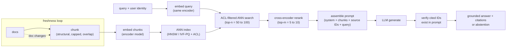

# 9. Summary

## One-page recap

- **Retrieval recall is the quality ceiling.** The end-to-end quality of a RAG
  system is bounded: $Q_{\text{e2e}} \leq \text{recall@}k \times Q_{\text{gen} \mid \text{retrieved}}$.
  When answers are wrong, look at chunking and the embedding model before the
  generator. A stronger generator cannot recover a chunk that was never retrieved.

- **The two paths must stay separate.** The offline (write) path pays the
  expensive chunk-embedding cost once per document change. The online (read) path
  pays only a single query embedding plus a fast index lookup per request. Mixing
  them means either paying embedding cost at query time or losing freshness.

- **Chunking is a design decision, not a default.** Chunk on document structure
  first (headings, paragraphs, tables), then size-cap. A chunk split mid-table
  produces a malformed embedding and a wrong answer. State the tradeoff: smaller
  chunks are more precise, larger chunks carry more context and inflate prompt cost.

- **ACL enforcement lives inside the ANN search.** Post-filtering the top-k leaks
  document existence and empties results for restricted users. ACL metadata must
  travel with every chunk from ingest through the index to the query.

- **Hybrid beats dense-only on exact-term queries.** BM25 catches product codes,
  ticket IDs, and jargon that dense embeddings blur. RRF fusion adds 3 to 5
  percentage points of recall with no architecture change.

- **Rerank hard; keep the context tight.** A cross-encoder costs roughly one
  seventy-fifth of a generation call per passage. Keeping top-m at 5 to 10
  instead of top-50 cuts prefill cost, cuts the "lost in the middle" effect,
  and often improves accuracy.

- **Abstain when retrieval is weak; verify citations before returning.** A confident
  wrong answer is worse than an honest abstention. Post-generation citation
  verification is a sub-millisecond string check that catches fabricated source IDs.

## The system on one page

**How it works.** The diagram folds the whole system onto one page by drawing the
write path and the read path meeting at the index. Offline, documents are chunked
with structure-aware capped-and-overlapped splits, embedded by the encoder, and
written into an ACL-tagged ANN index; the dashed freshness loop re-runs just the
changed document through the same chunk-and-embed steps so the index stays current
without a full rebuild. Online, the query plus the user identity is embedded by the
same encoder (embedding both sides with one model is what makes their vectors
comparable), then an ACL-filtered ANN search returns a broad top-n, which a
cross-encoder narrows to a precise top-m. Those chunks, the system prompt, the source
IDs, and the query are assembled into one prompt for the LLM, and a final check
verifies that every cited ID actually appears in the assembled prompt before the
answer is returned. That last node is the cheap guard against fabricated citations,
and the abstention branch is what the system emits when retrieval is too weak to
ground a confident reply.

## Test yourself

1. Why does retrieval recall upper-bound end-to-end answer quality, and what does
   that mean for where you debug first when answers are wrong?
2. A team is post-filtering ANN results by ACL permissions. Name the two failure
   modes and explain how to fix both.
3. A user query contains the string "PROJ-8821". Dense retrieval returns nothing
   useful. What is happening and what do you change?
4. Your system returns correct answers for common questions but wrong answers for
   edge-case questions that span multiple sections of a long document. What
   chunking approach addresses this, and why?
5. You need to cut cost per query by 50%. List three changes in order of how much
   each costs in quality, from cheapest to most expensive.
6. An answer is fluent and confident but factually wrong. The cited source ID
   appears in the answer but not in the assembled prompt. What failure mode is
   this, and what is the fix?

## Further reading

- Dense topic reference (case studies, math, quadrant chart, full production
  comparison): [topics/01-rag-serving.md](../../topics/01-rag-serving.md).
- Per-company teardowns with interview questions and gotchas:
  [tools/teardowns/01.md](../../tools/teardowns/01.md).
- Retrieval-strategy comparison and the math that separates them:
  [tools/comparisons/01.md](../../tools/comparisons/01.md).
- Trace the embedding encoder live (MiniLM-L6, 384-dim pooled output):
  [Model Zoo](https://github.com/neurarch-ai/awesome-llm-model-zoo).
- Next topic (long context and KV-cache mechanics, relevant to RAG prefill cost):
  [topics/02-long-context-and-kv-cache.md](../../topics/02-long-context-and-kv-cache.md).
