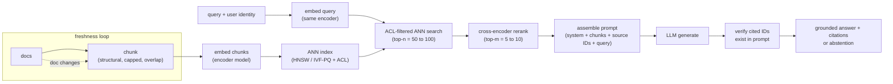

# 9. Summary

## One-page recap

- **Retrieval recall is the quality ceiling.** The end-to-end quality of a RAG
  system is bounded: $Q_{\text{e2e}} \leq \text{recall@}k \times Q_{\text{gen} \mid \text{retrieved}}$.
  When answers are wrong, look at chunking and the embedding model before the
  generator. A stronger generator cannot recover a chunk that was never retrieved.

- **The two paths must stay separate.** The offline (write) path pays the
  expensive chunk-embedding cost once per document change. The online (read) path
  pays only a single query embedding plus a fast index lookup per request. Mixing
  them means either paying embedding cost at query time or losing freshness.

- **Chunking is a design decision, not a default.** Chunk on document structure
  first (headings, paragraphs, tables), then size-cap. A chunk split mid-table
  produces a malformed embedding and a wrong answer. State the tradeoff: smaller
  chunks are more precise, larger chunks carry more context and inflate prompt cost.

- **ACL enforcement lives inside the ANN search.** Post-filtering the top-k leaks
  document existence and empties results for restricted users. ACL metadata must
  travel with every chunk from ingest through the index to the query.

- **Hybrid beats dense-only on exact-term queries.** BM25 catches product codes,
  ticket IDs, and jargon that dense embeddings blur. RRF fusion adds 3 to 5
  percentage points of recall with no architecture change.

- **Rerank hard; keep the context tight.** A cross-encoder costs roughly one
  seventy-fifth of a generation call per passage. Keeping top-m at 5 to 10
  instead of top-50 cuts prefill cost, cuts the "lost in the middle" effect,
  and often improves accuracy.

- **Abstain when retrieval is weak; verify citations before returning.** A confident
  wrong answer is worse than an honest abstention. Post-generation citation
  verification is a sub-millisecond string check that catches fabricated source IDs.

## The system on one page

```mermaid
flowchart LR
  D["docs"] --> CH["chunk<br/>(structural, capped, overlap)"]
  CH --> EM["embed chunks<br/>(encoder model)"]
  EM --> IX["ANN index<br/>(HNSW / IVF-PQ + ACL)"]
  subgraph freshness["freshness loop"]
    D -.->|"doc changes"| CH
  end
  Q["query + user identity"] --> QE["embed query<br/>(same encoder)"]
  QE --> VS["ACL-filtered ANN search<br/>(top-n = 50 to 100)"]
  IX --> VS
  VS --> RR["cross-encoder rerank<br/>(top-m = 5 to 10)"]
  RR --> PA["assemble prompt<br/>(system + chunks + source IDs + query)"]
  PA --> G["LLM generate"]
  G --> VF["verify cited IDs<br/>exist in prompt"]
  VF --> A["grounded answer + citations<br/>or abstention"]
```

**How it works.** The diagram folds the whole system onto one page by drawing the
write path and the read path meeting at the index. Offline, documents are chunked
with structure-aware capped-and-overlapped splits, embedded by the encoder, and
written into an ACL-tagged ANN index; the dashed freshness loop re-runs just the
changed document through the same chunk-and-embed steps so the index stays current
without a full rebuild. Online, the query plus the user identity is embedded by the
same encoder (embedding both sides with one model is what makes their vectors
comparable), then an ACL-filtered ANN search returns a broad top-n, which a
cross-encoder narrows to a precise top-m. Those chunks, the system prompt, the source
IDs, and the query are assembled into one prompt for the LLM, and a final check
verifies that every cited ID actually appears in the assembled prompt before the
answer is returned. That last node is the cheap guard against fabricated citations,
and the abstention branch is what the system emits when retrieval is too weak to
ground a confident reply.

## Test yourself

Answers are collapsed. Attempt each question before opening one.

1. Why does retrieval recall upper-bound end-to-end answer quality, and what does
   that mean for where you debug first when answers are wrong?

   

Answer

   The generator can only use what retrieval put in the context window, so a chunk
   that never entered the top-k cannot be recovered by any downstream stage:
   $Q_{\text{e2e}} \leq \text{recall@}k \times Q_{\text{gen} \mid \text{retrieved}}$.
   Debugging order follows directly. Ask "was the relevant chunk retrieved?" before
   "was the generator weak?", because swapping in a stronger and more expensive
   model cannot fix a recall miss, and you will have paid for nothing. Section
   [2](02-frame-the-system.md) frames this as the retrieve-then-generate contract;
   the write-path failures in [3](03-indexing-and-chunking.md) are the usual root
   cause.

   

2. A team is post-filtering ANN results by ACL permissions. Name the two failure
   modes and explain how to fix both.

   

Answer

   First, **recall starvation**: the index returns a top-k drawn from the whole
   corpus, and filtering afterward can empty the list for a user whose visible set
   is small, so they get no answer even though relevant documents they may read
   exist. Second, **existence leakage**: a user who reliably gets an abstention on
   one specific topic can infer that a document about it exists, which is itself
   a disclosure. The fix for both is the same and structural: push the permission
   filter into the ANN query so the search only ever traverses authorized vectors.
   That requires ACL metadata to travel with every chunk from ingest through the
   index, and it constrains index choice to engines with native metadata
   filtering (sections [1](01-clarifying-requirements.md) and
   [3](03-indexing-and-chunking.md)).

   

3. A user query contains the string "PROJ-8821". Dense retrieval returns nothing
   useful. What is happening and what do you change?

   

Answer

   Embeddings encode semantic similarity, and a ticket ID carries no semantics: the
   encoder maps "PROJ-8821" close to other identifier-shaped strings rather than to
   the one document that contains it, so the exact match is blurred away. This is
   the standard dense-retrieval blind spot for identifiers, SKUs, error codes, and
   internal jargon. Add a lexical arm: run BM25 alongside the dense retriever and
   fuse the two ranked lists with reciprocal rank fusion. Section
   [4](04-retrieval-and-reranking.md) puts the gain at roughly 3 to 5 points of
   recall for one fusion step and no architectural change, which is why hybrid is
   the default rather than an optimization.

   

4. Your system returns correct answers for common questions but wrong answers for
   edge-case questions that span multiple sections of a long document. What
   chunking approach addresses this, and why?

   

Answer

   The answer straddles a chunk boundary, so every individual chunk is a partial
   match and the model hedges or fills the gap. Two complementary fixes from
   section [3](03-indexing-and-chunking.md). **Parent-child retrieval** separates
   the retrieval unit from the context unit: embed small chunks so the match stays
   precise, then expand the winner to its surrounding section before it reaches the
   prompt. **Recursive structural chunking with a 10 to 15 percent overlap window**
   keeps a straddling answer whole inside at least one chunk to begin with. If the
   chunks read fine in place but poorly alone (pronouns, "the above design"), add
   contextual chunking so each chunk carries a short summary of where it came from.

   

5. You need to cut cost per query by 50%. List three changes in order of how much
   each costs in quality, from cheapest to most expensive.

   

Answer

   Cheapest first, because prefill dominates the bill and prefill scales with the
   token count you assemble. **One, rerank harder and keep fewer chunks.** Dropping
   the kept-chunk count m from 10 to 5 roughly halves prompt cost and first-token
   latency, and it often *improves* accuracy by cutting the lost-in-the-middle
   effect. **Two, add caching.** A query-embedding cache and a system-prompt prefix
   cache take real spend off repeat traffic at effectively no quality cost, which
   is why internal deployments get so much from them. **Three, drop to a smaller
   generator.** This is last because it is the only lever that trades answer quality
   directly rather than trimming waste. Sections
   [6](06-serving-and-scaling.md) and [10](10-putting-it-together.md) work the
   arithmetic.

   

6. An answer is fluent and confident but factually wrong. The cited source ID
   appears in the answer but not in the assembled prompt. What failure mode is
   this, and what is the fix?

   

Answer

   The model fabricated the citation. It produced an identifier that looks like the
   ones in its context, which is the most dangerous hallucination shape because the
   citation is exactly what makes the wrong answer look trustworthy. The fix is a
   post-generation check, not a better prompt: verify every cited ID against the set
   of IDs actually assembled into the prompt, and suppress or regenerate the answer
   when one does not match. It is a sub-millisecond string comparison, so it belongs
   on the hot path for every request. Pair it with the abstention rule from section
   [5](05-generation-and-grounding.md): when retrieval confidence is below the
   threshold, decline instead of generating, because an honest abstention beats a
   confident fabrication.

   

## Further reading

- The capstone: [the complete build](10-putting-it-together.md), where every
  choice in this chapter is committed once for the scenario, costed, rebuilt
  under two other constraint sets, and compressed into a runnable one-file RAG.
- Dense topic reference (case studies, math, quadrant chart, full production
  comparison): [topics/01-rag-serving.md](../../topics/01-rag-serving.md).
- Per-company teardowns with interview questions and gotchas:
  [tools/teardowns/01.md](../../tools/teardowns/01.md).
- Retrieval-strategy comparison and the math that separates them:
  [tools/comparisons/01.md](../../tools/comparisons/01.md).
- Trace the embedding encoder live (MiniLM-L6, 384-dim pooled output):
  [Model Zoo](https://github.com/neurarch-ai/awesome-llm-model-zoo).
- Next topic (long context and KV-cache mechanics, relevant to RAG prefill cost):
  [topics/02-long-context-and-kv-cache.md](../../topics/02-long-context-and-kv-cache.md).
