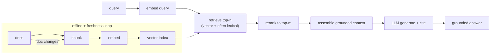

# RAG Serving

> **Style note.** This chapter is a teach-first, book-like treatment of
> Retrieval-Augmented Generation serving. It borrows the *thinking* of a
> Candidate/Interviewer dialogue to pin requirements, then follows a consistent
> frame-index-retrieve-generate-serve arc, one small figure per idea. On top of
> that it keeps what this repo adds: real production case studies, a "when to
> use which" table per method group, a live Model Zoo link for the embedding
> model, worked figures (mermaid and matplotlib), and an interview Q&A.

An interviewer rarely says "design a RAG system." They say **"design a system
that answers employee questions over our internal knowledge base."** That
specification already contains several traps: candidates rush to draw
"embed, retrieve, generate" in thirty seconds and have nothing left to say. The
signal is in retrieval quality, freshness, access control, and knowing what
breaks the quality ceiling and why.

This chapter builds the system end to end, grounding every decision in the
constraints the interviewer actually cares about, and shows how Uber, Dropbox,
NVIDIA, Glean, Microsoft, and a dozen more teams actually ship it.

## Sections

1. [Clarifying the requirements](01-clarifying-requirements.md) - the dialogue that scopes the problem.
2. [Framing the system](02-frame-the-system.md) - the two paths, retrieve-then-generate, input and output.
3. [Indexing and chunking](03-indexing-and-chunking.md) - chunking strategy, the embedding service, freshness.
4. [Retrieval and reranking](04-retrieval-and-reranking.md) - dense, sparse, hybrid, and cross-encoder reranking.
5. [Generation and grounding](05-generation-and-grounding.md) - prompt assembly, citations, hallucination control.
6. [Serving and scaling](06-serving-and-scaling.md) - latency budget, caching, bottlenecks.
7. [How teams do it in production](07-how-teams-do-it-in-production.md) - where named companies diverge, and first-party links.
8. [Interview Q&A](08-interview-qa.md) - commonly asked, tricky, and commonly answered wrong.
9. [Summary](09-summary.md) - the one-page recap, full-system diagram, and self-test.

## The whole system on one page

Read the sections in order the first time; they build on each other. Each opens
with the question an interviewer actually asks, then answers it.
