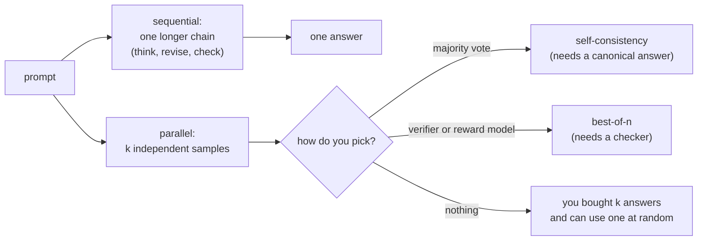

# 2. Framing test-time compute

## Two ways to spend more at inference

**Sequential scaling** spends tokens on a single trajectory: longer chains of
thought, self-checking, backtracking. It needs no extra machinery, it is what a
provider's "effort" or "thinking budget" parameter controls, and its cost shows up
as latency because the tokens are produced serially.

**Parallel scaling** spends tokens on several independent attempts. It is latency-
friendly (the samples run concurrently) and throughput-hostile (you pay for all of
them), and it is worthless without a way to choose between the samples. That is the
sentence to say in an interview: **parallel sampling is a multiplier on a verifier,
not a technique on its own.** Repeated sampling raises coverage, the fraction of
problems where *at least one* sample is correct, sharply
([Large Language Monkeys](https://arxiv.org/abs/2407.21787)), which converts into
delivered quality only if something can identify the correct one.

The two compose, and the optimal mix depends on the difficulty of the problem
relative to the model: easier problems benefit more from revision-style sequential
spend, harder ones from broader search, and allocating compute adaptively beats a
fixed setting ([Scaling LLM Test-Time Compute Optimally can be More Effective than
Scaling Model Parameters](https://arxiv.org/abs/2408.03314)).

## What the curve looks like

Accuracy against log compute rises and then flattens. Three implications that
matter more than the exact shape:

- **The flat part arrives.** Past some budget, more thinking produces more tokens
  and the same answer, or worse, talks itself out of a correct one. The budget where
  your task flattens is an empirical quantity, and measuring it is a day of work
  that pays for itself immediately.
- **The knee is task-dependent.** Competition math keeps improving for a long time;
  extraction and formatting flatten almost at once.
- **Cost is not the x-axis the product cares about.** Latency is, on the sequential
  path, and dollars are, on the parallel path. The same number of tokens has very
  different consequences depending on which axis you spent them.

## Where thinking does not help

| Task shape | Why extended thinking underperforms | What to do instead |
|---|---|---|
| Factual recall | The answer is in the weights or it is not; deliberation does not add knowledge | Retrieval |
| Formatting, extraction, classification | The mapping is shallow; long chains add drift and cost | A small model plus constrained decoding |
| Latency-bound interactive UX | The tail is the product; a fast wrong-ish answer often beats a slow right one | Non-thinking path with a verifier and escalation |
| Tasks with no checkable signal and no rubric | You cannot select among samples or tell when to stop | Fix the evaluation before buying compute |
| Very long context aggregation | The bottleneck is attention over the input, not deliberation about it | Better retrieval and chunking |

The general rule: **thinking helps where the model can find, and recognize, a better
answer than its first one.** If it cannot recognize it, spend the money on a
verifier instead of on tokens.

## Compare and contrast: five ways to spend inference compute

| Method | Extra machinery | Latency cost | Token cost | Where it wins | Where it fails |
|---|---|---|---|---|---|
| Extended thinking (sequential) | None; a budget parameter | High, serial | Linear in budget | Hard single problems, no verifier available | Cost and tail latency scale together |
| Self-consistency (majority vote) | Answer canonicalization | Low (parallel) | k times | Short canonical answers (math, labels) | Free-form output with no canonical form |
| Best-of-n with a verifier | A verifier or reward model | Low (parallel) | k times plus verification | Code, SQL, anything executable | Verifier quality caps the gain; gaming |
| Cascade (cheap, check, escalate) | A verifier or confidence signal | Low for most requests | Cheapest per solved task | Mixed workloads with a solvable majority | Needs a trustworthy accept test |
| Tool use and retrieval | Tools, indexes | Depends | Modest | Knowledge and computation the model lacks | Not a substitute for reasoning on hard logic |

Reading this table by the "extra machinery" column explains most production
designs: teams start with the sequential knob because it needs nothing, and the
teams that get the economics right are the ones that invested in a verifier and
moved to the last three rows.

## Inputs and outputs

**Input to the system:** a request, a difficulty or stakes signal (predicted or
declared), and a policy that maps those to a budget.

**Output:** an answer, plus an accounting record that must include tokens spent,
wall-clock, whether a verifier accepted, and whether the task was ultimately solved.
Without the last field you cannot compute cost per solved task, and every policy
comparison in this chapter is meaningless.

## The relationship to training

Reasoning behavior is trained, usually with reinforcement learning against
verifiable rewards, and the resulting models expose an inference-time budget knob
([DeepSeek-R1](https://arxiv.org/abs/2501.12948) is the canonical open account).
Two consequences for a serving discussion. First, the model's behavior at a budget
you did not train for is not guaranteed to be graceful, which is why forcing a
budget can produce truncated or degenerate output rather than a shorter well-formed
one, and why explicit budget-forcing techniques exist
([s1: Simple test-time scaling](https://arxiv.org/abs/2501.19393)). Second, the same
verifier that trained the model is often the one you should deploy alongside it: if
a checker was good enough to shape the policy, it is good enough to select among
samples at inference.
